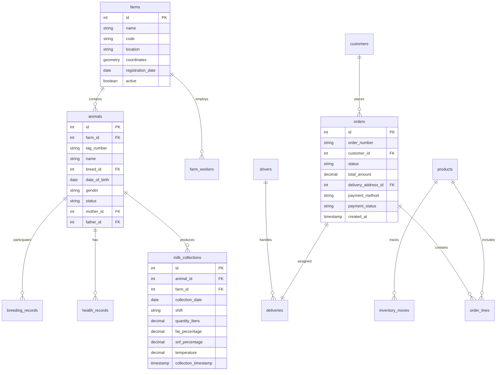
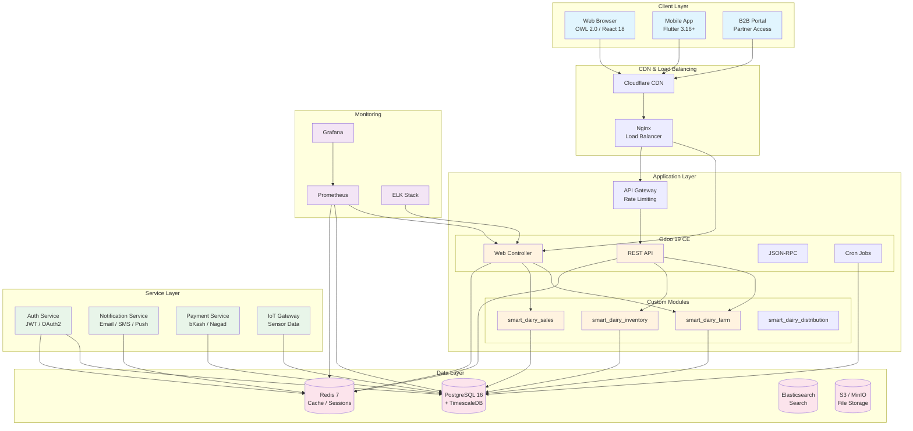

# Milestone 137: Technical Documentation

## Smart Dairy Digital Smart Portal + ERP - Phase 14: Testing & Documentation

| Field | Detail |
|-------|--------|
| Milestone | 137 of 150 (7 of 10 in Phase 14) |
| Title | Technical Documentation |
| Phase | Phase 14 - Testing & Documentation |
| Days | Days 681-685 (of 750 total) |
| Duration | 5 working days |
| Predecessor | Milestone 136 - Accessibility Testing |
| Successor | Milestone 138 - User Manuals |
| Version | 1.0 |
| Status | Draft |
| Last Updated | 2026-02-05 |
| Authors | Dev 1 (Backend Lead), Dev 2 (Full-Stack), Dev 3 (Frontend Lead) |

---

## Table of Contents

1. [Milestone Overview](#1-milestone-overview)
2. [Requirement Traceability Matrix](#2-requirement-traceability-matrix)
3. [Day-by-Day Breakdown](#3-day-by-day-breakdown)
4. [Technical Specifications](#4-technical-specifications)
5. [Testing & Validation](#5-testing--validation)
6. [Risk & Mitigation](#6-risk--mitigation)
7. [Dependencies & Handoffs](#7-dependencies--handoffs)
8. [Appendices](#8-appendices)

---

## 1. Milestone Overview

### 1.1 Sprint Goal

Create comprehensive technical documentation for the Smart Dairy Digital Portal, including API documentation (OpenAPI/Swagger), system architecture documentation, database schema documentation, deployment guides, and developer onboarding materials to ensure maintainability and knowledge transfer.

### 1.2 Objectives

| # | Objective | Priority | Success Indicator |
|---|-----------|----------|-------------------|
| 1 | Generate complete API documentation with OpenAPI 3.0 | Critical | All endpoints documented |
| 2 | Document system architecture with diagrams | Critical | Architecture diagrams complete |
| 3 | Create database schema documentation | High | All tables documented |
| 4 | Write Docker/Kubernetes deployment guides | Critical | Deployment procedures documented |
| 5 | Document Odoo module architecture | High | All custom modules documented |
| 6 | Create CI/CD pipeline documentation | High | Pipeline docs complete |
| 7 | Write monitoring and logging documentation | High | Monitoring setup documented |
| 8 | Generate component library documentation | Medium | UI components documented |
| 9 | Create troubleshooting guide | High | Common issues documented |
| 10 | Write developer onboarding guide | High | Onboarding materials ready |

### 1.3 Key Deliverables

| # | Deliverable | Format | Owner | Day |
|---|-------------|--------|-------|-----|
| 1 | OpenAPI 3.0 Specification | YAML/JSON | Dev 1 | 681 |
| 2 | API Reference Documentation | HTML | Dev 1 | 681 |
| 3 | System Architecture Document | PDF | Dev 2 | 681 |
| 4 | Frontend Architecture Guide | MD | Dev 3 | 681 |
| 5 | Odoo Module Documentation | MD | Dev 1 | 682 |
| 6 | Docker Compose Documentation | MD | Dev 2 | 682 |
| 7 | Component Library Storybook | HTML | Dev 3 | 682 |
| 8 | Database Schema Documentation | PDF | Dev 1 | 683 |
| 9 | CI/CD Pipeline Guide | MD | Dev 2 | 683 |
| 10 | Mobile Architecture Document | MD | Dev 3 | 683 |
| 11 | Authentication Flow Documentation | MD | Dev 1 | 684 |
| 12 | Monitoring Setup Guide | MD | Dev 2 | 684 |
| 13 | State Management Guide | MD | Dev 3 | 684 |
| 14 | Troubleshooting Guide | MD | Dev 1 | 685 |
| 15 | Scaling Guide | MD | Dev 2 | 685 |
| 16 | UI/UX Patterns Documentation | MD | Dev 3 | 685 |

### 1.4 Prerequisites

| # | Prerequisite | Source | Validation |
|---|--------------|--------|------------|
| 1 | Accessibility testing completed | Milestone 136 | Sign-off document |
| 2 | All APIs finalized | Development | API freeze confirmed |
| 3 | Database schema stable | DBA | No pending migrations |
| 4 | Deployment scripts tested | DevOps | Scripts validated |
| 5 | MkDocs/Docusaurus configured | Development | Build successful |

### 1.5 Success Criteria

| # | Criterion | Target | Measurement |
|---|-----------|--------|-------------|
| 1 | API Endpoint Coverage | 100% | OpenAPI validation |
| 2 | Architecture Diagrams | All major components | Review checklist |
| 3 | Database Tables Documented | 100% | Schema comparison |
| 4 | Deployment Procedures | Complete | Manual verification |
| 5 | Code Examples | Working | Build/run tests |
| 6 | Documentation Build | Successful | CI/CD validation |
| 7 | Peer Review | Approved | Review sign-off |
| 8 | Total Pages | 500+ | Page count |

---

## 2. Requirement Traceability Matrix

### 2.1 RFP Requirements

| Req ID | Requirement Description | Implementation | Day | Verification |
|--------|------------------------|----------------|-----|--------------|
| RFP-DOC-001 | Complete API documentation | OpenAPI specification | 681 | API coverage |
| RFP-DOC-002 | System architecture documentation | Architecture diagrams | 681 | Diagram review |
| RFP-DOC-003 | Deployment documentation | Docker/K8s guides | 682-683 | Procedure test |
| RFP-DOC-004 | Maintenance documentation | Troubleshooting guide | 685 | Review |

### 2.2 BRD Requirements

| Req ID | Requirement Description | Implementation | Day | Verification |
|--------|------------------------|----------------|-----|--------------|
| BRD-DOC-001 | Technical documentation for IT team | Complete tech docs | 681-685 | Coverage review |
| BRD-DOC-002 | Integration documentation | API docs with examples | 681 | Example testing |
| BRD-DOC-003 | Knowledge transfer materials | Onboarding guide | 685 | New dev test |

### 2.3 SRS Requirements

| Req ID | Requirement Description | Implementation | Day | Verification |
|--------|------------------------|----------------|-----|--------------|
| SRS-DOC-001 | OpenAPI 3.0 specification | YAML/JSON spec | 681 | Validator |
| SRS-DOC-002 | Database ERD diagrams | Schema documentation | 683 | Diagram review |
| SRS-DOC-003 | Authentication flow documentation | Auth flow docs | 684 | Flow validation |
| SRS-DOC-004 | Error handling documentation | Error codes guide | 681 | Completeness |

### 2.4 Technology Stack Requirements

| Req ID | Requirement Description | Implementation | Day | Verification |
|--------|------------------------|----------------|-----|--------------|
| TECH-DOC-001 | Odoo 19 CE module documentation | Module docs | 682 | Review |
| TECH-DOC-002 | PostgreSQL schema documentation | DB docs | 683 | Schema match |
| TECH-DOC-003 | Redis configuration documentation | Cache docs | 684 | Config review |
| TECH-DOC-004 | OWL Framework documentation | Component docs | 682 | Coverage |
| TECH-DOC-005 | Flutter architecture documentation | Mobile docs | 683 | Review |

---

## 3. Day-by-Day Breakdown

### Day 681 - API and Architecture Documentation
**Date Reference:** Day 681 of 750 | Phase 14, Day 31 of 50

#### Dev 1 - Backend Lead (8 hours)

| Time | Duration | Task | Output |
|------|----------|------|--------|
| 09:00 | 2h | Generate OpenAPI 3.0 specification | openapi.yaml |
| 11:00 | 2h | Document authentication endpoints | Auth API docs |
| 13:00 | 1h | Lunch Break | - |
| 14:00 | 2h | Document core business APIs | Business API docs |
| 16:00 | 1h | Configure Redoc/Swagger UI | API reference site |
| 17:00 | 1h | Review and validate API docs | Validation report |

**Key Deliverables:**
- Complete OpenAPI 3.0 specification
- Interactive API documentation site
- Authentication API reference

#### Dev 2 - Full-Stack (8 hours)

| Time | Duration | Task | Output |
|------|----------|------|--------|
| 09:00 | 2h | Create system architecture overview | Architecture overview |
| 11:00 | 2h | Document infrastructure architecture | Infra diagrams |
| 13:00 | 1h | Lunch Break | - |
| 14:00 | 2h | Create data flow diagrams | Data flow docs |
| 16:00 | 1h | Document security architecture | Security architecture |
| 17:00 | 1h | Generate architecture document | architecture.pdf |

**Key Deliverables:**
- System architecture document
- Infrastructure diagrams
- Data flow documentation

#### Dev 3 - Frontend/Mobile Lead (8 hours)

| Time | Duration | Task | Output |
|------|----------|------|--------|
| 09:00 | 2h | Document frontend architecture | Frontend architecture |
| 11:00 | 2h | Create OWL component hierarchy | OWL component docs |
| 13:00 | 1h | Lunch Break | - |
| 14:00 | 2h | Document React component architecture | React architecture |
| 16:00 | 1h | Create frontend folder structure guide | Structure guide |
| 17:00 | 1h | Document build and bundling process | Build docs |

**Key Deliverables:**
- Frontend architecture document
- Component hierarchy documentation
- Build process guide

---

### Day 682 - Module and Container Documentation
**Date Reference:** Day 682 of 750 | Phase 14, Day 32 of 50

#### Dev 1 - Backend Lead (8 hours)

| Time | Duration | Task | Output |
|------|----------|------|--------|
| 09:00 | 2h | Document Odoo module: smart_dairy_farm | Farm module docs |
| 11:00 | 2h | Document Odoo module: smart_dairy_sales | Sales module docs |
| 13:00 | 1h | Lunch Break | - |
| 14:00 | 2h | Document Odoo module: smart_dairy_inventory | Inventory module docs |
| 16:00 | 1h | Document custom wizards and reports | Wizard/report docs |
| 17:00 | 1h | Create module dependency diagram | Dependency diagram |

**Key Deliverables:**
- Complete Odoo module documentation
- Module dependency diagrams
- Wizard and report documentation

#### Dev 2 - Full-Stack (8 hours)

| Time | Duration | Task | Output |
|------|----------|------|--------|
| 09:00 | 2h | Document Docker Compose configuration | docker-compose.md |
| 11:00 | 2h | Document Kubernetes manifests | k8s-deployment.md |
| 13:00 | 1h | Lunch Break | - |
| 14:00 | 2h | Create environment configuration guide | Environment guide |
| 16:00 | 1h | Document volume and network setup | Storage/network docs |
| 17:00 | 1h | Create container orchestration guide | Orchestration guide |

**Key Deliverables:**
- Docker Compose documentation
- Kubernetes deployment guide
- Environment configuration documentation

#### Dev 3 - Frontend/Mobile Lead (8 hours)

| Time | Duration | Task | Output |
|------|----------|------|--------|
| 09:00 | 2h | Set up Storybook for OWL components | Storybook config |
| 11:00 | 2h | Document OWL component library | OWL component stories |
| 13:00 | 1h | Lunch Break | - |
| 14:00 | 2h | Document React component library | React component docs |
| 16:00 | 1h | Create component usage examples | Usage examples |
| 17:00 | 1h | Generate component documentation site | Component site |

**Key Deliverables:**
- Storybook component library
- Component usage documentation
- Interactive component examples

---

### Day 683 - Database and CI/CD Documentation
**Date Reference:** Day 683 of 750 | Phase 14, Day 33 of 50

#### Dev 1 - Backend Lead (8 hours)

| Time | Duration | Task | Output |
|------|----------|------|--------|
| 09:00 | 2h | Generate database ERD diagrams | ERD diagrams |
| 11:00 | 2h | Document core tables (animals, farms) | Core table docs |
| 13:00 | 1h | Lunch Break | - |
| 14:00 | 2h | Document transaction tables (orders, collections) | Transaction docs |
| 16:00 | 1h | Document TimescaleDB hypertables | TimescaleDB docs |
| 17:00 | 1h | Create data dictionary | Data dictionary |

**Key Deliverables:**
- Database ERD diagrams
- Table documentation
- Complete data dictionary

#### Dev 2 - Full-Stack (8 hours)

| Time | Duration | Task | Output |
|------|----------|------|--------|
| 09:00 | 2h | Document GitHub Actions workflows | CI/CD workflow docs |
| 11:00 | 2h | Document build and test pipelines | Build pipeline docs |
| 13:00 | 1h | Lunch Break | - |
| 14:00 | 2h | Document deployment pipelines | Deployment docs |
| 16:00 | 1h | Create pipeline troubleshooting guide | Pipeline debug guide |
| 17:00 | 1h | Document secrets and environment management | Secrets management |

**Key Deliverables:**
- CI/CD pipeline documentation
- Deployment procedure guide
- Secrets management documentation

#### Dev 3 - Frontend/Mobile Lead (8 hours)

| Time | Duration | Task | Output |
|------|----------|------|--------|
| 09:00 | 2h | Document Flutter app architecture | Flutter architecture |
| 11:00 | 2h | Document Flutter state management (BLoC) | BLoC documentation |
| 13:00 | 1h | Lunch Break | - |
| 14:00 | 2h | Document mobile API integration | Mobile API docs |
| 16:00 | 1h | Create Flutter folder structure guide | Structure guide |
| 17:00 | 1h | Document offline-first patterns | Offline mode docs |

**Key Deliverables:**
- Flutter architecture documentation
- State management guide
- Offline mode documentation

---

### Day 684 - Authentication and Monitoring Documentation
**Date Reference:** Day 684 of 750 | Phase 14, Day 34 of 50

#### Dev 1 - Backend Lead (8 hours)

| Time | Duration | Task | Output |
|------|----------|------|--------|
| 09:00 | 2h | Document authentication flow | Auth flow docs |
| 11:00 | 2h | Document JWT token management | JWT documentation |
| 13:00 | 1h | Lunch Break | - |
| 14:00 | 2h | Document role-based access control | RBAC documentation |
| 16:00 | 1h | Create session management guide | Session guide |
| 17:00 | 1h | Document OAuth2 integration | OAuth2 docs |

**Key Deliverables:**
- Authentication flow documentation
- RBAC documentation
- Session management guide

#### Dev 2 - Full-Stack (8 hours)

| Time | Duration | Task | Output |
|------|----------|------|--------|
| 09:00 | 2h | Document Prometheus metrics setup | Prometheus docs |
| 11:00 | 2h | Document Grafana dashboard configuration | Grafana guide |
| 13:00 | 1h | Lunch Break | - |
| 14:00 | 2h | Document logging architecture (ELK) | Logging docs |
| 16:00 | 1h | Create alerting configuration guide | Alerting guide |
| 17:00 | 1h | Document health check endpoints | Health check docs |

**Key Deliverables:**
- Monitoring setup documentation
- Dashboard configuration guide
- Alerting documentation

#### Dev 3 - Frontend/Mobile Lead (8 hours)

| Time | Duration | Task | Output |
|------|----------|------|--------|
| 09:00 | 2h | Document React state management | State management docs |
| 11:00 | 2h | Document OWL services and stores | OWL state docs |
| 13:00 | 1h | Lunch Break | - |
| 14:00 | 2h | Document real-time data patterns | Real-time docs |
| 16:00 | 1h | Create error handling guide | Error handling docs |
| 17:00 | 1h | Document form state management | Form state docs |

**Key Deliverables:**
- State management documentation
- Real-time data handling guide
- Error handling patterns

---

### Day 685 - Troubleshooting and Knowledge Transfer
**Date Reference:** Day 685 of 750 | Phase 14, Day 35 of 50

#### Dev 1 - Backend Lead (8 hours)

| Time | Duration | Task | Output |
|------|----------|------|--------|
| 09:00 | 2h | Create backend troubleshooting guide | Backend troubleshoot |
| 11:00 | 2h | Document common error codes | Error code guide |
| 13:00 | 1h | Lunch Break | - |
| 14:00 | 2h | Create performance tuning guide | Performance guide |
| 16:00 | 1h | Document backup and recovery procedures | Backup procedures |
| 17:00 | 1h | Final documentation review | Review notes |

**Key Deliverables:**
- Troubleshooting guide
- Error code reference
- Performance tuning guide

#### Dev 2 - Full-Stack (8 hours)

| Time | Duration | Task | Output |
|------|----------|------|--------|
| 09:00 | 2h | Create scaling guide | Scaling documentation |
| 11:00 | 2h | Document horizontal scaling procedures | Horizontal scaling |
| 13:00 | 1h | Lunch Break | - |
| 14:00 | 2h | Create disaster recovery documentation | DR documentation |
| 16:00 | 1h | Document infrastructure troubleshooting | Infra troubleshoot |
| 17:00 | 1h | Prepare Milestone 138 handoff | Handoff package |

**Key Deliverables:**
- Scaling guide
- Disaster recovery documentation
- Infrastructure troubleshooting guide

#### Dev 3 - Frontend/Mobile Lead (8 hours)

| Time | Duration | Task | Output |
|------|----------|------|--------|
| 09:00 | 2h | Document UI/UX design patterns | Design patterns |
| 11:00 | 2h | Create frontend troubleshooting guide | Frontend troubleshoot |
| 13:00 | 1h | Lunch Break | - |
| 14:00 | 2h | Create developer onboarding guide | Onboarding guide |
| 16:00 | 1h | Compile documentation index | Documentation index |
| 17:00 | 1h | Team documentation review meeting | Meeting notes |

**Key Deliverables:**
- UI/UX patterns documentation
- Developer onboarding guide
- Documentation index

---

## 4. Technical Specifications

### 4.1 OpenAPI 3.0 Specification

```yaml
# openapi/openapi.yaml
# Smart Dairy Digital Portal API Specification

openapi: 3.0.3
info:
  title: Smart Dairy Digital Portal API
  description: |
    RESTful API for the Smart Dairy Digital Smart Portal + ERP System.

    ## Overview
    This API provides access to all Smart Dairy operations including:
    - Farm and animal management
    - Milk collection and quality tracking
    - Order processing and delivery
    - Customer and B2B partner management
    - Inventory and product management
    - Reporting and analytics

    ## Authentication
    All API endpoints (except `/auth/login` and `/auth/register`) require authentication
    using JWT Bearer tokens. Include the token in the Authorization header:
    ```
    Authorization: Bearer <your_jwt_token>
    ```

    ## Rate Limiting
    - Standard users: 100 requests per minute
    - Premium users: 500 requests per minute
    - Rate limit headers are included in all responses

    ## Pagination
    List endpoints support pagination with `page` and `limit` query parameters.
    Default limit is 20, maximum is 100.

    ## Error Handling
    All errors follow RFC 7807 Problem Details format.
  version: 1.0.0
  contact:
    name: Smart Dairy API Support
    email: api-support@smartdairy.com
    url: https://developer.smartdairy.com
  license:
    name: Proprietary
    url: https://smartdairy.com/licenses/api

servers:
  - url: https://api.smartdairy.com/v1
    description: Production server
  - url: https://staging-api.smartdairy.com/v1
    description: Staging server
  - url: http://localhost:8069/api/v1
    description: Local development

tags:
  - name: Authentication
    description: User authentication and authorization
  - name: Animals
    description: Animal management operations
  - name: Farms
    description: Farm management operations
  - name: Collections
    description: Milk collection operations
  - name: Orders
    description: Order management
  - name: Customers
    description: Customer management
  - name: Products
    description: Product catalog
  - name: Inventory
    description: Inventory management
  - name: Reports
    description: Reporting and analytics

paths:
  /auth/login:
    post:
      tags:
        - Authentication
      summary: User login
      description: Authenticate user and return JWT tokens
      operationId: login
      requestBody:
        required: true
        content:
          application/json:
            schema:
              $ref: '#/components/schemas/LoginRequest'
            examples:
              admin:
                summary: Admin login
                value:
                  email: admin@smartdairy.com
                  password: SecurePassword123!
      responses:
        '200':
          description: Successful authentication
          content:
            application/json:
              schema:
                $ref: '#/components/schemas/LoginResponse'
        '401':
          $ref: '#/components/responses/Unauthorized'
        '422':
          $ref: '#/components/responses/ValidationError'
        '429':
          $ref: '#/components/responses/RateLimitExceeded'

  /auth/refresh:
    post:
      tags:
        - Authentication
      summary: Refresh access token
      description: Get new access token using refresh token
      operationId: refreshToken
      requestBody:
        required: true
        content:
          application/json:
            schema:
              type: object
              properties:
                refresh_token:
                  type: string
              required:
                - refresh_token
      responses:
        '200':
          description: Token refreshed
          content:
            application/json:
              schema:
                $ref: '#/components/schemas/TokenResponse'
        '401':
          $ref: '#/components/responses/Unauthorized'

  /animals:
    get:
      tags:
        - Animals
      summary: List animals
      description: Get paginated list of animals with filtering options
      operationId: listAnimals
      security:
        - bearerAuth: []
      parameters:
        - $ref: '#/components/parameters/PageParam'
        - $ref: '#/components/parameters/LimitParam'
        - name: farm_id
          in: query
          description: Filter by farm
          schema:
            type: integer
        - name: status
          in: query
          description: Filter by status
          schema:
            type: string
            enum: [active, sold, deceased, dry]
        - name: breed
          in: query
          description: Filter by breed
          schema:
            type: string
        - name: search
          in: query
          description: Search by tag number or name
          schema:
            type: string
      responses:
        '200':
          description: List of animals
          content:
            application/json:
              schema:
                $ref: '#/components/schemas/AnimalListResponse'
        '401':
          $ref: '#/components/responses/Unauthorized'
        '403':
          $ref: '#/components/responses/Forbidden'

    post:
      tags:
        - Animals
      summary: Create animal
      description: Register a new animal
      operationId: createAnimal
      security:
        - bearerAuth: []
      requestBody:
        required: true
        content:
          application/json:
            schema:
              $ref: '#/components/schemas/AnimalCreate'
      responses:
        '201':
          description: Animal created
          content:
            application/json:
              schema:
                $ref: '#/components/schemas/Animal'
        '401':
          $ref: '#/components/responses/Unauthorized'
        '422':
          $ref: '#/components/responses/ValidationError'

  /animals/{id}:
    get:
      tags:
        - Animals
      summary: Get animal details
      description: Get detailed information about a specific animal
      operationId: getAnimal
      security:
        - bearerAuth: []
      parameters:
        - $ref: '#/components/parameters/AnimalId'
      responses:
        '200':
          description: Animal details
          content:
            application/json:
              schema:
                $ref: '#/components/schemas/AnimalDetail'
        '404':
          $ref: '#/components/responses/NotFound'

    put:
      tags:
        - Animals
      summary: Update animal
      description: Update animal information
      operationId: updateAnimal
      security:
        - bearerAuth: []
      parameters:
        - $ref: '#/components/parameters/AnimalId'
      requestBody:
        required: true
        content:
          application/json:
            schema:
              $ref: '#/components/schemas/AnimalUpdate'
      responses:
        '200':
          description: Animal updated
          content:
            application/json:
              schema:
                $ref: '#/components/schemas/Animal'
        '404':
          $ref: '#/components/responses/NotFound'
        '422':
          $ref: '#/components/responses/ValidationError'

    delete:
      tags:
        - Animals
      summary: Delete animal
      description: Soft delete an animal record
      operationId: deleteAnimal
      security:
        - bearerAuth: []
      parameters:
        - $ref: '#/components/parameters/AnimalId'
      responses:
        '204':
          description: Animal deleted
        '404':
          $ref: '#/components/responses/NotFound'

  /collections:
    post:
      tags:
        - Collections
      summary: Record milk collection
      description: Record a new milk collection entry
      operationId: createCollection
      security:
        - bearerAuth: []
      requestBody:
        required: true
        content:
          application/json:
            schema:
              $ref: '#/components/schemas/CollectionCreate'
      responses:
        '201':
          description: Collection recorded
          content:
            application/json:
              schema:
                $ref: '#/components/schemas/Collection'
        '422':
          $ref: '#/components/responses/ValidationError'

  /collections/summary:
    get:
      tags:
        - Collections
      summary: Get collection summary
      description: Get milk collection summary for a date range
      operationId: getCollectionSummary
      security:
        - bearerAuth: []
      parameters:
        - name: start_date
          in: query
          required: true
          schema:
            type: string
            format: date
        - name: end_date
          in: query
          required: true
          schema:
            type: string
            format: date
        - name: farm_id
          in: query
          schema:
            type: integer
      responses:
        '200':
          description: Collection summary
          content:
            application/json:
              schema:
                $ref: '#/components/schemas/CollectionSummary'

  /orders:
    get:
      tags:
        - Orders
      summary: List orders
      description: Get paginated list of orders
      operationId: listOrders
      security:
        - bearerAuth: []
      parameters:
        - $ref: '#/components/parameters/PageParam'
        - $ref: '#/components/parameters/LimitParam'
        - name: status
          in: query
          schema:
            type: string
            enum: [pending, confirmed, processing, shipped, delivered, cancelled]
        - name: customer_id
          in: query
          schema:
            type: integer
      responses:
        '200':
          description: List of orders
          content:
            application/json:
              schema:
                $ref: '#/components/schemas/OrderListResponse'

    post:
      tags:
        - Orders
      summary: Create order
      description: Create a new customer order
      operationId: createOrder
      security:
        - bearerAuth: []
      requestBody:
        required: true
        content:
          application/json:
            schema:
              $ref: '#/components/schemas/OrderCreate'
      responses:
        '201':
          description: Order created
          content:
            application/json:
              schema:
                $ref: '#/components/schemas/Order'
        '422':
          $ref: '#/components/responses/ValidationError'

components:
  securitySchemes:
    bearerAuth:
      type: http
      scheme: bearer
      bearerFormat: JWT
      description: JWT access token

  parameters:
    PageParam:
      name: page
      in: query
      description: Page number (1-based)
      schema:
        type: integer
        minimum: 1
        default: 1

    LimitParam:
      name: limit
      in: query
      description: Items per page
      schema:
        type: integer
        minimum: 1
        maximum: 100
        default: 20

    AnimalId:
      name: id
      in: path
      required: true
      description: Animal ID
      schema:
        type: integer

  schemas:
    LoginRequest:
      type: object
      properties:
        email:
          type: string
          format: email
          description: User email address
        password:
          type: string
          format: password
          minLength: 8
          description: User password
      required:
        - email
        - password

    LoginResponse:
      type: object
      properties:
        access_token:
          type: string
          description: JWT access token
        refresh_token:
          type: string
          description: JWT refresh token
        token_type:
          type: string
          example: Bearer
        expires_in:
          type: integer
          description: Token expiry in seconds
          example: 3600
        user:
          $ref: '#/components/schemas/User'

    TokenResponse:
      type: object
      properties:
        access_token:
          type: string
        expires_in:
          type: integer

    User:
      type: object
      properties:
        id:
          type: integer
        email:
          type: string
          format: email
        name:
          type: string
        role:
          type: string
          enum: [admin, farm_manager, farm_worker, customer, driver, b2b_partner]
        farm_id:
          type: integer
          nullable: true

    Animal:
      type: object
      properties:
        id:
          type: integer
        tag_number:
          type: string
        name:
          type: string
        breed:
          type: string
        date_of_birth:
          type: string
          format: date
        gender:
          type: string
          enum: [male, female]
        status:
          type: string
          enum: [active, sold, deceased, dry]
        farm_id:
          type: integer
        created_at:
          type: string
          format: date-time
        updated_at:
          type: string
          format: date-time

    AnimalCreate:
      type: object
      properties:
        tag_number:
          type: string
          maxLength: 50
        name:
          type: string
          maxLength: 100
        breed:
          type: string
        date_of_birth:
          type: string
          format: date
        gender:
          type: string
          enum: [male, female]
        farm_id:
          type: integer
        mother_id:
          type: integer
          nullable: true
        father_id:
          type: integer
          nullable: true
      required:
        - tag_number
        - breed
        - date_of_birth
        - gender
        - farm_id

    AnimalUpdate:
      type: object
      properties:
        name:
          type: string
        status:
          type: string
          enum: [active, sold, deceased, dry]

    AnimalDetail:
      allOf:
        - $ref: '#/components/schemas/Animal'
        - type: object
          properties:
            farm:
              $ref: '#/components/schemas/FarmSummary'
            health_records:
              type: array
              items:
                $ref: '#/components/schemas/HealthRecord'
            collection_stats:
              $ref: '#/components/schemas/CollectionStats'

    AnimalListResponse:
      type: object
      properties:
        data:
          type: array
          items:
            $ref: '#/components/schemas/Animal'
        pagination:
          $ref: '#/components/schemas/Pagination'

    FarmSummary:
      type: object
      properties:
        id:
          type: integer
        name:
          type: string
        location:
          type: string

    HealthRecord:
      type: object
      properties:
        id:
          type: integer
        record_date:
          type: string
          format: date
        type:
          type: string
        description:
          type: string
        veterinarian:
          type: string

    CollectionStats:
      type: object
      properties:
        total_collections:
          type: integer
        total_liters:
          type: number
        average_per_collection:
          type: number
        last_collection_date:
          type: string
          format: date

    CollectionCreate:
      type: object
      properties:
        animal_id:
          type: integer
        farm_id:
          type: integer
        collection_date:
          type: string
          format: date
        shift:
          type: string
          enum: [morning, evening]
        quantity_liters:
          type: number
          minimum: 0
        fat_percentage:
          type: number
          minimum: 0
          maximum: 100
        snf_percentage:
          type: number
          minimum: 0
          maximum: 100
        temperature:
          type: number
      required:
        - animal_id
        - farm_id
        - collection_date
        - shift
        - quantity_liters

    Collection:
      type: object
      properties:
        id:
          type: integer
        animal_id:
          type: integer
        farm_id:
          type: integer
        collection_date:
          type: string
          format: date
        shift:
          type: string
        quantity_liters:
          type: number
        fat_percentage:
          type: number
        snf_percentage:
          type: number
        temperature:
          type: number
        quality_grade:
          type: string
        created_at:
          type: string
          format: date-time

    CollectionSummary:
      type: object
      properties:
        total_collections:
          type: integer
        total_liters:
          type: number
        average_fat:
          type: number
        average_snf:
          type: number
        daily_breakdown:
          type: array
          items:
            type: object
            properties:
              date:
                type: string
                format: date
              liters:
                type: number
              collections:
                type: integer

    OrderCreate:
      type: object
      properties:
        customer_id:
          type: integer
        items:
          type: array
          items:
            type: object
            properties:
              product_id:
                type: integer
              quantity:
                type: integer
                minimum: 1
        delivery_address_id:
          type: integer
        payment_method:
          type: string
          enum: [cash_on_delivery, bkash, nagad, card]
        notes:
          type: string
      required:
        - customer_id
        - items
        - delivery_address_id

    Order:
      type: object
      properties:
        id:
          type: integer
        order_number:
          type: string
        customer_id:
          type: integer
        status:
          type: string
        total_amount:
          type: number
        items:
          type: array
          items:
            $ref: '#/components/schemas/OrderItem'
        created_at:
          type: string
          format: date-time

    OrderItem:
      type: object
      properties:
        product_id:
          type: integer
        product_name:
          type: string
        quantity:
          type: integer
        unit_price:
          type: number
        total:
          type: number

    OrderListResponse:
      type: object
      properties:
        data:
          type: array
          items:
            $ref: '#/components/schemas/Order'
        pagination:
          $ref: '#/components/schemas/Pagination'

    Pagination:
      type: object
      properties:
        page:
          type: integer
        limit:
          type: integer
        total:
          type: integer
        total_pages:
          type: integer

    Error:
      type: object
      properties:
        type:
          type: string
          format: uri
        title:
          type: string
        status:
          type: integer
        detail:
          type: string
        instance:
          type: string

    ValidationError:
      allOf:
        - $ref: '#/components/schemas/Error'
        - type: object
          properties:
            errors:
              type: array
              items:
                type: object
                properties:
                  field:
                    type: string
                  message:
                    type: string

  responses:
    Unauthorized:
      description: Authentication required
      content:
        application/json:
          schema:
            $ref: '#/components/schemas/Error'
          example:
            type: /errors/unauthorized
            title: Unauthorized
            status: 401
            detail: Invalid or expired token

    Forbidden:
      description: Permission denied
      content:
        application/json:
          schema:
            $ref: '#/components/schemas/Error'

    NotFound:
      description: Resource not found
      content:
        application/json:
          schema:
            $ref: '#/components/schemas/Error'

    ValidationError:
      description: Validation failed
      content:
        application/json:
          schema:
            $ref: '#/components/schemas/ValidationError'

    RateLimitExceeded:
      description: Too many requests
      content:
        application/json:
          schema:
            $ref: '#/components/schemas/Error'
      headers:
        X-RateLimit-Limit:
          schema:
            type: integer
        X-RateLimit-Remaining:
          schema:
            type: integer
        X-RateLimit-Reset:
          schema:
            type: integer
```

### 4.2 Docker Compose Documentation

```yaml
# docker/docker-compose.yml
# Smart Dairy Production Docker Compose Configuration
# Documentation Version: 1.0

version: '3.8'

# ==============================================================================
# SERVICE DEFINITIONS
# ==============================================================================

services:
  # ============================================================================
  # ODOO APPLICATION SERVER
  # ============================================================================
  # Main Odoo 19 CE application server
  # Handles all business logic and serves web interface
  odoo:
    image: smartdairy/odoo:19-ce
    build:
      context: ./odoo
      dockerfile: Dockerfile
    container_name: smartdairy-odoo
    restart: unless-stopped

    # Environment Configuration
    # See .env.example for all available options
    environment:
      # Database connection
      - HOST=db
      - PORT=5432
      - USER=${POSTGRES_USER:-odoo}
      - PASSWORD=${POSTGRES_PASSWORD}

      # Odoo configuration
      - ADMIN_PASSWORD=${ODOO_ADMIN_PASSWORD}
      - DB_NAME=${ODOO_DB_NAME:-smartdairy}

      # Performance settings
      - WORKERS=${ODOO_WORKERS:-4}
      - MAX_CRON_THREADS=${ODOO_CRON_THREADS:-2}
      - LIMIT_TIME_CPU=${ODOO_LIMIT_TIME_CPU:-600}
      - LIMIT_TIME_REAL=${ODOO_LIMIT_TIME_REAL:-1200}
      - LIMIT_MEMORY_SOFT=${ODOO_LIMIT_MEMORY_SOFT:-2147483648}
      - LIMIT_MEMORY_HARD=${ODOO_LIMIT_MEMORY_HARD:-2684354560}

    # Port mapping
    ports:
      - "${ODOO_PORT:-8069}:8069"      # Web interface
      - "${ODOO_LONGPOLL:-8072}:8072"  # Long polling

    # Volume mounts
    volumes:
      # Persistent data
      - odoo-data:/var/lib/odoo
      - odoo-filestore:/var/lib/odoo/filestore

      # Custom addons
      - ./addons:/mnt/extra-addons:ro

      # Configuration
      - ./config/odoo.conf:/etc/odoo/odoo.conf:ro

    # Service dependencies
    depends_on:
      db:
        condition: service_healthy
      redis:
        condition: service_healthy

    # Health check
    healthcheck:
      test: ["CMD", "curl", "-f", "http://localhost:8069/web/health"]
      interval: 30s
      timeout: 10s
      retries: 5
      start_period: 60s

    # Resource limits
    deploy:
      resources:
        limits:
          cpus: '4'
          memory: 8G
        reservations:
          cpus: '2'
          memory: 4G

    # Network configuration
    networks:
      - smartdairy-network

    # Logging configuration
    logging:
      driver: json-file
      options:
        max-size: "100m"
        max-file: "5"

  # ============================================================================
  # POSTGRESQL DATABASE
  # ============================================================================
  # Primary database server with TimescaleDB extension
  db:
    image: timescale/timescaledb:2.13.0-pg16
    container_name: smartdairy-db
    restart: unless-stopped

    environment:
      - POSTGRES_USER=${POSTGRES_USER:-odoo}
      - POSTGRES_PASSWORD=${POSTGRES_PASSWORD}
      - POSTGRES_DB=${POSTGRES_DB:-postgres}
      - PGDATA=/var/lib/postgresql/data/pgdata

    volumes:
      # Persistent database storage
      - postgres-data:/var/lib/postgresql/data

      # Initialization scripts
      - ./db/init:/docker-entrypoint-initdb.d:ro

      # Custom configuration
      - ./config/postgresql.conf:/etc/postgresql/postgresql.conf:ro

    ports:
      - "${POSTGRES_PORT:-5432}:5432"

    # Health check
    healthcheck:
      test: ["CMD-SHELL", "pg_isready -U ${POSTGRES_USER:-odoo}"]
      interval: 10s
      timeout: 5s
      retries: 5

    # PostgreSQL tuning via command
    command:
      - "postgres"
      - "-c"
      - "shared_buffers=2GB"
      - "-c"
      - "effective_cache_size=6GB"
      - "-c"
      - "maintenance_work_mem=512MB"
      - "-c"
      - "work_mem=64MB"
      - "-c"
      - "max_connections=200"
      - "-c"
      - "random_page_cost=1.1"
      - "-c"
      - "effective_io_concurrency=200"
      - "-c"
      - "max_wal_size=4GB"
      - "-c"
      - "checkpoint_completion_target=0.9"
      - "-c"
      - "wal_buffers=64MB"
      - "-c"
      - "default_statistics_target=100"

    deploy:
      resources:
        limits:
          cpus: '2'
          memory: 8G
        reservations:
          cpus: '1'
          memory: 4G

    networks:
      - smartdairy-network

    logging:
      driver: json-file
      options:
        max-size: "100m"
        max-file: "5"

  # ============================================================================
  # REDIS CACHE
  # ============================================================================
  # In-memory cache for session storage and caching
  redis:
    image: redis:7-alpine
    container_name: smartdairy-redis
    restart: unless-stopped

    # Redis configuration
    command: >
      redis-server
      --appendonly yes
      --maxmemory 1gb
      --maxmemory-policy allkeys-lru
      --save 60 1000
      --save 300 10
      --tcp-keepalive 300

    volumes:
      - redis-data:/data

    ports:
      - "${REDIS_PORT:-6379}:6379"

    healthcheck:
      test: ["CMD", "redis-cli", "ping"]
      interval: 10s
      timeout: 5s
      retries: 5

    deploy:
      resources:
        limits:
          cpus: '1'
          memory: 2G

    networks:
      - smartdairy-network

  # ============================================================================
  # NGINX REVERSE PROXY
  # ============================================================================
  # Load balancer and SSL termination
  nginx:
    image: nginx:1.25-alpine
    container_name: smartdairy-nginx
    restart: unless-stopped

    ports:
      - "80:80"
      - "443:443"

    volumes:
      - ./config/nginx/nginx.conf:/etc/nginx/nginx.conf:ro
      - ./config/nginx/conf.d:/etc/nginx/conf.d:ro
      - ./certs:/etc/nginx/certs:ro
      - nginx-cache:/var/cache/nginx

    depends_on:
      - odoo

    healthcheck:
      test: ["CMD", "nginx", "-t"]
      interval: 30s
      timeout: 10s
      retries: 3

    networks:
      - smartdairy-network

# ==============================================================================
# VOLUMES
# ==============================================================================
volumes:
  # Odoo application data
  odoo-data:
    driver: local
  odoo-filestore:
    driver: local

  # PostgreSQL database
  postgres-data:
    driver: local

  # Redis cache
  redis-data:
    driver: local

  # Nginx cache
  nginx-cache:
    driver: local

# ==============================================================================
# NETWORKS
# ==============================================================================
networks:
  smartdairy-network:
    driver: bridge
    ipam:
      config:
        - subnet: 172.28.0.0/16
```

### 4.3 Database Schema Documentation

```markdown
# Smart Dairy Database Schema Documentation

## Overview

The Smart Dairy database is built on PostgreSQL 16 with TimescaleDB extension
for time-series data. The schema follows Odoo's ORM conventions while adding
custom tables for domain-specific functionality.

## Schema Diagram



## Table Definitions

### Core Tables

#### `farms` - Farm Registration

| Column | Type | Constraints | Description |
|--------|------|-------------|-------------|
| id | SERIAL | PRIMARY KEY | Unique identifier |
| name | VARCHAR(255) | NOT NULL | Farm name |
| code | VARCHAR(50) | UNIQUE NOT NULL | Farm code |
| owner_id | INTEGER | FK → res_partner | Farm owner |
| location | TEXT | | Full address |
| coordinates | GEOMETRY(Point) | | GPS coordinates |
| area_hectares | DECIMAL(10,2) | | Farm area |
| registration_date | DATE | NOT NULL | Registration date |
| active | BOOLEAN | DEFAULT TRUE | Active status |
| created_at | TIMESTAMP | DEFAULT NOW() | Creation timestamp |
| updated_at | TIMESTAMP | | Last update |

**Indexes:**
- `idx_farms_code` on `code`
- `idx_farms_owner` on `owner_id`
- `idx_farms_location` GIST on `coordinates`

#### `animals` - Animal Registry

| Column | Type | Constraints | Description |
|--------|------|-------------|-------------|
| id | SERIAL | PRIMARY KEY | Unique identifier |
| farm_id | INTEGER | FK → farms | Parent farm |
| tag_number | VARCHAR(50) | UNIQUE NOT NULL | Ear tag number |
| name | VARCHAR(100) | | Animal name |
| breed_id | INTEGER | FK → breeds | Breed reference |
| date_of_birth | DATE | NOT NULL | Birth date |
| gender | VARCHAR(10) | CHECK (male/female) | Gender |
| status | VARCHAR(20) | DEFAULT 'active' | Current status |
| mother_id | INTEGER | FK → animals | Mother reference |
| father_id | INTEGER | FK → animals | Father reference |
| purchase_date | DATE | | If purchased |
| purchase_price | DECIMAL(10,2) | | Purchase price |
| notes | TEXT | | Additional notes |

**Indexes:**
- `idx_animals_farm` on `farm_id`
- `idx_animals_tag` on `tag_number`
- `idx_animals_status` on `status`

### Time-Series Tables (TimescaleDB)

#### `milk_collections` - Milk Collection Records

| Column | Type | Constraints | Description |
|--------|------|-------------|-------------|
| id | BIGSERIAL | PRIMARY KEY | Unique identifier |
| animal_id | INTEGER | FK → animals | Source animal |
| farm_id | INTEGER | FK → farms | Collection farm |
| collection_date | DATE | NOT NULL | Collection date |
| shift | VARCHAR(10) | NOT NULL | morning/evening |
| quantity_liters | DECIMAL(8,2) | NOT NULL | Quantity collected |
| fat_percentage | DECIMAL(5,2) | | Fat content |
| snf_percentage | DECIMAL(5,2) | | SNF content |
| temperature | DECIMAL(4,1) | | Milk temperature |
| quality_grade | VARCHAR(10) | | Quality grade |
| collector_id | INTEGER | FK → farm_workers | Who collected |
| collection_timestamp | TIMESTAMPTZ | DEFAULT NOW() | Exact time |

**Hypertable Configuration:**
```sql
SELECT create_hypertable('milk_collections', 'collection_timestamp',
  chunk_time_interval => INTERVAL '1 week');
```

**Indexes:**
- `idx_collections_animal_date` on `(animal_id, collection_date)`
- `idx_collections_farm_date` on `(farm_id, collection_date)`

### Transaction Tables

#### `orders` - Customer Orders

| Column | Type | Constraints | Description |
|--------|------|-------------|-------------|
| id | SERIAL | PRIMARY KEY | Unique identifier |
| order_number | VARCHAR(50) | UNIQUE NOT NULL | Order reference |
| customer_id | INTEGER | FK → customers | Customer |
| status | VARCHAR(20) | NOT NULL | Order status |
| total_amount | DECIMAL(12,2) | NOT NULL | Total amount |
| tax_amount | DECIMAL(10,2) | | Tax amount |
| discount_amount | DECIMAL(10,2) | | Discount |
| delivery_address_id | INTEGER | FK → addresses | Delivery address |
| delivery_date | DATE | | Requested delivery |
| delivery_slot | VARCHAR(20) | | Time slot |
| payment_method | VARCHAR(20) | | Payment method |
| payment_status | VARCHAR(20) | | Payment status |
| notes | TEXT | | Order notes |
| created_at | TIMESTAMPTZ | DEFAULT NOW() | Created time |
| confirmed_at | TIMESTAMPTZ | | Confirmation time |
| delivered_at | TIMESTAMPTZ | | Delivery time |

**Status Values:** pending, confirmed, processing, shipped, delivered, cancelled

## Views

### `v_daily_collection_summary`

```sql
CREATE VIEW v_daily_collection_summary AS
SELECT
    farm_id,
    collection_date,
    COUNT(*) as total_collections,
    SUM(quantity_liters) as total_liters,
    AVG(fat_percentage) as avg_fat,
    AVG(snf_percentage) as avg_snf,
    COUNT(DISTINCT animal_id) as animals_milked
FROM milk_collections
GROUP BY farm_id, collection_date;
```

### `v_order_statistics`

```sql
CREATE VIEW v_order_statistics AS
SELECT
    DATE_TRUNC('day', created_at) as order_date,
    COUNT(*) as total_orders,
    SUM(total_amount) as revenue,
    AVG(total_amount) as avg_order_value,
    COUNT(DISTINCT customer_id) as unique_customers
FROM orders
WHERE status != 'cancelled'
GROUP BY DATE_TRUNC('day', created_at);
```

## Stored Procedures

### `sp_calculate_payment`

```sql
CREATE OR REPLACE FUNCTION sp_calculate_payment(
    p_farm_id INTEGER,
    p_start_date DATE,
    p_end_date DATE
) RETURNS TABLE (
    total_liters DECIMAL,
    avg_fat DECIMAL,
    avg_snf DECIMAL,
    quality_bonus DECIMAL,
    total_payment DECIMAL
) AS $$
BEGIN
    RETURN QUERY
    SELECT
        SUM(mc.quantity_liters),
        AVG(mc.fat_percentage),
        AVG(mc.snf_percentage),
        CASE
            WHEN AVG(mc.fat_percentage) > 4.0 THEN SUM(mc.quantity_liters) * 2
            ELSE 0
        END,
        SUM(mc.quantity_liters) * (SELECT base_rate FROM price_settings)
    FROM milk_collections mc
    WHERE mc.farm_id = p_farm_id
    AND mc.collection_date BETWEEN p_start_date AND p_end_date;
END;
$$ LANGUAGE plpgsql;
```
```

### 4.4 Architecture Diagram (Mermaid)



---

## 5. Testing & Validation

### 5.1 Documentation Validation Checklist

| Category | Check | Status |
|----------|-------|--------|
| **API Documentation** | | |
| OpenAPI spec validates | `openapi-spec-validator openapi.yaml` | [ ] |
| All endpoints documented | Coverage report | [ ] |
| Request/response examples | Manual review | [ ] |
| Error codes documented | Completeness check | [ ] |
| Authentication documented | Security review | [ ] |
| **Architecture** | | |
| All components shown | Diagram review | [ ] |
| Data flows documented | Flow validation | [ ] |
| Integration points clear | Peer review | [ ] |
| **Database** | | |
| All tables documented | Schema comparison | [ ] |
| Indexes documented | DBA review | [ ] |
| Relationships accurate | ERD validation | [ ] |
| **Code Examples** | | |
| Examples compile | Build test | [ ] |
| Examples execute | Runtime test | [ ] |
| Examples match current code | Code review | [ ] |

### 5.2 Documentation Build Validation

```yaml
# .github/workflows/docs-build.yml
name: Documentation Build

on:
  push:
    paths:
      - 'docs/**'
      - 'openapi/**'
  pull_request:
    paths:
      - 'docs/**'
      - 'openapi/**'

jobs:
  validate-openapi:
    runs-on: ubuntu-latest
    steps:
      - uses: actions/checkout@v4
      - name: Validate OpenAPI
        run: npx @redocly/cli lint openapi/openapi.yaml

  build-docs:
    runs-on: ubuntu-latest
    steps:
      - uses: actions/checkout@v4
      - name: Setup Python
        uses: actions/setup-python@v5
        with:
          python-version: '3.11'
      - name: Install MkDocs
        run: pip install mkdocs mkdocs-material
      - name: Build Documentation
        run: mkdocs build --strict
      - name: Upload artifacts
        uses: actions/upload-artifact@v4
        with:
          name: documentation
          path: site/
```

---

## 6. Risk & Mitigation

### 6.1 Risk Register

| Risk ID | Risk Description | Probability | Impact | Mitigation Strategy | Owner |
|---------|-----------------|-------------|--------|---------------------|-------|
| DOC-R001 | API changes after documentation | Medium | High | Freeze APIs before docs | Dev 1 |
| DOC-R002 | Code examples become outdated | High | Medium | Automated example testing | Dev 2 |
| DOC-R003 | Missing edge cases in docs | Medium | Medium | Peer review process | All |
| DOC-R004 | Inconsistent terminology | Medium | Low | Style guide enforcement | Dev 3 |
| DOC-R005 | Documentation build failures | Low | Medium | CI/CD validation | Dev 2 |

---

## 7. Dependencies & Handoffs

### 7.1 Milestone 138 Handoff Package

| Item | Description | Location |
|------|-------------|----------|
| API Documentation | OpenAPI spec + Redoc site | `/docs/api/` |
| Architecture Docs | System architecture PDF | `/docs/architecture/` |
| Database Docs | Schema + ERD diagrams | `/docs/database/` |
| Deployment Guides | Docker/K8s docs | `/docs/deployment/` |
| Developer Guide | Onboarding materials | `/docs/developer/` |
| Component Library | Storybook site | `/docs/components/` |

---

## 8. Appendices

### 8.1 Documentation Tools

| Tool | Purpose | Version |
|------|---------|---------|
| MkDocs | Documentation site | 1.5+ |
| Redoc | API documentation | 2.1+ |
| Storybook | Component docs | 7.6+ |
| Mermaid | Diagrams | 10.6+ |
| PlantUML | UML diagrams | 2023.x |
| dbdiagram.io | ERD diagrams | Online |

---

## Document Control

| Version | Date | Author | Changes |
|---------|------|--------|---------|
| 1.0 | 2026-02-05 | Dev Team | Initial document creation |

---

**End of Milestone 137: Technical Documentation**
