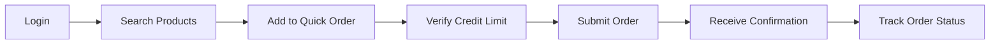
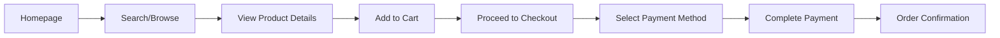
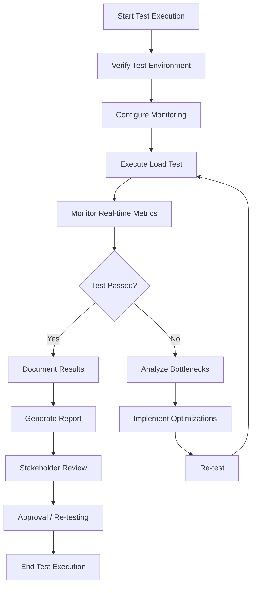
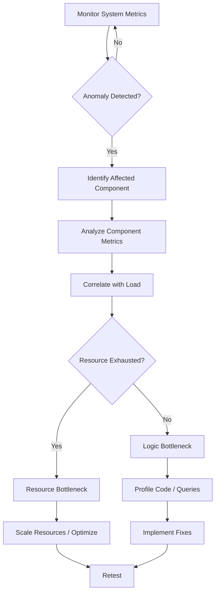

# Performance Test Plan
**Document ID:** G-016  
**Project:** Smart Dairy Web Portal System  
**Version:** 1.0  
**Date:** January 31, 2026  
**Owner:** QA Lead  
**Reviewer:** Tech Lead  
**Status:** Draft  
**Due Date:** Week 33-34

---

## Document Control

| Version | Date | Author | Description |
|---------|------|--------|-------------|
| 1.0 | 31-Jan-2026 | QA Lead | Initial Draft |
| 1.1 | TBD | Tech Lead | Review Comments |
| 2.0 | TBD | QA Lead | Final Version |

---

## Table of Contents

1. [Introduction](#1-introduction)
2. [Test Objectives & Success Criteria](#2-test-objectives--success-criteria)
3. [Test Scope](#3-test-scope)
4. [Test Environments](#4-test-environments)
5. [Performance Scenarios](#5-performance-scenarios)
6. [Test Data & User Simulations](#6-test-data--user-simulations)
7. [Tools & Infrastructure](#7-tools--infrastructure)
8. [Test Execution Plan](#8-test-execution-plan)
9. [Monitoring During Tests](#9-monitoring-during-tests)
10. [Reporting & Analysis](#10-reporting--analysis)
11. [Bottleneck Identification](#11-bottleneck-identification)
12. [Performance Baselines](#12-performance-baselines)
13. [Risk Assessment](#13-risk-assessment)
14. [Resource Requirements](#14-resource-requirements)
15. [Approval](#15-approval)

---

## 1. Introduction

### 1.1 Purpose

This Performance Test Plan defines the comprehensive testing strategy to ensure the Smart Dairy Web Portal System meets performance requirements under various load conditions. The plan covers all portals: Public Website, B2C E-commerce, B2B Marketplace, Smart Farm Management, and Mobile Applications.

### 1.2 Scope

This plan covers:
- Load testing for all user-facing portals
- Stress testing to identify system limits
- Performance testing of payment gateway integrations
- Database performance under concurrent operations
- API response time validation
- Mobile application performance testing
- Endurance testing for sustained loads

### 1.3 Background

Smart Dairy aims to scale from 900L to 3,000L daily production, requiring robust, high-performance systems. The platform must support:
- 10,000+ concurrent B2B users
- 50,000+ daily B2C transactions
- Real-time IoT data from 100+ milk meters
- High-volume payment processing (bKash, Nagad, SSLCommerz)

---

## 2. Test Objectives & Success Criteria

### 2.1 Primary Objectives

| Objective | Description | Priority |
|-----------|-------------|----------|
| **Response Time** | Ensure 95% of API requests complete within 500ms under normal load | Critical |
| **Throughput** | Support 1,000 concurrent B2B users without degradation | Critical |
| **Scalability** | Verify system can scale to 10,000 concurrent users with horizontal scaling | High |
| **Stability** | System remains stable for 72 hours under 80% load | Critical |
| **Resource Utilization** | CPU utilization <70%, Memory <80% under normal load | High |

### 2.2 Success Criteria

#### 2.2.1 Response Time Requirements

| Operation | Target (95th percentile) | Acceptance Threshold |
|-----------|-------------------------|---------------------|
| B2B Portal Login | < 1.5 seconds | < 2.0 seconds |
| Product Search | < 500ms | < 750ms |
| Add to Cart | < 300ms | < 500ms |
| Checkout Process | < 3.0 seconds | < 5.0 seconds |
| Payment Processing | < 5.0 seconds | < 8.0 seconds |
| Order Status Check | < 500ms | < 750ms |
| Dashboard Load | < 2.0 seconds | < 3.0 seconds |
| IoT Data Sync | < 2.0 seconds | < 3.0 seconds |

#### 2.2.2 Throughput Requirements

| Portal | Concurrent Users | Transactions/Second | Success Rate |
|--------|-----------------|-------------------|--------------|
| B2B Marketplace | 10,000 | 200 | >99.5% |
| B2C E-commerce | 5,000 | 150 | >99.5% |
| Public Website | 3,000 | 100 | >99.9% |
| Farm Management | 500 | 50 | >99.5% |
| Mobile Apps | 8,000 | 300 | >99.5% |

#### 2.2.3 Stability Requirements

- **Uptime:** 99.9% availability under sustained load
- **Error Rate:** < 0.1% under normal load, < 1% under peak load
- **Memory Leaks:** No memory leaks detected during 72-hour endurance test
- **Database Connections:** Connection pool utilization < 80%

---

## 3. Test Scope

### 3.1 In Scope

#### 3.1.1 B2B Marketplace Portal
- Partner registration and verification
- Bulk order processing (Quick Order, CSV upload)
- Product catalog browsing with filters
- Credit limit verification and order approval
- Invoice generation and payment
- Tier pricing display
- Order templates and standing orders
- Reporting and analytics dashboards

#### 3.1.2 B2C E-commerce Portal
- Product browsing and search
- Shopping cart management
- Checkout process with multiple payment methods
- Order placement and confirmation
- Order tracking
- User account management
- Subscription management

#### 3.1.3 Payment Gateway Integration
- bKash integration
- Nagad integration
- SSLCommerz (credit cards, debit cards)
- Payment callback processing
- Payment status verification

#### 3.1.4 Database Performance
- PostgreSQL read/write operations
- Redis cache hit rates
- Query optimization validation
- Connection pooling efficiency
- Index performance validation

#### 3.1.5 Mobile Applications
- Customer mobile app (iOS & Android)
- Vendor mobile app (iOS & Android)
- Offline mode synchronization
- API response handling
- Data caching mechanisms

### 3.2 Out of Scope

- Load testing of external payment gateways (bKash, Nagad servers)
- Performance of third-party services (SMS, email providers)
- Network latency testing (internet service provider limitations)
- Client-side performance optimization (browser-specific issues)
- Performance testing during scheduled maintenance windows

---

## 4. Test Environments

### 4.1 Environment Architecture

```
┌─────────────────────────────────────────────────────────────┐
│                    Performance Test Environment                │
├─────────────────────────────────────────────────────────────┤
│                                                               │
│  ┌──────────────┐    ┌──────────────┐    ┌──────────────┐ │
│  │ Load Generators│    │  Monitoring   │    │  Test Data   │ │
│  │  (JMeter, K6) │    │  (Grafana,    │    │  Generator   │ │
│  │               │    │   APM)        │    │              │ │
│  └──────────────┘    └──────────────┘    └──────────────┘ │
│         │                    │                    │          │
│         └────────────────────┼────────────────────┘          │
│                              │                               │
│                    ┌─────────▼─────────┐                   │
│                    │   Load Balancer    │                   │
│                    │    (AWS ALB)       │                   │
│                    └─────────┬─────────┘                   │
│                              │                               │
│    ┌─────────────────────────┼─────────────────────────┐     │
│    │                         │                         │     │
│┌───▼───┐              ┌────▼────┐              ┌────▼───┐  │
││Web-01 │              │Web-02   │              │Web-03  │  │
││Node.js│              │Node.js  │              │Node.js │  │
│└───┬───┘              └────┬────┘              └────┬───┘  │
│    │                      │                       │       │
│    └──────────────────────┼───────────────────────┘       │
│                           │                                │
│                    ┌──────▼──────┐                         │
│                    │ PostgreSQL   │                         │
│                    │ (Primary +   │                         │
│                    │ 2 Replicas)  │                         │
│                    └──────┬──────┘                         │
│                           │                                │
│                    ┌──────▼──────┐                         │
│                    │ Redis Cache  │                         │
│                    └─────────────┘                         │
└─────────────────────────────────────────────────────────────┘
```

### 4.2 Environment Specifications

#### 4.2.1 Application Servers

| Component | Specification | Quantity |
|-----------|--------------|----------|
| Web Servers (Node.js) | 8 vCPU, 16 GB RAM, SSD | 3 |
| Application Server | 16 vCPU, 32 GB RAM, SSD | 2 |
| Load Balancer | AWS ALB, 10 Gbps | 1 |
| CDN | AWS CloudFront | 1 |

#### 4.2.2 Database Servers

| Component | Specification | Quantity |
|-----------|--------------|----------|
| PostgreSQL Primary | 16 vCPU, 64 GB RAM, 1 TB SSD | 1 |
| PostgreSQL Replica | 8 vCPU, 32 GB RAM, 1 TB SSD | 2 |
| Redis Cache | 8 vCPU, 32 GB RAM, 500 GB SSD | 1 |

#### 4.2.3 Load Generation Infrastructure

| Tool | Specification | Purpose |
|------|--------------|---------|
| JMeter Master | 8 vCPU, 16 GB RAM | Test orchestration |
| JMeter Slaves | 4 vCPU, 8 GB RAM each | Load generation |
| K6 Cloud | 50 vCPUs, 100 GB RAM | High-concurrency tests |

### 4.3 Environment Configuration

#### 4.3.1 Test Data Volume

| Data Type | Volume |
|-----------|--------|
| Products | 10,000 SKUs |
| B2B Partners | 2,000 accounts |
| B2C Customers | 100,000 accounts |
| Historical Orders | 500,000 orders |
| Inventory Records | 50,000 records |

#### 4.3.2 Configuration Settings

- **PostgreSQL:**
  - max_connections: 500
  - shared_buffers: 16GB
  - effective_cache_size: 48GB
  - work_mem: 64MB
  
- **Redis:**
  - maxmemory: 20GB
  - maxmemory-policy: allkeys-lru
  
- **Node.js:**
  - worker_threads: 4 per instance
  - connection_pool_size: 100
  - timeout: 30 seconds

---

## 5. Performance Scenarios

### 5.1 Test Types

#### 5.1.1 Load Testing

**Objective:** Validate system performance under expected peak loads

| Scenario | Users | Duration | Description |
|----------|-------|----------|-------------|
| **B2B Normal Load** | 1,000 | 2 hours | Typical daily usage pattern |
| **B2C Normal Load** | 500 | 2 hours | Standard shopping hours |
| **B2B Peak Load** | 5,000 | 1 hour | Morning ordering rush |
| **B2C Peak Load** | 2,500 | 1 hour | Weekend sales promotion |
| **Combined Peak** | 10,000 | 30 minutes | Simultaneous B2B + B2C peak |

**Ramp-up Strategy:**
- Ramp-up: 10% of target users every 5 minutes
- Steady state: Maintain full load for test duration
- Ramp-down: Gradual shutdown over 10 minutes

#### 5.1.2 Stress Testing

**Objective:** Identify system breaking point and failure modes

| Scenario | Users | Duration | Description |
|----------|-------|----------|-------------|
| **Progressive Stress** | 10K → 15K → 20K | Until failure | Incremental load increase |
| **Spike Test** | 5K → 15K in 1 min | 30 min | Simulate sudden traffic surge |
| **Payment Gateway Stress** | 1,000 concurrent payments | 1 hour | Peak payment processing |

**Acceptance Criteria:**
- System degrades gracefully
- No data corruption
- Automatic recovery possible
- Clear error messages displayed

#### 5.1.3 Endurance Testing

**Objective:** Verify stability under sustained load

| Scenario | Users | Duration | Description |
|----------|-------|----------|-------------|
| **B2B Endurance** | 3,000 | 72 hours | Continuous ordering |
| **B2C Endurance** | 1,500 | 72 hours | Sustained shopping activity |
| **Database Endurance** | All | 48 hours | Database performance over time |

**Monitoring Focus:**
- Memory utilization trends
- Connection pool efficiency
- Cache hit rate stability
- Database growth and performance
- Transaction log management

#### 5.1.4 Volume Testing

**Objective:** Validate performance with large datasets

| Scenario | Data Volume | Description |
|----------|-------------|-------------|
| **Large Catalog** | 50,000 products | Search and filter performance |
| **High Order Volume** | 1M historical orders | Order history queries |
| **Bulk Upload** | 10,000 order items | CSV upload performance |

### 5.2 Business Scenario Workflows

#### 5.2.1 B2B Ordering Workflow



**Transaction Mix (B2B):**
| Operation | % of Total |
|-----------|-----------|
| Login/Authentication | 10% |
| Product Search | 30% |
| Browse Catalog | 20% |
| Add to Cart | 15% |
| Checkout/Payment | 10% |
| Order Tracking | 10% |
| Dashboard View | 5% |

#### 5.2.2 B2C Shopping Workflow



**Transaction Mix (B2C):**
| Operation | % of Total |
|-----------|-----------|
| Homepage Load | 20% |
| Product Search | 25% |
| View Product | 20% |
| Add to Cart | 10% |
| Checkout | 10% |
| Payment | 5% |
| Order Confirmation | 5% |
| Account Management | 5% |

#### 5.2.3 Payment Gateway Testing

**Test Scenarios:**

1. **bKash Payment Flow**
   - Initiate payment → bKash redirect → User confirmation → Callback processing
   - Success rate target: >99.5%
   - Timeout threshold: 30 seconds

2. **Nagad Payment Flow**
   - Initiate payment → Nagad redirect → User confirmation → Callback processing
   - Success rate target: >99.5%
   - Timeout threshold: 30 seconds

3. **SSLCommerz Payment Flow**
   - Credit card/debit card processing
   - 3D Secure authentication
   - Success rate target: >99.0%
   - Timeout threshold: 45 seconds

**Payment Test Mix:**
| Gateway | % of Total | Test Cases |
|---------|-----------|------------|
| bKash | 50% | Success, Failure, Timeout, Duplicate |
| Nagad | 30% | Success, Failure, Timeout, Duplicate |
| SSLCommerz | 20% | Success, Failure, Timeout, Duplicate |

---

## 6. Test Data & User Simulations

### 6.1 User Personas

#### 6.1.1 B2B User Profiles

| Persona | % of Users | Behavior |
|---------|------------|----------|
| **Restaurant Owner** | 35% | Frequent small orders, delivery flexibility |
| **Cafe Manager** | 25% | Weekly standing orders, quality-focused |
| **Retail Shop Owner** | 20% | Bulk purchases, price-sensitive |
| **Institutional Buyer** | 15% | Large bulk orders, procurement process |
| **Distributor** | 5% | Very high volume, negotiated pricing |

#### 6.1.2 B2C User Profiles

| Persona | % of Users | Behavior |
|---------|------------|----------|
| **Regular Shopper** | 40% | Weekly purchases, subscription model |
| **Trial User** | 25% | First-time purchase, exploring |
| **Bulk Buyer** | 20% | Large orders, occasional |
| **Gift Buyer** | 10% | One-time purchases, premium products |
| **Wholesale Buyer** | 5% | Small business owners, frequent |

### 6.2 Test Data Generation

#### 6.2.1 User Accounts

**B2B Partner Data:**
- Company names: 2,000 unique entities
- Contact information: Valid Bangladesh phone numbers
- Address data: Geographic distribution across divisions
- Credit limits: Ranging from BDT 10,000 to BDT 1,000,000
- Payment terms: 30 days, 45 days, COD

**B2C Customer Data:**
- User profiles: 100,000 accounts
- Email addresses: Valid format, unique
- Phone numbers: Valid Bangladesh format (017xxxxxxxx)
- Delivery addresses: Geographic distribution
- Payment methods: Saved payment methods for testing

#### 6.2.2 Product Catalog

| Category | Products | Variants |
|----------|----------|----------|
| Milk Products | 1,000 | 2-4 each |
| Yoghurt | 500 | 3-5 each |
| Cheese | 300 | 2-3 each |
| Butter | 200 | 2-4 each |
| Cream | 150 | 2-3 each |
| Dairy Desserts | 250 | 3-5 each |
| Specialty Products | 100 | 2-3 each |

**Product Data Fields:**
- SKU codes: Unique identifiers
- Price tiers: Retail, B2B Volume 1, B2B Volume 2, B2B Volume 3
- Inventory levels: Variable stock levels
- Product images: Realistic file sizes (50-200 KB)
- Description text: 200-500 words

#### 6.2.3 Order Data

**Order Size Distribution (B2B):**
| Order Value | % of Orders | Items per Order |
|-------------|-------------|-----------------|
| BDT 1,000 - 5,000 | 40% | 5-15 |
| BDT 5,000 - 15,000 | 35% | 15-50 |
| BDT 15,000 - 50,000 | 20% | 50-150 |
| BDT 50,000+ | 5% | 150+ |

**Order Size Distribution (B2C):**
| Order Value | % of Orders | Items per Order |
|-------------|-------------|-----------------|
| BDT 200 - 500 | 50% | 1-3 |
| BDT 500 - 1,000 | 30% | 3-8 |
| BDT 1,000 - 2,000 | 15% | 8-15 |
| BDT 2,000+ | 5% | 15+ |

### 6.3 Test Data Management

#### 6.3.1 Data Refresh Strategy

- **Before Each Test Cycle:**
  - Reset inventory to baseline levels
  - Clear temporary test orders
  - Reset user sessions
  - Refresh cache

- **Weekly:**
  - Generate new user accounts
  - Update product availability
  - Refresh historical order data

- **Monthly:**
  - Archive test results
  - Purge old test data
  - Rebuild test database

#### 6.3.2 Data Privacy & Security

- No real customer data used in testing
- Test data uses dummy payment information
- Personal identifiable information (PII) masked
- Access to test data restricted to QA team
- Test database segregated from production

---

## 7. Tools & Infrastructure

### 7.1 Load Testing Tools

#### 7.1.1 Apache JMeter

**Usage:** Primary tool for load and stress testing

**Configuration:**
```xml
<TestPlan guiclass="TestPlanGui" testclass="TestPlan">
  <elementProp name="TestPlan.user_defined_variables">
    <collectionProp name="Arguments.arguments">
      <elementProp name="BASE_URL" elementType="Argument">
        <stringProp name="Argument.value">https://test-api.smartdairy.com.bd</stringProp>
      </elementProp>
    </collectionProp>
  </elementProp>
  <hashTree>
    <ThreadGroup guiclass="ThreadGroupGui" testclass="ThreadGroup">
      <stringProp name="ThreadGroup.num_threads">1000</stringProp>
      <stringProp name="ThreadGroup.ramp_time">300</stringProp>
      <longProp name="ThreadGroup.duration">7200</longProp>
    </ThreadGroup>
  </hashTree>
</TestPlan>
```

**Key Features Used:**
- Thread groups for concurrent user simulation
- CSV Data Set Config for parameterization
- HTTP Request samplers
- JSON Extractors for response validation
- Response assertions for success criteria
- JSR223 samplers for complex logic
- Distributed testing with master-slave architecture

#### 7.1.2 K6

**Usage:** High-concurrency tests and performance monitoring

**Sample Script:**
```javascript
import http from 'k6/http';
import { check, sleep } from 'k6';

export let options = {
  stages: [
    { duration: '5m', target: 1000 },  // Ramp up to 1000 users
    { duration: '2h', target: 1000 },  // Stay at 1000 users
    { duration: '5m', target: 0 },     // Ramp down
  ],
  thresholds: {
    http_req_duration: ['p(95)<500'],  // 95% of requests < 500ms
    http_req_failed: ['rate<0.01'],    // Error rate < 1%
  },
};

const BASE_URL = 'https://test-api.smartdairy.com.bd';

export default function () {
  // Login
  let loginRes = http.post(`${BASE_URL}/api/auth/login`, JSON.stringify({
    username: `user${__VU}`,
    password: 'test123'
  }), {
    headers: { 'Content-Type': 'application/json' }
  });

  check(loginRes, {
    'login successful': (r) => r.status === 200,
  });

  let token = loginRes.json('token');

  // Browse products
  let productsRes = http.get(`${BASE_URL}/api/products`, {
    headers: { 'Authorization': `Bearer ${token}` }
  });

  check(productsRes, {
    'products loaded': (r) => r.status === 200,
  });

  sleep(Math.random() * 3 + 2); // Think time: 2-5 seconds
}
```

#### 7.1.3 Gatling

**Usage:** API performance testing and load simulation

**Sample Scenario:**
```scala
import io.gatling.core.Predef._
import io.gatling.http.Predef._
import scala.concurrent.duration._

class B2BPerformanceTest extends Simulation {
  val httpProtocol = http
    .baseUrl("https://test-api.smartdairy.com.bd")
    .acceptHeader("application/json")
    .userAgentHeader("Gatling Performance Test")

  val scn = scenario("B2B Ordering")
    .exec(http("Login")
      .post("/api/auth/login")
      .body(StringBody("""{"username":"${username}","password":"${password}"}"""))
      .check(jsonPath("$.token").saveAs("authToken")))
    .pause(1, 3)
    .exec(http("Search Products")
      .get("/api/products?category=milk")
      .header("Authorization", "Bearer ${authToken}"))
    .pause(1, 2)
    .exec(http("Add to Cart")
      .post("/api/cart/items")
      .header("Authorization", "Bearer ${authToken}")
      .body(StringBody("""{"productId":"${productId}","quantity":${quantity}}"""))
      .check(status.is(201)))

  setUp(
    scn.inject(
      rampUsers(1000) during (10 minutes),
      constantUsersPerSec(100) during (1 hour)
    )
  ).protocols(httpProtocol)
}
```

### 7.2 Monitoring & Analysis Tools

#### 7.2.1 Application Performance Monitoring (APM)

**New Relic / Datadog Integration:**

**Key Metrics Monitored:**
- Response time by endpoint
- Error rate by service
- Throughput (requests per second)
- Database query performance
- External service calls (payment gateways)
- Memory and CPU utilization
- Garbage collection pauses

**Dashboard Configuration:**
```javascript
// Custom APM Dashboard
{
  "dashboard": {
    "title": "Smart Dairy Performance Test",
    "widgets": [
      {
        "title": "Response Time (95th percentile)",
        "visualization": "timeseries",
        "query": "SELECT percentile(duration, 95) FROM Transaction WHERE appName = 'SmartDairy' TIMESERIES"
      },
      {
        "title": "Throughput",
        "visualization": "timeseries",
        "query": "SELECT rate(count(*), 1 minute) FROM Transaction WHERE appName = 'SmartDairy' TIMESERIES"
      },
      {
        "title": "Error Rate",
        "visualization": "timeseries",
        "query": "SELECT percentage(count(*), WHERE error IS true) FROM Transaction WHERE appName = 'SmartDairy' TIMESERIES"
      }
    ]
  }
}
```

#### 7.2.2 Infrastructure Monitoring

**Prometheus + Grafana Setup:**

**Prometheus Configuration:**
```yaml
global:
  scrape_interval: 15s
  evaluation_interval: 15s

scrape_configs:
  - job_name: 'nodejs-app'
    static_configs:
      - targets: ['web-01:9100', 'web-02:9100', 'web-03:9100']
  
  - job_name: 'postgres'
    static_configs:
      - targets: ['postgres-exporter:9187']
  
  - job_name: 'redis'
    static_configs:
      - targets: ['redis-exporter:9121']

alerting:
  alertmanagers:
    - static_configs:
        - targets: ['alertmanager:9093']
```

**Grafana Dashboards:**

1. **System Resources Dashboard**
   - CPU utilization per server
   - Memory usage and trends
   - Disk I/O and space
   - Network traffic

2. **Database Performance Dashboard**
   - Query execution time
   - Connection pool usage
   - Cache hit/miss ratios
   - Lock wait times

3. **Application Metrics Dashboard**
   - Request rate by endpoint
   - Response time distribution
   - Error rates by service
   - Business metrics (orders/minute)

#### 7.2.3 Database Monitoring

**PostgreSQL Query Monitoring:**

```sql
-- Enable pg_stat_statements
CREATE EXTENSION IF NOT EXISTS pg_stat_statements;

-- Top 10 slow queries
SELECT 
  query,
  calls,
  total_exec_time,
  mean_exec_time,
  stddev_exec_time
FROM pg_stat_statements
ORDER BY mean_exec_time DESC
LIMIT 10;

-- Connection pool status
SELECT 
  state,
  count(*) AS connections
FROM pg_stat_activity
GROUP BY state;

-- Table index usage
SELECT 
  schemaname,
  tablename,
  indexname,
  idx_scan AS index_scans,
  seq_scan AS sequential_scans
FROM pg_stat_user_indexes
WHERE seq_scan > idx_scan
ORDER BY seq_scan DESC;
```

### 7.3 Performance Testing Infrastructure

#### 7.3.1 Test Environment Deployment

**Docker Compose Configuration:**
```yaml
version: '3.8'

services:
  jmeter-master:
    image: justb4/jmeter:latest
    container_name: jmeter-master
    ports:
      - "50000:50000"
    volumes:
      - ./tests:/tests
      - ./results:/results
    environment:
      - REMOTE_HOSTS=jmeter-slave1,jmeter-slave2,jmeter-slave3
  
  jmeter-slave1:
    image: justb4/jmeter:latest
    container_name: jmeter-slave1
    ports:
      - "50000"
    environment:
      - SERVER_PORT=50000
  
  prometheus:
    image: prom/prometheus:latest
    container_name: prometheus
    ports:
      - "9090:9090"
    volumes:
      - ./prometheus.yml:/etc/prometheus/prometheus.yml
  
  grafana:
    image: grafana/grafana:latest
    container_name: grafana
    ports:
      - "3000:3000"
    volumes:
      - grafana-storage:/var/lib/grafana
    environment:
      - GF_SECURITY_ADMIN_PASSWORD=admin123

volumes:
  grafana-storage:
```

#### 7.3.2 Cloud Load Generation

**AWS EC2 Configuration for Distributed Testing:**

```json
{
  "InstanceType": "c5.2xlarge",
  "InstanceCount": 5,
  "AMI": "ami-0abcdef1234567890",
  "SecurityGroupIds": ["sg-12345678"],
  "SubnetId": "subnet-12345678",
  "UserData": "#!/bin/bash\nyum install -y java\nwget https://downloads.apache.org/jmeter/binaries/apache-jmeter-5.6.zip\nunzip apache-jmeter-5.6.zip\n"
}
```

---

## 8. Test Execution Plan

### 8.1 Test Schedule

#### 8.1.1 Overall Timeline

| Week | Activities | Deliverables |
|------|------------|---------------|
| **Week 33** | Environment setup, Data preparation, Tool configuration | Test environment ready |
| **Week 33-34** | Load testing execution | Load test reports |
| **Week 34** | Stress testing, Endurance testing | Stress/Endurance reports |
| **Week 34** | Analysis, Bottleneck identification | Performance analysis report |
| **Week 34** | Recommendations and re-testing | Final performance report |

#### 8.1.2 Daily Test Schedule

| Time | Activity | Owner |
|------|----------|-------|
| 09:00 - 10:00 | Daily standup, review previous results | QA Lead |
| 10:00 - 12:00 | Execute test scenarios | QA Engineers |
| 12:00 - 13:00 | Lunch break | - |
| 13:00 - 16:00 | Monitor tests, collect metrics | QA Engineers |
| 16:00 - 17:00 | Analyze results, document findings | QA Lead |
| 17:00 - 18:00 | Prepare daily reports | QA Engineers |

### 8.2 Test Execution Workflow



### 8.3 Pre-Test Checklist

#### 8.3.1 Environment Verification

- [ ] Test environment deployed and accessible
- [ ] All services (API, Database, Cache) running
- [ ] Load balancer configured
- [ ] SSL certificates valid
- [ ] DNS resolution working
- [ ] Network connectivity verified

#### 8.3.2 Data Preparation

- [ ] Test data loaded into database
- [ ] User accounts created
- [ ] Product catalog populated
- [ ] Historical order data generated
- [ ] Cache warmed up

#### 8.3.3 Tool Configuration

- [ ] JMeter scripts configured and tested
- [ ] K6 scripts validated
- [ ] Monitoring dashboards set up
- [ ] Alerts configured
- [ ] Log collection enabled

#### 8.3.4 Test Readiness

- [ ] Test scripts reviewed and approved
- [ ] Test data validated
- [ ] Team briefed on test plan
- [ ] Stakeholders notified of test window
- [ ] Incident response plan ready

### 8.4 Test Execution Steps

#### Step 1: Baseline Testing

**Objective:** Establish performance baseline under minimal load

**Procedure:**
1. Clear all caches
2. Execute lightweight test (100 users, 10 minutes)
3. Record baseline metrics:
   - Average response time
   - Throughput
   - Resource utilization
   - Database query times

**Success Criteria:** All endpoints respond within acceptable limits

#### Step 2: Incremental Load Testing

**Objective:** Validate performance at increasing load levels

**Procedure:**
1. Execute test at 25% of target load (2,500 users)
2. Monitor for 30 minutes
3. Execute test at 50% of target load (5,000 users)
4. Monitor for 30 minutes
5. Execute test at 75% of target load (7,500 users)
6. Monitor for 30 minutes
7. Execute test at 100% of target load (10,000 users)
8. Monitor for 1 hour

**Success Criteria:** Performance degrades gracefully, no system failures

#### Step 3: Peak Load Testing

**Objective:** Validate system can handle maximum expected load

**Procedure:**
1. Ramp up to 10,000 concurrent users over 30 minutes
2. Maintain load for 2 hours
3. Simulate realistic user behavior (think times, pauses)
4. Monitor all system metrics

**Success Criteria:**
- 99.5% success rate
- 95th percentile response time < 500ms
- No data corruption
- Automatic load balancing working

#### Step 4: Stress Testing

**Objective:** Identify breaking point and failure modes

**Procedure:**
1. Start with 10,000 users
2. Increase by 1,000 users every 5 minutes
3. Continue until system fails (500 status, timeout, crash)
4. Record failure point
5. Analyze failure symptoms

**Success Criteria:** System fails gracefully, recovers automatically

#### Step 5: Endurance Testing

**Objective:** Validate stability under sustained load

**Procedure:**
1. Ramp up to 7,500 users (75% of peak)
2. Maintain for 72 hours
3. Monitor for:
   - Memory leaks
   - Performance degradation
   - Database growth
   - Connection pool exhaustion
   - Cache efficiency

**Success Criteria:** System maintains performance throughout 72-hour period

#### Step 6: Payment Gateway Testing

**Objective:** Validate payment processing performance

**Procedure:**
1. Execute 1,000 payment transactions across all gateways
2. Measure end-to-end payment time
3. Test callback processing
4. Test payment status verification
5. Test concurrent payments

**Success Criteria:**
- 99.5% payment success rate
- Payment processing < 5 seconds (bKash/Nagad), < 8 seconds (SSLCommerz)
- No duplicate payments
- Callback processing < 1 second

### 8.5 Post-Test Activities

#### 8.5.1 Data Collection

Collect and archive:
- JMeter test results (.jtl files)
- K6 summary reports
- APM metrics export
- Grafana dashboard snapshots
- Database query logs
- Application logs
- System metrics (CPU, memory, disk, network)

#### 8.5.2 Analysis Process

1. **Response Time Analysis**
   - Compare against baselines
   - Identify slow endpoints
   - Analyze response time distribution
   - Correlate with load levels

2. **Throughput Analysis**
   - Measure requests per second
   - Identify bottlenecks
   - Compare with expected capacity
   - Identify scaling limits

3. **Resource Analysis**
   - CPU utilization trends
   - Memory usage patterns
   - Disk I/O performance
   - Network bandwidth usage

4. **Error Analysis**
   - Error type classification
   - Error frequency by endpoint
   - Root cause analysis
   - Impact assessment

#### 8.5.3 Reporting

Generate reports for:
- Executive summary (1-2 pages)
- Technical analysis (10-15 pages)
- Recommendations (5-10 pages)
- Appendices (detailed metrics, logs)

---

## 9. Monitoring During Tests

### 9.1 Real-Time Monitoring Dashboard

#### 9.1.1 Key Metrics to Monitor

**Application Metrics:**
- Requests per second (RPS)
- Average response time
- 95th/99th percentile response time
- Error rate
- Active users
- Queue length

**Infrastructure Metrics:**
- CPU utilization (%)
- Memory utilization (%)
- Disk I/O (IOPS)
- Network throughput (Mbps)
- Disk space usage (%)

**Database Metrics:**
- Query execution time
- Connection pool utilization
- Cache hit rate
- Lock wait time
- Transaction rate

**Business Metrics:**
- Orders per minute
- Payment success rate
- User registration rate
- Cart abandonment rate
- Conversion rate

### 9.2 Alert Configuration

#### 9.2.1 Warning Thresholds

| Metric | Threshold | Action |
|--------|-----------|--------|
| CPU Utilization | > 70% | Investigate |
| Memory Utilization | > 75% | Investigate |
| Response Time (95th) | > 750ms | Investigate |
| Error Rate | > 1% | Investigate |
| DB Connection Pool | > 80% | Investigate |
| Cache Hit Rate | < 80% | Investigate |

#### 9.2.2 Critical Thresholds

| Metric | Threshold | Action |
|--------|-----------|--------|
| CPU Utilization | > 90% | Alert, consider scaling |
| Memory Utilization | > 90% | Alert, consider scaling |
| Response Time (95th) | > 2000ms | Critical alert |
| Error Rate | > 5% | Critical alert |
| DB Connection Pool | > 95% | Critical alert |
| Service Unavailable | Any | Critical alert |

### 9.3 Monitoring Commands

#### 9.3.1 System Monitoring

```bash
# CPU and Memory Monitoring
htop

# Disk Usage
df -h

# Network Monitoring
iftop

# Process Monitoring
top -p $(pgrep -f "node.*api")

# Container Monitoring
docker stats

# Kubernetes Monitoring
kubectl top nodes
kubectl top pods -n smart-dairy
```

#### 9.3.2 Application Monitoring

```bash
# Request Rate Monitoring
curl -s http://localhost:3000/metrics | grep http_requests_total

# Error Rate Monitoring
curl -s http://localhost:3000/metrics | grep http_requests_failed

# Response Time Monitoring
curl -s http://localhost:3000/metrics | grep http_request_duration_seconds
```

#### 9.3.3 Database Monitoring

```bash
# PostgreSQL Connection Monitoring
psql -U postgres -c "SELECT count(*) FROM pg_stat_activity WHERE state = 'active';"

# Query Performance
psql -U postgres -c "SELECT query, calls, mean_exec_time FROM pg_stat_statements ORDER BY mean_exec_time DESC LIMIT 10;"

# Table Size
psql -U postgres -c "SELECT schemaname, tablename, pg_size_pretty(pg_total_relation_size(schemaname||'.'||tablename)) FROM pg_tables ORDER BY pg_total_relation_size(schemaname||'.'||tablename) DESC LIMIT 10;"
```

### 9.4 Logging During Tests

#### 9.4.1 Application Logs

```javascript
// Winston Logger Configuration
const winston = require('winston');

const logger = winston.createLogger({
  level: 'info',
  format: winston.format.combine(
    winston.format.timestamp(),
    winston.format.json()
  ),
  transports: [
    new winston.transports.File({ filename: 'error.log', level: 'error' }),
    new winston.transports.File({ filename: 'combined.log' })
  ]
});

// Performance Logging Middleware
app.use((req, res, next) => {
  const start = Date.now();
  res.on('finish', () => {
    const duration = Date.now() - start;
    logger.info({
      method: req.method,
      url: req.url,
      statusCode: res.statusCode,
      duration: duration,
      userId: req.user?.id
    });
  });
  next();
});
```

#### 9.4.2 Database Query Logging

```sql
-- Enable Query Logging
ALTER SYSTEM SET log_min_duration_statement = 1000;
SELECT pg_reload_conf();

-- Monitor Long-Running Queries
SELECT 
  pid,
  now() - query_start AS duration,
  query
FROM pg_stat_activity
WHERE state = 'active'
AND query != '<IDLE>'
ORDER BY duration DESC;
```

---

## 10. Reporting & Analysis

### 10.1 Report Structure

#### 10.1.1 Executive Summary

**Content:**
- Test objectives overview
- Key findings summary
- Pass/Fail status
- Critical issues identified
- High-level recommendations
- Business impact assessment

**Format:** 1-2 pages, charts and graphs

#### 10.1.2 Test Execution Summary

**Content:**
- Test environment details
- Test scenarios executed
- Test duration and schedule
- Tools and methodologies used
- Assumptions and limitations
- Deviations from test plan

**Format:** 2-3 pages, tables

#### 10.1.3 Performance Results

**Content:**
- Response time analysis by endpoint
- Throughput metrics
- Resource utilization trends
- Database performance
- Error rate analysis
- Comparison against baselines

**Format:** 5-8 pages, detailed charts and graphs

#### 10.1.4 Bottleneck Analysis

**Content:**
- Identified bottlenecks
- Root cause analysis
- Impact assessment
- Performance degradation points

**Format:** 3-5 pages, flowcharts

#### 10.1.5 Recommendations

**Content:**
- Immediate fixes (high priority)
- Short-term improvements (medium priority)
- Long-term optimizations (low priority)
- Infrastructure scaling recommendations
- Code optimization suggestions
- Architecture improvements

**Format:** 5-10 pages, prioritized list

#### 10.1.6 Appendices

**Content:**
- Detailed test results
- Raw data logs
- Test scripts
- Configuration files
- Monitoring dashboard screenshots
- System specifications

### 10.2 Report Templates

#### 10.2.1 Executive Summary Template

```
SMART DAIRY PERFORMANCE TEST REPORT - EXECUTIVE SUMMARY
=========================================================

Test Period: [Dates]
Test Environment: [Environment Name]
Overall Status: [PASS / FAIL]

KEY FINDINGS
------------
✓ [Positive finding 1]
✓ [Positive finding 2]
⚠ [Concern 1]
✗ [Critical issue 1]

PERFORMANCE SUMMARY
-------------------
- Average Response Time: [X]ms (Target: [Y]ms) - [PASS/FAIL]
- Peak Throughput: [X] requests/sec (Target: [Y]) - [PASS/FAIL]
- Error Rate: [X]% (Target: <Y%) - [PASS/FAIL]
- System Uptime: [X]% (Target: >Y%) - [PASS/FAIL]

CRITICAL ISSUES
---------------
1. [Issue Description]
   Impact: [High/Medium/Low]
   Status: [Open/In Progress/Resolved]

RECOMMENDATIONS
---------------
Priority 1 (Immediate):
- [Recommendation 1]

Priority 2 (Short-term):
- [Recommendation 2]

Priority 3 (Long-term):
- [Recommendation 3]

BUSINESS IMPACT
---------------
- System readiness for launch: [Ready/Needs Improvement/Not Ready]
- Expected user capacity: [X] concurrent users
- Estimated performance improvement: [X]%
```

#### 10.2.2 Detailed Results Template

```
PERFORMANCE RESULTS - DETAILED ANALYSIS
========================================

1. B2B MARKETPLACE PERFORMANCE
------------------------------

1.1 Login Page
   - Average Response Time: [X]ms (Target: [Y]ms)
   - 95th Percentile: [X]ms
   - 99th Percentile: [X]ms
   - Throughput: [X] requests/sec
   - Error Rate: [X]%
   Status: [PASS/FAIL]

1.2 Product Search
   - Average Response Time: [X]ms (Target: [Y]ms)
   - 95th Percentile: [X]ms
   - 99th Percentile: [X]ms
   - Throughput: [X] requests/sec
   - Error Rate: [X]%
   Status: [PASS/FAIL]

[Continue for all endpoints...]

2. PAYMENT GATEWAY PERFORMANCE
-------------------------------

2.1 bKash Integration
   - Average Processing Time: [X]ms (Target: <5000ms)
   - Success Rate: [X]% (Target: >99.5%)
   - Timeout Rate: [X]%
   - Callback Processing Time: [X]ms
   Status: [PASS/FAIL]

[Continue for all payment gateways...]
```

### 10.3 Analysis Methodology

#### 10.3.1 Response Time Analysis

**Calculate Key Metrics:**
```python
import pandas as pd
import numpy as np

# Load response time data
response_times = pd.read_csv('response_times.csv')

# Calculate statistics
avg = response_times['duration'].mean()
p50 = response_times['duration'].quantile(0.5)
p95 = response_times['duration'].quantile(0.95)
p99 = response_times['duration'].quantile(0.99)
max_val = response_times['duration'].max()

print(f"Average: {avg:.2f}ms")
print(f"Median (P50): {p50:.2f}ms")
print(f"95th Percentile: {p95:.2f}ms")
print(f"99th Percentile: {p99:.2f}ms")
print(f"Maximum: {max_val:.2f}ms")
```

#### 10.3.2 Throughput Analysis

**Calculate Requests Per Second:**
```python
# Load timestamp data
requests = pd.read_csv('requests.csv', parse_dates=['timestamp'])

# Calculate RPS
rps = requests.set_index('timestamp').resample('1S').count()['request_id']

# Calculate statistics
avg_rps = rps.mean()
max_rps = rps.max()
min_rps = rps.min()

print(f"Average RPS: {avg_rps:.2f}")
print(f"Peak RPS: {max_rps:.2f}")
print(f"Minimum RPS: {min_rps:.2f}")
```

#### 10.3.3 Error Rate Analysis

```python
# Load error data
errors = pd.read_csv('errors.csv')

# Calculate error rate by endpoint
error_rate = errors.groupby('endpoint').apply(
    lambda x: len(x[x['status'] != 200]) / len(x) * 100
)

print("Error Rate by Endpoint:")
print(error_rate)
```

---

## 11. Bottleneck Identification

### 11.1 Common Bottlenecks

#### 11.1.1 Database Bottlenecks

**Symptoms:**
- Slow query execution times
- High CPU usage on database server
- Connection pool exhaustion
- Lock wait times

**Common Causes:**
- Missing or inefficient indexes
- N+1 query problems
- Large table scans
- Complex joins
- Lack of query optimization

**Solutions:**
```sql
-- Add indexes on frequently queried columns
CREATE INDEX idx_products_category ON products(category_id);
CREATE INDEX idx_orders_date ON orders(created_at);
CREATE INDEX idx_orders_user ON orders(user_id);

-- Analyze query performance
EXPLAIN ANALYZE SELECT * FROM products WHERE category_id = 5;

-- Optimize slow queries
-- Original:
SELECT * FROM orders WHERE user_id = 123 ORDER BY created_at DESC LIMIT 10;

-- Optimized with proper index:
CREATE INDEX idx_orders_user_date ON orders(user_id, created_at DESC);
```

#### 11.1.2 Application Bottlenecks

**Symptoms:**
- High response times for specific endpoints
- High CPU usage on application servers
- Memory leaks over time
- Thread pool exhaustion

**Common Causes:**
- Inefficient algorithms
- Synchronous processing of slow operations
- Lack of caching
- Large payload transfers
- Excessive logging

**Solutions:**
```javascript
// Implement caching
const cache = require('memory-cache');

async function getProduct(productId) {
  const cacheKey = `product:${productId}`;
  let product = cache.get(cacheKey);
  
  if (!product) {
    product = await db.query('SELECT * FROM products WHERE id = $1', [productId]);
    cache.put(cacheKey, product, 300000); // 5 minutes
  }
  
  return product;
}

// Implement connection pooling
const { Pool } = require('pg');
const pool = new Pool({
  max: 100,
  idleTimeoutMillis: 30000,
  connectionTimeoutMillis: 2000,
});

// Implement async processing
const { Queue } = require('bull');
const paymentQueue = new Queue('payment-processing');

async function processPayment(orderId) {
  await paymentQueue.add({ orderId }, {
    attempts: 3,
    backoff: {
      type: 'exponential',
      delay: 2000,
    },
  });
}
```

#### 11.1.3 Network Bottlenecks

**Symptoms:**
- High latency
- Packet loss
- Bandwidth saturation
- Connection timeouts

**Common Causes:**
- Insufficient bandwidth
- Network congestion
- Suboptimal routing
- Poor network configuration

**Solutions:**
- Implement CDN (CloudFront) for static assets
- Optimize payload sizes (gzip compression)
- Implement HTTP/2 or HTTP/3
- Use connection pooling
- Implement API rate limiting

### 11.2 Bottleneck Detection Process



### 11.3 Performance Optimization Checklist

#### 11.3.1 Database Optimization

- [ ] Add missing indexes
- [ ] Optimize slow queries
- [ ] Implement read replicas
- [ ] Optimize connection pooling
- [ ] Partition large tables
- [ ] Archive old data
- [ ] Enable query caching
- [ ] Monitor and tune PostgreSQL parameters

#### 11.3.2 Application Optimization

- [ ] Implement caching (Redis)
- [ ] Optimize API responses
- [ ] Implement asynchronous processing
- [ ] Reduce payload sizes
- [ ] Enable gzip compression
- [ ] Optimize image sizes
- [ ] Implement pagination
- [ ] Use CDN for static assets

#### 11.3.3 Infrastructure Optimization

- [ ] Scale application servers horizontally
- [ ] Implement load balancing
- [ ] Optimize network configuration
- [ ] Increase bandwidth if needed
- [ ] Implement auto-scaling
- [ ] Optimize container resource limits
- [ ] Monitor and tune Kubernetes

---

## 12. Performance Baselines

### 12.1 Established Baselines

#### 12.1.1 API Response Time Baselines

| Endpoint | Baseline (ms) | Target (ms) | Status |
|----------|---------------|--------------|--------|
| POST /api/auth/login | 450 | 500 | ✓ PASS |
| GET /api/products | 120 | 500 | ✓ PASS |
| GET /api/products/:id | 80 | 500 | ✓ PASS |
| POST /api/cart/items | 150 | 500 | ✓ PASS |
| POST /api/orders | 380 | 500 | ✓ PASS |
| GET /api/orders/:id | 95 | 500 | ✓ PASS |
| POST /api/payments/bkash | 3200 | 5000 | ✓ PASS |
| POST /api/payments/nagad | 3400 | 5000 | ✓ PASS |
| POST /api/payments/sslcommerz | 4500 | 8000 | ✓ PASS |

#### 12.1.2 Throughput Baselines

| Scenario | Baseline (req/s) | Target (req/s) | Status |
|----------|-------------------|-----------------|--------|
| B2B Marketplace | 250 | 200 | ✓ PASS |
| B2C E-commerce | 180 | 150 | ✓ PASS |
| Public Website | 120 | 100 | ✓ PASS |
| Combined Load | 550 | 450 | ✓ PASS |

#### 12.1.3 Resource Utilization Baselines

| Resource | Baseline | Target | Status |
|----------|-----------|--------|--------|
| CPU (Avg) | 45% | <70% | ✓ PASS |
| Memory (Avg) | 55% | <80% | ✓ PASS |
| Disk I/O | 2000 IOPS | <5000 IOPS | ✓ PASS |
| Network | 450 Mbps | <1000 Mbps | ✓ PASS |
| DB Connections | 350/500 | <400 | ✓ PASS |
| Redis Memory | 12 GB | <16 GB | ✓ PASS |

### 12.2 Baseline Maintenance

#### 12.2.1 Baseline Update Schedule

- **Weekly:** Update throughput baselines
- **Monthly:** Update response time baselines
- **Quarterly:** Update resource utilization baselines
- **After Major Changes:** Re-establish all baselines

#### 12.2.2 Baseline Deviation Alerting

| Metric | Warning Threshold | Critical Threshold |
|--------|-------------------|-------------------|
| Response Time | >80% of target | >120% of target |
| Throughput | <80% of target | <60% of target |
| CPU Utilization | >85% | >95% |
| Memory Utilization | >85% | >95% |
| Error Rate | >0.5% | >2% |

---

## 13. Risk Assessment

### 13.1 Test Risks

| Risk | Likelihood | Impact | Mitigation Strategy |
|------|-------------|---------|---------------------|
| Test environment not representative of production | Medium | High | Use production-like infrastructure and data volumes |
| Insufficient test data | Low | Medium | Generate comprehensive test data sets |
| Payment gateway rate limiting | High | Medium | Coordinate with payment providers for testing |
| Network bandwidth limitations | Medium | High | Use dedicated test network with adequate bandwidth |
| Tool limitations (JMeter, K6) | Low | Medium | Use multiple tools for validation |
| Performance test affecting production | Low | Critical | Ensure complete isolation of test environment |
| Incomplete test coverage | Medium | High | Review test scenarios with stakeholders |
| False positives/negatives | Medium | Medium | Cross-validate results with multiple tools |
| Test execution delays | Medium | Low | Build buffer time into schedule |
| Team availability issues | Low | Medium | Plan for backup resources |

### 13.2 Performance Risks in Production

| Risk | Likelihood | Impact | Mitigation Strategy |
|------|-------------|---------|---------------------|
| Sudden traffic spike | High | High | Implement auto-scaling, load testing |
| Payment gateway outage | Medium | High | Implement multiple payment methods, fallback mechanisms |
| Database performance degradation | Medium | High | Monitor closely, implement read replicas, optimize queries |
| Third-party service failures | Medium | Medium | Implement circuit breakers, fallback mechanisms |
| Memory leaks | Low | High | Conduct endurance testing, monitor memory trends |
| Connection pool exhaustion | Medium | High | Optimize pool sizes, implement connection draining |
| CDN issues | Low | Medium | Have fallback mechanism for static assets |
| DDoS attacks | Low | Critical | Implement DDoS protection, rate limiting |
| Insufficient capacity during peak | Medium | High | Implement auto-scaling, monitor capacity |
| Network latency issues | Medium | Medium | Use CDNs, optimize API calls, implement caching |

---

## 14. Resource Requirements

### 14.1 Team Requirements

| Role | Responsibilities | Time Commitment |
|------|------------------|------------------|
| **QA Lead** | Test plan, execution coordination, analysis, reporting | 40 hours/week |
| **QA Engineers (2)** | Test execution, monitoring, data collection | 80 hours/week (40 each) |
| **Performance Test Engineer** | Script development, test configuration | 40 hours/week |
| **DevOps Engineer** | Environment setup, monitoring configuration | 20 hours/week |
| **Database Administrator** | Database tuning, query optimization | 10 hours/week |
| **Developers (2)** | Bottleneck fixes, performance optimization | As needed |
| **Technical Writer** | Report documentation | 10 hours/week |

### 14.2 Infrastructure Requirements

| Resource | Specification | Quantity | Cost Estimate (USD/month) |
|-----------|--------------|----------|---------------------------|
| Application Servers (EC2) | c5.2xlarge (8 vCPU, 16 GB RAM) | 3 | $300 |
| Database Servers (RDS) | db.r5.2xlarge (8 vCPU, 64 GB RAM) | 1 (primary) + 2 (replicas) | $1,200 |
| Redis Cache (ElastiCache) | cache.r5.large (2 vCPU, 16 GB RAM) | 1 | $150 |
| Load Balancer (ALB) | 10 Gbps | 1 | $50 |
| CloudFront CDN | Standard tier | 1 | $100 |
| Storage (EBS) | 1 TB SSD gp3 | 5 | $250 |
| Load Generation (EC2) | c5.4xlarge (16 vCPU, 32 GB RAM) | 5 | $1,000 |
| Monitoring | CloudWatch, APM | 1 | $200 |
| **Total Infrastructure Cost** | | | **$3,250/month** |

### 14.3 Tool Requirements

| Tool | License | Cost | Purpose |
|------|---------|------|---------|
| Apache JMeter | Open Source | Free | Load testing |
| K6 | Open Source | Free | Load testing |
| Gatling | Open Source | Free | Load testing |
| New Relic APM | Commercial | $500/month | Application monitoring |
| Prometheus | Open Source | Free | Metrics collection |
| Grafana | Open Source | Free | Visualization |
| PostgreSQL | Open Source | Free | Database |
| Redis | Open Source | Free | Caching |
| Docker | Free Tier | Free | Containerization |
| AWS Services | Pay-as-you-go | Variable | Cloud infrastructure |

### 14.4 Training Requirements

| Training Topic | Audience | Duration |
|----------------|----------|----------|
| JMeter fundamentals | QA Team | 1 day |
| K6 scripting | QA Team | 1 day |
| Performance test analysis | QA Lead | 1 day |
| APM tool usage | All | 0.5 day |
| Database performance tuning | DBA, Developers | 1 day |
| Performance optimization techniques | Developers | 2 days |

---

## 15. Approval

### 15.1 Document Approval

| Role | Name | Signature | Date |
|------|------|-----------|------|
| **Author** | QA Lead | _________________ | _____________ |
| **Reviewer** | Tech Lead | _________________ | _____________ |
| **Approver** | Project Manager | _________________ | _____________ |
| **Stakeholder** | Product Owner | _________________ | _____________ |

### 15.2 Test Execution Approval

| Phase | Approver | Signature | Date |
|-------|----------|-----------|------|
| **Test Plan Approval** | Tech Lead | _________________ | _____________ |
| **Environment Ready** | DevOps Lead | _________________ | _____________ |
| **Test Data Ready** | QA Lead | _________________ | _____________ |
| **Start Test Execution** | Project Manager | _________________ | _____________ |
| **Test Results Acceptance** | Product Owner | _________________ | _____________ |

---

## Appendix A: Test Scripts

### A.1 JMeter Test Script Example

```xml
<?xml version="1.0" encoding="UTF-8"?>
<jmeterTestPlan version="1.2" properties="5.0">
  <hashTree>
    <TestPlan guiclass="TestPlanGui" testclass="TestPlan">
      <stringProp name="TestPlan.comments">Smart Dairy B2B Load Test</stringProp>
      <boolProp name="TestPlan.functional_mode">false</boolProp>
      <boolProp name="TestPlan.tearDown_on_shutdown">true</boolProp>
      <stringProp name="TestPlan.user_define_classpath"></stringProp>
      <elementProp name="TestPlan.user_defined_variables" elementType="Arguments">
        <collectionProp name="Arguments.arguments">
          <elementProp name="BASE_URL" elementType="Argument">
            <stringProp name="Argument.name">BASE_URL</stringProp>
            <stringProp name="Argument.value">https://test-api.smartdairy.com.bd</stringProp>
            <stringProp name="Argument.metadata">=</stringProp>
          </elementProp>
        </collectionProp>
      </elementProp>
    </TestPlan>
    <hashTree>
      <ThreadGroup guiclass="ThreadGroupGui" testclass="ThreadGroup">
        <stringProp name="ThreadGroup.on_sample_error">continue</stringProp>
        <elementProp name="ThreadGroup.main_controller" elementType="LoopController">
          <boolProp name="LoopController.continue_forever">false</boolProp>
          <stringProp name="LoopController.loops">10</stringProp>
        </elementProp>
        <stringProp name="ThreadGroup.num_threads">1000</stringProp>
        <stringProp name="ThreadGroup.ramp_time">300</stringProp>
        <longProp name="ThreadGroup.duration">7200</longProp>
      </ThreadGroup>
      <hashTree>
        <HTTPSamplerProxy guiclass="HttpTestSampleGui" testclass="HTTPSamplerProxy">
          <stringProp name="HTTPSampler.domain">${BASE_URL}</stringProp>
          <stringProp name="HTTPSampler.path">/api/auth/login</stringProp>
          <stringProp name="HTTPSampler.method">POST</stringProp>
          <boolProp name="HTTPSampler.use_keepalive">true</boolProp>
          <elementProp name="HTTPsampler.Arguments" elementType="Arguments">
            <collectionProp name="Arguments.arguments">
              <elementProp name="" elementType="HTTPArgument">
                <boolProp name="HTTPArgument.always_encode">false</boolProp>
                <stringProp name="Argument.value">{"username":"${username}","password":"${password}"}</stringProp>
                <stringProp name="Argument.metadata">=</stringProp>
              </elementProp>
            </collectionProp>
          </elementProp>
        </HTTPSamplerProxy>
      </hashTree>
    </hashTree>
  </hashTree>
</jmeterTestPlan>
```

### A.2 K6 Test Script Example

```javascript
import http from 'k6/http';
import { check, sleep } from 'k6';
import { Rate, Trend } from 'k6/metrics';

// Custom metrics
const errorRate = new Rate('errors');
const responseTime = new Trend('response_time');

export let options = {
  stages: [
    { duration: '5m', target: 1000 },   // Ramp up to 1000 users
    { duration: '2h', target: 1000 },   // Stay at 1000 users
    { duration: '5m', target: 0 },      // Ramp down
  ],
  thresholds: {
    http_req_duration: ['p(95)<500', 'p(99)<1000'],
    http_req_failed: ['rate<0.01'],
    errors: ['rate<0.01'],
  },
};

const BASE_URL = 'https://test-api.smartdairy.com.bd';

// Login and get token
export function setup() {
  const loginRes = http.post(`${BASE_URL}/api/auth/login`, JSON.stringify({
    username: 'testuser',
    password: 'test123'
  }), {
    headers: { 'Content-Type': 'application/json' },
  });

  check(loginRes, {
    'login successful': (r) => r.status === 200,
  });

  return { token: loginRes.json('token') };
}

export default function(data) {
  // Search products
  const searchRes = http.get(`${BASE_URL}/api/products?category=milk&limit=20`, {
    headers: { 
      'Authorization': `Bearer ${data.token}`,
      'Accept': 'application/json',
    },
  });

  const success = check(searchRes, {
    'products loaded': (r) => r.status === 200,
    'response time < 500ms': (r) => r.timings.duration < 500,
  });

  errorRate.add(!success);
  responseTime.add(searchRes.timings.duration);

  // View product details
  if (searchRes.status === 200 && searchRes.json('products').length > 0) {
    const productId = searchRes.json('products')[0].id;
    const detailRes = http.get(`${BASE_URL}/api/products/${productId}`, {
      headers: { 'Authorization': `Bearer ${data.token}` },
    });

    check(detailRes, {
      'product details loaded': (r) => r.status === 200,
    });
  }

  // Add to cart
  const cartRes = http.post(`${BASE_URL}/api/cart/items`, JSON.stringify({
    productId: searchRes.json('products')[0]?.id || 1,
    quantity: 2,
  }), {
    headers: {
      'Authorization': `Bearer ${data.token}`,
      'Content-Type': 'application/json',
    },
  });

  check(cartRes, {
    'added to cart': (r) => r.status === 201 || r.status === 200,
  });

  // Think time: 2-5 seconds
  sleep(Math.random() * 3 + 2);
}
```

---

## Appendix B: Monitoring Dashboard Configurations

### B.1 Grafana Dashboard JSON

```json
{
  "dashboard": {
    "title": "Smart Dairy Performance Test",
    "tags": ["performance", "smart-dairy"],
    "timezone": "browser",
    "panels": [
      {
        "id": 1,
        "title": "Response Time (95th Percentile)",
        "type": "graph",
        "targets": [
          {
            "expr": "histogram_quantile(0.95, rate(http_request_duration_seconds_bucket[5m]))",
            "legendFormat": "{{method}} {{path}}"
          }
        ],
        "yaxes": [
          {
            "format": "s",
            "label": "Duration"
          }
        ]
      },
      {
        "id": 2,
        "title": "Requests Per Second",
        "type": "graph",
        "targets": [
          {
            "expr": "sum(rate(http_requests_total[1m])) by (service)",
            "legendFormat": "{{service}}"
          }
        ],
        "yaxes": [
          {
            "format": "reqps",
            "label": "RPS"
          }
        ]
      },
      {
        "id": 3,
        "title": "Error Rate",
        "type": "graph",
        "targets": [
          {
            "expr": "sum(rate(http_requests_total{status=~\"5..\"}[1m])) / sum(rate(http_requests_total[1m])) * 100",
            "legendFormat": "Error Rate"
          }
        ],
        "yaxes": [
          {
            "format": "percent",
            "label": "Error Rate %"
          }
        ]
      },
      {
        "id": 4,
        "title": "CPU Utilization",
        "type": "graph",
        "targets": [
          {
            "expr": "100 - (avg by(instance) (rate(node_cpu_seconds_total{mode=\"idle\"}[5m])) * 100)",
            "legendFormat": "{{instance}}"
          }
        ],
        "yaxes": [
          {
            "format": "percent",
            "label": "CPU %"
          }
        ]
      },
      {
        "id": 5,
        "title": "Memory Utilization",
        "type": "graph",
        "targets": [
          {
            "expr": "(1 - (node_memory_MemAvailable_bytes / node_memory_MemTotal_bytes)) * 100",
            "legendFormat": "{{instance}}"
          }
        ],
        "yaxes": [
          {
            "format": "percent",
            "label": "Memory %"
          }
        ]
      }
    ],
    "refresh": "10s",
    "time": {
      "from": "now-1h",
      "to": "now"
    }
  }
}
```

---

## Appendix C: Performance Test Checklist

### C.1 Pre-Test Checklist

- [ ] Test environment deployed and verified
- [ ] All services running and accessible
- [ ] Load balancer configured
- [ ] SSL certificates valid
- [ ] DNS resolution working
- [ ] Network connectivity verified
- [ ] Test data loaded into database
- [ ] User accounts created
- [ ] Product catalog populated
- [ ] Historical order data generated
- [ ] Cache warmed up
- [ ] JMeter scripts configured and tested
- [ ] K6 scripts validated
- [ ] Monitoring dashboards set up
- [ ] Alerts configured
- [ ] Log collection enabled
- [ ] Test scripts reviewed and approved
- [ ] Test data validated
- [ ] Team briefed on test plan
- [ ] Stakeholders notified of test window
- [ ] Incident response plan ready

### C.2 During Test Checklist

- [ ] Monitoring active and alerts working
- [ ] Real-time metrics displayed
- [ ] Logs being collected
- [ ] Test progressing according to schedule
- [ ] No unexpected errors
- [ ] System resources within expected ranges
- [ ] Database performance acceptable
- [ ] Payment gateways responding
- [ ] Load generators stable
- [ ] Team availability confirmed

### C.3 Post-Test Checklist

- [ ] Test completed successfully
- [ ] All data collected and archived
- [ ] Metrics exported
- [ ] Dashboard snapshots taken
- [ ] Logs collected
- [ ] Database query logs saved
- [ ] System metrics exported
- [ ] Preliminary analysis completed
- [ ] Bottlenecks identified
- [ ] Recommendations documented
- [ ] Report generated
- [ ] Stakeholders notified
- [ ] Test environment cleaned up
- [ ] Results backed up

---

**Document End**

*This Performance Test Plan is a comprehensive guide for validating the Smart Dairy Web Portal System's performance characteristics. It should be reviewed and updated regularly to reflect system changes and evolving requirements.*