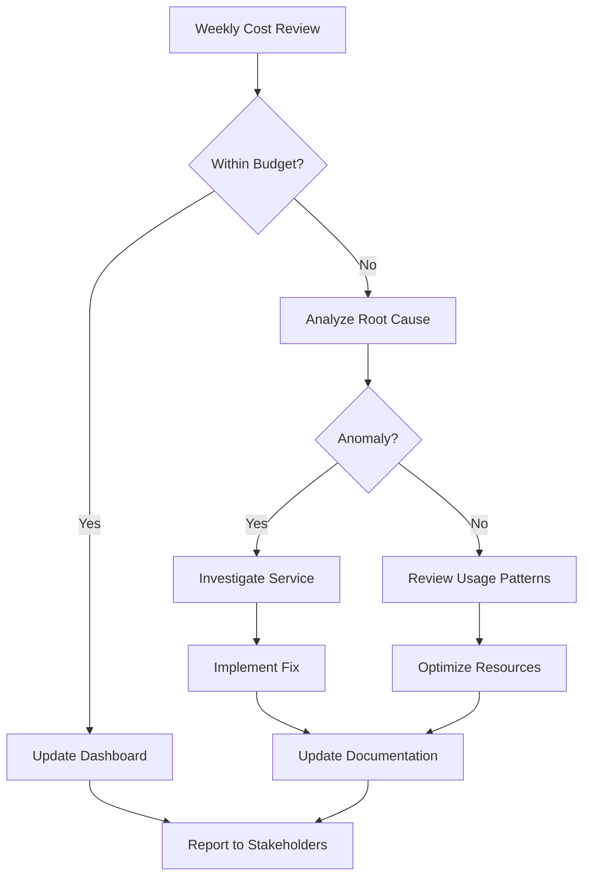

# D-015: Cost Optimization Guide

## Smart Dairy Ltd. - Smart Web Portal System

---

## Document Information

| Field | Value |
|-------|-------|
| **Document ID** | D-015 |
| **Version** | 1.0 |
| **Date** | January 31, 2026 |
| **Author** | Cloud Architect |
| **Owner** | DevOps Lead |
| **Reviewer** | CTO |
| **Status** | Draft |
| **Classification** | Internal |

### Revision History

| Version | Date | Author | Description |
|---------|------|--------|-------------|
| 1.0 | 2026-01-31 | Cloud Architect | Initial document creation |

### Approvals

| Role | Name | Signature | Date |
|------|------|-----------|------|
| DevOps Lead | | | |
| CTO | | | |

---

## Table of Contents

1. [Introduction](#1-introduction)
2. [Cost Architecture](#2-cost-architecture)
3. [Compute Optimization](#3-compute-optimization)
4. [Reserved Capacity](#4-reserved-capacity)
5. [Storage Optimization](#5-storage-optimization)
6. [Database Cost](#6-database-cost)
7. [Container Optimization](#7-container-optimization)
8. [Networking Cost](#8-networking-cost)
9. [Monitoring & Alerts](#9-monitoring--alerts)
10. [Governance](#10-governance)
11. [Appendices](#11-appendices)

---

## 1. Introduction

### 1.1 Purpose

This document provides comprehensive cost optimization strategies for Smart Dairy Ltd.'s AWS infrastructure, targeting a monthly spend of **<$5,000 for production** while maintaining high availability and performance standards.

### 1.2 Scope

- **Environments**: Development, Staging, Production (3 environments)
- **Services**: EKS, RDS, S3, EC2, Networking, Monitoring
- **Growth Projection**: 10% monthly growth rate
- **Primary Goal**: Optimize costs without compromising reliability

### 1.3 FinOps Approach

Smart Dairy adopts the **FinOps Foundation** principles:

```
┌─────────────────────────────────────────────────────────────┐
│                    FINOPS LIFECYCLE                         │
├─────────────────────────────────────────────────────────────┤
│                                                             │
│   ┌─────────────┐    ┌─────────────┐    ┌─────────────┐    │
│   │   INFORM    │───→│   OPTIMIZE  │───→│   OPERATE   │    │
│   │             │    │             │    │             │    │
│   │ • Visibility│    │ • Rate      │    │ • Automation│    │
│   │ • Allocation│    │ • Usage     │    │ • Governance│    │
│   │ • Benchmarks│    │ • Workload  │    │ • Culture   │    │
│   └─────────────┘    └─────────────┘    └─────────────┘    │
│          ↑───────────────────────────────────┘              │
└─────────────────────────────────────────────────────────────┘
```

### 1.4 Cost Optimization Pillars

| Pillar | Description | Target Savings |
|--------|-------------|----------------|
| **Right Sizing** | Match resources to actual demand | 15-20% |
| **Reserved Capacity** | Commit to 1-3 year terms | 30-40% |
| **Spot Instances** | Use spare capacity for fault-tolerant workloads | 60-70% |
| **Storage Optimization** | Implement lifecycle policies | 20-30% |
| **Container Efficiency** | Optimize Kubernetes resources | 25-35% |

### 1.5 Key Metrics

| Metric | Target | Measurement |
|--------|--------|-------------|
| Monthly AWS Bill | <$5,000 (Prod) | AWS Cost Explorer |
| Cost per Request | <$0.001 | Custom dashboard |
| Resource Utilization | >70% | CloudWatch |
| Tag Compliance | 100% | AWS Config |
| Idle Resources | <5% | Cost Anomaly Detection |

---

## 2. Cost Architecture

### 2.1 Current Cost Breakdown (Estimated)

#### Production Environment

```
Monthly Cost Estimate (Target: $5,000/month)
═══════════════════════════════════════════════════════════════

Compute (EKS/EC2)          ████████████████████░░░░░  $1,800 (36%)
Database (RDS)             █████████████░░░░░░░░░░░░  $1,200 (24%)
Storage (S3/EBS)           ██████░░░░░░░░░░░░░░░░░░░    $600 (12%)
Networking                 █████░░░░░░░░░░░░░░░░░░░░    $500 (10%)
Monitoring & Logs          ████░░░░░░░░░░░░░░░░░░░░░    $400  (8%)
Other Services             ████░░░░░░░░░░░░░░░░░░░░░    $500 (10%)
                                                           ─────
Total                                                    $5,000

Growth Buffer (10%)                                        $500
═══════════════════════════════════════════════════════════════
Maximum Budget                                           $5,500
```

#### Multi-Environment Distribution

| Environment | Percentage | Monthly Budget | Purpose |
|-------------|------------|----------------|---------|
| Production | 70% | $3,500 | Live customer traffic |
| Staging | 20% | $1,000 | Pre-production testing |
| Development | 10% | $500 | Development & experimentation |
| **Total** | **100%** | **$5,000** | |

### 2.2 AWS Service Cost Breakdown

| Service | Monthly Cost | Optimization Potential |
|---------|--------------|------------------------|
| EKS Control Plane | $73/environment | N/A (Fixed) |
| EC2 (EKS Nodes) | $1,200 | High (Spot, Graviton) |
| RDS PostgreSQL | $1,000 | Medium (Reserved, Aurora) |
| S3 | $300 | High (Lifecycle, IA) |
| EBS | $250 | Medium (GP3 migration) |
| CloudFront | $150 | Medium (Caching) |
| NAT Gateway | $200 | High (VPC Endpoints) |
| CloudWatch/Logs | $300 | Medium (Retention) |
| ELB/ALB | $100 | Low |
| Secrets Manager | $50 | Low |

### 2.3 Tagging Strategy

#### Mandatory Cost Allocation Tags

```json
{
  "Tags": {
    "Environment": "production|staging|development",
    "Project": "smart-dairy-web-portal",
    "CostCenter": "engineering",
    "Owner": "devops-team",
    "ManagedBy": "terraform",
    "Service": "eks|rds|s3|ec2",
    "Component": "api|web|worker|database",
    "Criticality": "critical|high|medium|low",
    "Schedule": "24x7|business-hours|on-demand"
  }
}
```

#### Terraform Tag Implementation

```hcl
# locals.tf
locals {
  common_tags = {
    Project     = "smart-dairy-web-portal"
    Owner       = "devops-team"
    ManagedBy   = "terraform"
    CostCenter  = "engineering"
  }
  
  environment_tags = {
    production = {
      Environment = "production"
      Criticality = "critical"
      Schedule    = "24x7"
    }
    staging = {
      Environment = "staging"
      Criticality = "medium"
      Schedule    = "business-hours"
    }
    development = {
      Environment = "development"
      Criticality = "low"
      Schedule    = "on-demand"
    }
  }
}

# Usage in resources
resource "aws_instance" "example" {
  tags = merge(local.common_tags, local.environment_tags[var.environment], {
    Service     = "ec2"
    Component   = "worker"
  })
}
```

### 2.4 AWS CLI Cost Analysis Commands

```bash
#!/bin/bash
# cost-analysis.sh - Monthly cost analysis commands

# 1. Get current month costs by service
aws ce get-cost-and-usage \
  --time-period Start=$(date -d "$(date +%Y-%m-01) -1 month" +%Y-%m-01),End=$(date +%Y-%m-01) \
  --granularity MONTHLY \
  --metrics "BlendedCost" \
  --group-by Type=DIMENSION,Key=SERVICE \
  --output table

# 2. Get costs by tag (Environment)
aws ce get-cost-and-usage \
  --time-period Start=$(date -d "$(date +%Y-%m-01) -1 month" +%Y-%m-01),End=$(date +%Y-%m-01) \
  --granularity MONTHLY \
  --metrics "BlendedCost" \
  --group-by Type=TAG,Key=Environment \
  --output table

# 3. Get EC2 costs by instance type
aws ce get-cost-and-usage \
  --time-period Start=$(date -d "$(date +%Y-%m-01) -1 month" +%Y-%m-01),End=$(date +%Y-%m-01) \
  --granularity MONTHLY \
  --metrics "BlendedCost" \
  --group-by Type=DIMENSION,Key=INSTANCE_TYPE \
  --filter '{"Dimensions":{"Key":"SERVICE","Values":["Amazon Elastic Compute Cloud - Compute"]}}' \
  --output table

# 4. Get daily costs for current month
aws ce get-cost-and-usage \
  --time-period Start=$(date +%Y-%m-01),End=$(date -d "+1 month" +%Y-%m-01) \
  --granularity DAILY \
  --metrics "BlendedCost" \
  --output table

# 5. Forecast next 3 months
aws ce get-cost-forecast \
  --time-period Start=$(date -d "+1 day" +%Y-%m-%d),End=$(date -d "+3 months" +%Y-%m-%d) \
  --metric BLENDED_COST \
  --granularity MONTHLY

# 6. Get reservation coverage
aws ce get-reservation-coverage \
  --time-period Start=$(date +%Y-%m-01),End=$(date -d "+1 month" +%Y-%m-01) \
  --granularity MONTHLY \
  --group-by Type=DIMENSION,Key=REGION

# 7. Get reservation utilization
aws ce get-reservation-utilization \
  --time-period Start=$(date +%Y-%m-01),End=$(date -d "+1 month" +%Y-%m-01) \
  --granularity MONTHLY

# 8. List untagged resources
aws resourcegroupstaggingapi get-resources \
  --tag-filters Key=Environment,Values= \
  --output table
```

---

## 3. Compute Optimization

### 3.1 Rightsizing Strategy

#### Current Instance Analysis

| Environment | Current | Recommendation | Savings |
|-------------|---------|----------------|---------|
| Production | m6i.2xlarge | m6i.xlarge + auto-scaling | 40% |
| Staging | m6i.xlarge | t3.large (scheduled) | 60% |
| Development | m6i.xlarge | t3.medium (on-demand) | 70% |

#### CPU Utilization Analysis Script

```bash
#!/bin/bash
# rightsizing-analysis.sh

echo "=== CPU Utilization Analysis (Last 7 Days) ==="

# Get all EC2 instances
instances=$(aws ec2 describe-instances \
  --filters "Name=instance-state-name,Values=running" \
  --query 'Reservations[*].Instances[*].[InstanceId,InstanceType,Tags[?Key==`Name`].Value|[0]]' \
  --output text)

while IFS=$'\t' read -r instance_id instance_type name; do
  echo ""
  echo "Instance: $name ($instance_id) - Type: $instance_type"
  
  # Get average CPU utilization
  aws cloudwatch get-metric-statistics \
    --namespace AWS/EC2 \
    --metric-name CPUUtilization \
    --dimensions Name=InstanceId,Value=$instance_id \
    --start-time $(date -d '7 days ago' --utc +%Y-%m-%dT%H:%M:%S) \
    --end-time $(date --utc +%Y-%m-%dT%H:%M:%S) \
    --period 86400 \
    --statistics Average \
    --query 'Datapoints[*].[Average]' \
    --output text | awk '{sum+=$1; count++} END {if(count>0) printf "  Average CPU: %.2f%%\n", sum/count}'
  
  # Get memory utilization (CloudWatch agent required)
  aws cloudwatch get-metric-statistics \
    --namespace CWAgent \
    --metric-name mem_used_percent \
    --dimensions Name=InstanceId,Value=$instance_id \
    --start-time $(date -d '7 days ago' --utc +%Y-%m-%dT%H:%M:%S) \
    --end-time $(date --utc +%Y-%m-%dT%H:%M:%S) \
    --period 86400 \
    --statistics Average \
    --query 'Datapoints[*].[Average]' \
    --output text | awk '{sum+=$1; count++} END {if(count>0) printf "  Average Memory: %.2f%%\n", sum/count}'
done <<< "$instances"
```

#### Rightsizing Recommendations Matrix

| Current Type | Avg CPU | Avg Memory | Recommended | Est. Savings |
|--------------|---------|------------|-------------|--------------|
| m6i.4xlarge | <30% | <40% | m6i.2xlarge | 50% |
| m6i.2xlarge | <40% | <50% | m6i.xlarge | 50% |
| m6i.xlarge | <50% | <60% | m6i.large | 50% |
| t3.large | <30% | <40% | t3.medium | 50% |
| t3.medium | <40% | <50% | t3.small | 50% |

### 3.2 Graviton Migration

#### Graviton vs x86 Price Comparison

| Instance Type | vCPU | Memory | Linux On-Demand | Graviton Savings |
|---------------|------|--------|-----------------|------------------|
| m6i.large | 2 | 8 GB | $0.0864/hr | - |
| m6g.large | 2 | 8 GB | $0.0770/hr | **11%** |
| m6i.xlarge | 4 | 16 GB | $0.1728/hr | - |
| m6g.xlarge | 4 | 16 GB | $0.1540/hr | **11%** |
| m6i.2xlarge | 8 | 32 GB | $0.3456/hr | - |
| m6g.2xlarge | 8 | 32 GB | $0.3080/hr | **11%** |

#### Migration Checklist

- [ ] Identify non-ARM compatible workloads
- [ ] Test application on Graviton (dev environment)
- [ ] Update Docker images for multi-arch support
- [ ] Gradually migrate node groups
- [ ] Monitor performance metrics
- [ ] Rollback plan if issues detected

#### Multi-Arch Docker Build

```dockerfile
# Dockerfile - Multi-architecture build
FROM --platform=$BUILDPLATFORM node:18-alpine AS builder
WORKDIR /app
COPY package*.json ./
RUN npm ci --only=production

FROM node:18-alpine
WORKDIR /app
COPY --from=builder /app/node_modules ./node_modules
COPY . .
EXPOSE 3000
CMD ["node", "server.js"]
```

```bash
# Build script for multi-arch images
#!/bin/bash
# build-multiarch.sh

docker buildx create --use --name multiarch-builder || true

docker buildx build \
  --platform linux/amd64,linux/arm64 \
  --tag smart-dairy/app:latest \
  --tag smart-dairy/app:v1.0.0 \
  --push \
  .
```

#### Terraform EKS Node Group with Graviton

```hcl
# eks-node-groups.tf
resource "aws_eks_node_group" "graviton" {
  cluster_name    = aws_eks_cluster.main.name
  node_group_name = "graviton-workloads"
  node_role_arn   = aws_iam_role.eks_node.arn
  subnet_ids      = var.private_subnet_ids
  
  ami_type       = "AL2_ARM_64"
  capacity_type  = "ON_DEMAND"
  instance_types = ["m6g.xlarge", "m6g.2xlarge"]
  
  scaling_config {
    desired_size = 2
    min_size     = 1
    max_size     = 10
  }
  
  labels = {
    "node-type" = "graviton"
    "arch"      = "arm64"
  }
  
  taint {
    key    = "arch"
    value  = "arm64"
    effect = "NO_SCHEDULE"
  }
  
  tags = merge(local.common_tags, {
    Name = "smart-dairy-eks-graviton"
  })
}
```

### 3.3 Spot Instances

#### Spot Instance Strategy

| Workload Type | Spot Suitability | Fallback Strategy |
|---------------|------------------|-------------------|
| Stateless web servers | High | On-demand fallback |
| Background jobs | Very High | Spot only |
| CI/CD runners | Very High | Spot only |
| Caching layers | Medium | On-demand base + Spot burst |
| Database | Low | On-demand only |

#### Spot Savings Estimates

| Instance Type | On-Demand | Spot Price | Savings |
|---------------|-----------|------------|---------|
| m6i.xlarge | $0.1728/hr | $0.052/hr | **70%** |
| m6i.2xlarge | $0.3456/hr | $0.104/hr | **70%** |
| c6i.xlarge | $0.1700/hr | $0.051/hr | **70%** |

#### Terraform EKS Spot Node Group

```hcl
# eks-spot-nodes.tf
resource "aws_eks_node_group" "spot" {
  cluster_name    = aws_eks_cluster.main.name
  node_group_name = "spot-workloads"
  node_role_arn   = aws_iam_role.eks_node.arn
  subnet_ids      = var.private_subnet_ids
  
  capacity_type  = "SPOT"
  instance_types = ["m6i.xlarge", "m5.xlarge", "m5a.xlarge"]
  
  scaling_config {
    desired_size = 2
    min_size     = 0
    max_size     = 20
  }
  
  labels = {
    "node-type" = "spot"
    "lifecycle" = "spot"
  }
  
  taint {
    key    = "lifecycle"
    value  = "spot"
    effect = "NO_SCHEDULE"
  }
  
  tags = merge(local.common_tags, {
    Name = "smart-dairy-eks-spot"
  })
  
  lifecycle {
    ignore_changes = [scaling_config[0].desired_size]
  }
}
```

#### Kubernetes Spot Tolerations

```yaml
# spot-deployment.yaml
apiVersion: apps/v1
kind: Deployment
metadata:
  name: api-workers
spec:
  replicas: 3
  selector:
    matchLabels:
      app: api-workers
  template:
    metadata:
      labels:
        app: api-workers
    spec:
      tolerations:
        - key: "lifecycle"
          operator: "Equal"
          value: "spot"
          effect: "NoSchedule"
      affinity:
        nodeAffinity:
          preferredDuringSchedulingIgnoredDuringExecution:
            - weight: 100
              preference:
                matchExpressions:
                  - key: node-type
                    operator: In
                    values:
                      - spot
      containers:
        - name: worker
          image: smart-dairy/worker:latest
          resources:
            requests:
              memory: "512Mi"
              cpu: "250m"
            limits:
              memory: "1Gi"
              cpu: "500m"
```

#### Spot Instance Interruption Handling

```python
# spot-interruption-handler.py
"""
AWS Spot Instance Interruption Handler
Deploy as a DaemonSet in EKS
"""

import json
import requests
import subprocess
import time
import logging

logging.basicConfig(level=logging.INFO)
logger = logging.getLogger(__name__)

IMDS_TOKEN_URL = "http://169.254.169.254/latest/api/token"
IMDS_SPOT_URL = "http://169.254.169.254/latest/meta-data/spot/instance-action"

def get_imds_token():
    """Get IMDSv2 token"""
    headers = {"X-aws-ec2-metadata-token-ttl-seconds": "300"}
    response = requests.put(IMDS_TOKEN_URL, headers=headers, timeout=5)
    return response.text

def check_spot_interruption():
    """Check if spot instance is being interrupted"""
    try:
        token = get_imds_token()
        headers = {"X-aws-ec2-metadata-token": token}
        response = requests.get(IMDS_SPOT_URL, headers=headers, timeout=5)
        if response.status_code == 200:
            return json.loads(response.text)
        return None
    except Exception as e:
        logger.error(f"Error checking spot interruption: {e}")
        return None

def handle_interruption(action):
    """Handle spot interruption notice"""
    time_remaining = action.get('time', 'unknown')
    action_type = action.get('action', 'unknown')
    
    logger.warning(f"Spot interruption notice: {action_type} in {time_remaining}")
    
    # 1. Drain the node
    logger.info("Draining node...")
    subprocess.run([
        "kubectl", "drain", "$(hostname)",
        "--ignore-daemonsets",
        "--delete-emptydir-data",
        "--force",
        "--grace-period=30"
    ], check=False)
    
    # 2. Notify monitoring
    logger.info("Sending interruption alert...")
    # Add your notification logic here (SNS, Slack, etc.)
    
    # 3. Complete pending work
    logger.info("Completing pending tasks...")
    # Add graceful shutdown logic

def main():
    logger.info("Starting Spot Interruption Handler")
    
    while True:
        action = check_spot_interruption()
        if action:
            handle_interruption(action)
            break
        time.sleep(5)

if __name__ == "__main__":
    main()
```

---

## 4. Reserved Capacity

### 4.1 Savings Plans vs Reserved Instances

| Feature | Compute Savings Plans | EC2 Reserved Instances |
|---------|----------------------|------------------------|
| Flexibility | High (across instance types) | Low (specific instance type) |
| Term | 1 or 3 years | 1 or 3 years |
| Payment | All upfront, partial, no upfront | All upfront, partial, no upfront |
| Savings | Up to 66% | Up to 72% |
| Scope | Regional | Zonal or Regional |
| Best For | Dynamic workloads | Predictable steady-state |

### 4.2 Smart Dairy Recommendation

**Primary Strategy**: Compute Savings Plans (1-year, No Upfront)

| Component | Commitment | Coverage | Monthly Savings |
|-----------|------------|----------|-----------------|
| EKS Production Nodes | $1,200/mo | 80% baseline | $400 |
| RDS (Convertible RI) | $800/mo | 100% | $320 |
| **Total** | **$2,000/mo** | - | **$720** |

### 4.3 Commitment Analysis

#### Baseline Capacity Calculation

```python
# commitment-analyzer.py
"""
Calculate optimal Savings Plans commitment based on historical usage
"""

import boto3
from datetime import datetime, timedelta

def analyze_usage_for_commitment():
    ce = boto3.client('ce')
    
    # Get last 3 months of EC2 compute usage
    end_date = datetime.now().replace(day=1)
    start_date = (end_date - timedelta(days=90)).replace(day=1)
    
    response = ce.get_cost_and_usage(
        TimePeriod={
            'Start': start_date.strftime('%Y-%m-%d'),
            'End': end_date.strftime('%Y-%m-%d')
        },
        Granularity='MONTHLY',
        Metrics=['UsageQuantity'],
        GroupBy=[
            {'Type': 'DIMENSION', 'Key': 'SERVICE'},
            {'Type': 'DIMENSION', 'Key': 'INSTANCE_TYPE'}
        ],
        Filter={
            'Dimensions': {
                'Key': 'SERVICE',
                'Values': ['Amazon Elastic Compute Cloud - Compute']
            }
        }
    )
    
    # Calculate baseline (minimum usage across months)
    monthly_usage = {}
    for result in response['ResultsByTime']:
        month = result['TimePeriod']['Start']
        for group in result.get('Groups', []):
            instance_type = group['Keys'][1]
            usage = float(group['Metrics']['UsageQuantity']['Amount'])
            
            if instance_type not in monthly_usage:
                monthly_usage[instance_type] = []
            monthly_usage[instance_type].append(usage)
    
    # Calculate safe commitment (80% of minimum)
    recommendations = {}
    for instance_type, usage_list in monthly_usage.items():
        min_usage = min(usage_list)
        safe_commitment = min_usage * 0.8
        recommendations[instance_type] = {
            'minimum_usage': min_usage,
            'recommended_commitment': safe_commitment,
            'confidence': 'high' if len(usage_list) >= 3 else 'medium'
        }
    
    return recommendations

if __name__ == "__main__":
    recommendations = analyze_usage_for_commitment()
    print("=== Savings Plans Commitment Recommendations ===")
    for instance_type, data in recommendations.items():
        print(f"\n{instance_type}:")
        print(f"  Minimum Usage: {data['minimum_usage']:.2f} hours")
        print(f"  Recommended Commitment: {data['recommended_commitment']:.2f} hours")
        print(f"  Confidence: {data['confidence']}")
```

#### Terraform Savings Plans

```hcl
# savings-plans.tf
# Note: AWS Savings Plans cannot be purchased via Terraform
# This creates the recommendation analysis

resource "aws_ce_anomaly_monitor" "savings_plan_monitor" {
  name              = "smart-dairy-savings-plan-monitor"
  monitor_type      = "DIMENSIONAL"
  monitor_dimension = "SERVICE"
}

# Use AWS CLI or Console to purchase Savings Plans
# This script generates the purchase command

locals {
  savings_plan_recommendations = {
    production = {
      commitment = 1  # 1 year
      payment_option = "NO_UPFRONT"
      hourly_commitment = "1.5"  # $1.50/hour
      plan_type = "Compute"
    }
  }
}

# Output purchase command
output "savings_plan_purchase_command" {
  value = <<-EOT
    # Run this command to purchase Savings Plans:
    aws savingsplans create-savings-plan \
      --savings-plan-offering-id <offering-id> \
      --upfront-payment-option NO_UPFRONT \
      --commitment 1.5 \
      --term 1 \
      --payment-option NO_UPFRONT
    
    # Or use AWS Console: Cost Explorer > Savings Plans > Purchase Savings Plans
  EOT
}
```

### 4.4 Reserved Instances for RDS

```hcl
# rds-reserved.tf
# RDS Reserved Instance cannot be managed via Terraform directly
# Use this for documentation and CLI commands

locals {
  rds_reserved_instances = {
    production = {
      db_instance_class = "db.t3.medium"
      engine            = "postgres"
      duration          = 1  # 1 year
      offering_type     = "No Upfront"
      multi_az          = true
    }
  }
}

# CLI command output
output "rds_reserved_instance_commands" {
  value = <<-EOT
    # Describe available RDS Reserved Instance offerings
    aws rds describe-reserved-db-instances-offerings \
      --db-instance-class db.t3.medium \
      --engine postgres \
      --duration 31536000 \
      --offering-type "No Upfront" \
      --multi-az
    
    # Purchase Reserved Instance (run after finding offering-id)
    aws rds purchase-reserved-db-instances-offering \
      --reserved-db-instances-offering-id <offering-id> \
      --reserved-db-instance-id smart-dairy-prod-rds \
      --db-instance-count 1
    
    # List purchased Reserved Instances
    aws rds describe-reserved-db-instances
  EOT
}
```

---

## 5. Storage Optimization

### 5.1 S3 Lifecycle Policies

#### Smart Dairy S3 Bucket Strategy

| Bucket Purpose | Storage Class Transition | Retention |
|----------------|-------------------------|-----------|
| User uploads | Standard → IA (90d) → Glacier (1yr) | 7 years |
| Backups | Standard-IA → Glacier Deep Archive (30d) | 7 years |
| Logs | Standard → IA (30d) → Glacier (90d) | 1 year |
| Temporary | Standard | 7 days (with expiration) |

#### Terraform S3 Lifecycle Configuration

```hcl
# s3-lifecycle.tf
resource "aws_s3_bucket_lifecycle_configuration" "uploads" {
  bucket = aws_s3_bucket.uploads.id

  rule {
    id     = "transition-to-ia"
    status = "Enabled"

    transition {
      days          = 90
      storage_class = "STANDARD_IA"
    }

    transition {
      days          = 365
      storage_class = "GLACIER"
    }

    noncurrent_version_transition {
      noncurrent_days = 30
      storage_class   = "STANDARD_IA"
    }

    noncurrent_version_expiration {
      noncurrent_days = 90
    }
  }

  rule {
    id     = "abort-incomplete-multipart"
    status = "Enabled"

    abort_incomplete_multipart_upload {
      days_after_initiation = 7
    }
  }
}

resource "aws_s3_bucket_lifecycle_configuration" "backups" {
  bucket = aws_s3_bucket.backups.id

  rule {
    id     = "backup-retention"
    status = "Enabled"

    transition {
      days          = 30
      storage_class = "GLACIER"
    }

    transition {
      days          = 90
      storage_class = "DEEP_ARCHIVE"
    }

    expiration {
      days = 2555  # 7 years
    }
  }
}

resource "aws_s3_bucket_lifecycle_configuration" "logs" {
  bucket = aws_s3_bucket.logs.id

  rule {
    id     = "log-retention"
    status = "Enabled"

    transition {
      days          = 30
      storage_class = "STANDARD_IA"
    }

    transition {
      days          = 90
      storage_class = "GLACIER"
    }

    expiration {
      days = 365
    }
  }
}
```

#### S3 Storage Class Comparison

| Storage Class | Durability | Availability | Min Storage | Retrieval | Cost/GB/Month |
|--------------|------------|--------------|-------------|-----------|---------------|
| S3 Standard | 99.999999999% | 99.99% | None | Milliseconds | $0.023 |
| S3 Intelligent-Tiering | 99.999999999% | 99.9% | None | Milliseconds | $0.0025 + tiering |
| S3 Standard-IA | 99.999999999% | 99.9% | 30 days | Milliseconds | $0.0125 |
| S3 One Zone-IA | 99.999999999% | 99.5% | 30 days | Milliseconds | $0.01 |
| S3 Glacier | 99.999999999% | 99.99% | 90 days | 1-5 minutes | $0.004 |
| S3 Glacier Deep Archive | 99.999999999% | 99.9% | 180 days | 12-48 hours | $0.00099 |

### 5.2 EBS Volume Optimization

#### EBS Volume Type Migration

| Current | Target | Use Case | Savings |
|---------|--------|----------|---------|
| gp2 | gp3 | General purpose | 20% |
| io1 | io2 | High performance | 10-20% |
| st1 | gp3 | Throughput optimized | 15% |
| sc1 | gp3 | Cold storage | 20% |

#### Terraform EBS gp3 Migration

```hcl
# ebs-gp3-migration.tf
resource "aws_ebs_volume" "app_data" {
  availability_zone = var.availability_zone
  size              = 100
  type              = "gp3"
  iops              = 3000      # gp3 default, can go up to 16,000
  throughput        = 125       # MiB/s, can go up to 1,000

  tags = merge(local.common_tags, {
    Name = "smart-dairy-app-data"
  })
}

# EBS optimized root volumes
resource "aws_launch_template" "eks_nodes" {
  name_prefix   = "smart-dairy-eks-"
  image_id      = data.aws_ami.eks_worker.id
  instance_type = "m6i.xlarge"

  block_device_mappings {
    device_name = "/dev/xvda"
    ebs {
      volume_size           = 100
      volume_type           = "gp3"
      iops                  = 3000
      throughput            = 125
      encrypted             = true
      kms_key_id            = aws_kms_key.ebs.arn
      delete_on_termination = true
    }
  }

  metadata_options {
    http_endpoint               = "enabled"
    http_tokens                 = "required"
    http_put_response_hop_limit = 1
  }

  monitoring {
    enabled = true
  }

  tag_specifications {
    resource_type = "instance"
    tags = merge(local.common_tags, {
      Name = "smart-dairy-eks-node"
    })
  }
}
```

#### EBS Volume Cleanup Script

```bash
#!/bin/bash
# ebs-cleanup.sh
# Identify and snapshot unused EBS volumes before deletion

echo "=== EBS Volume Cleanup Analysis ==="

# Get all unattached volumes
unattached_volumes=$(aws ec2 describe-volumes \
  --filters Name=status,Values=available \
  --query 'Volumes[*].[VolumeId,Size,VolumeType,CreateTime]' \
  --output text)

if [ -z "$unattached_volumes" ]; then
  echo "No unattached volumes found."
  exit 0
fi

while IFS=$'\t' read -r volume_id size type create_time; do
  echo ""
  echo "Volume: $volume_id"
  echo "  Size: ${size}GB"
  echo "  Type: $type"
  echo "  Created: $create_time"
  
  # Check for snapshots
  snapshot_count=$(aws ec2 describe-snapshots \
    --filters Name=volume-id,Values=$volume_id \
    --query 'length(Snapshots)' \
    --output text)
  
  echo "  Snapshots: $snapshot_count"
  
  # Calculate monthly cost
  case $type in
    gp2|gp3)
      cost=$(echo "$size * 0.08" | bc)
      ;;
    io1|io2)
      cost=$(echo "$size * 0.125" | bc)
      ;;
    st1)
      cost=$(echo "$size * 0.045" | bc)
      ;;
    sc1)
      cost=$(echo "$size * 0.025" | bc)
      ;;
    *)
      cost="unknown"
      ;;
  esac
  
  echo "  Est. Monthly Cost: \$$cost"
  
  # Create snapshot if none exist
  if [ "$snapshot_count" -eq 0 ]; then
    echo "  Creating snapshot before potential deletion..."
    aws ec2 create-snapshot \
      --volume-id $volume_id \
      --description "Pre-cleanup snapshot of $volume_id" \
      --tag-specifications "ResourceType=snapshot,Tags=[{Key=SourceVolume,Value=$volume_id},{Key=Purpose,Value=cleanup-backup}]"
  fi
done <<< "$unattached_volumes"

echo ""
echo "Review volumes above. To delete, run:"
echo "aws ec2 delete-volume --volume-id <volume-id>"
```

### 5.3 Intelligent Tiering

```hcl
# s3-intelligent-tiering.tf
resource "aws_s3_bucket_intelligent_tiering_configuration" "documents" {
  bucket = aws_s3_bucket.documents.id
  name   = "EntireBucket"

  tiering {
    access_tier = "ARCHIVE_ACCESS"
    days        = 90
  }

  tiering {
    access_tier = "DEEP_ARCHIVE_ACCESS"
    days        = 180
  }
}
```

---

## 6. Database Cost

### 6.1 RDS Reserved Capacity

#### RDS Instance Cost Comparison

| Instance | On-Demand/Month | Reserved (1yr) | Reserved (3yr) | Savings |
|----------|-----------------|----------------|----------------|---------|
| db.t3.micro | $12.50 | $8.75 | $6.25 | 30-50% |
| db.t3.small | $25 | $17.50 | $12.50 | 30-50% |
| db.t3.medium | $50 | $35 | $25 | 30-50% |
| db.m6g.large | $140 | $98 | $70 | 30-50% |

#### Multi-AZ vs Single-AZ Decision Matrix

| Environment | Multi-AZ | Justification |
|-------------|----------|---------------|
| Production | Yes | SLA requirement, 99.95% availability |
| Staging | No | Cost optimization, can tolerate downtime |
| Development | No | Single AZ sufficient |

#### Terraform RDS Cost-Optimized Configuration

```hcl
# rds-cost-optimized.tf
locals {
  db_config = {
    production = {
      instance_class    = "db.t3.medium"
      multi_az          = true
      allocated_storage = 100
      max_allocated_storage = 500
      backup_retention  = 30
      deletion_protection = true
      performance_insights_enabled = true
    }
    staging = {
      instance_class    = "db.t3.small"
      multi_az          = false
      allocated_storage = 50
      max_allocated_storage = 100
      backup_retention  = 7
      deletion_protection = false
      performance_insights_enabled = false
    }
    development = {
      instance_class    = "db.t3.micro"
      multi_az          = false
      allocated_storage = 20
      max_allocated_storage = 50
      backup_retention  = 1
      deletion_protection = false
      performance_insights_enabled = false
    }
  }
}

resource "aws_db_instance" "primary" {
  identifier = "smart-dairy-${var.environment}"
  
  engine         = "postgres"
  engine_version = "15.4"
  
  instance_class    = local.db_config[var.environment].instance_class
  allocated_storage = local.db_config[var.environment].allocated_storage
  max_allocated_storage = local.db_config[var.environment].max_allocated_storage
  
  storage_type          = "gp3"
  storage_encrypted     = true
  kms_key_id           = aws_kms_key.rds.arn
  
  multi_az               = local.db_config[var.environment].multi_az
  db_subnet_group_name   = aws_db_subnet_group.main.name
  vpc_security_group_ids = [aws_security_group.rds.id]
  
  backup_retention_period = local.db_config[var.environment].backup_retention
  backup_window          = "03:00-04:00"
  maintenance_window     = "Mon:04:00-Mon:05:00"
  
  deletion_protection = local.db_config[var.environment].deletion_protection
  skip_final_snapshot = var.environment != "production"
  
  performance_insights_enabled    = local.db_config[var.environment].performance_insights_enabled
  performance_insights_retention_period = local.db_config[var.environment].performance_insights_enabled ? 7 : 0
  
  monitoring_interval = 60
  monitoring_role_arn = aws_iam_role.rds_monitoring.arn
  
  enabled_cloudwatch_logs_exports = ["postgresql", "upgrade"]
  
  auto_minor_version_upgrade = true
  
  tags = merge(local.common_tags, {
    Name = "smart-dairy-${var.environment}-db"
  })
}
```

### 6.2 Aurora Serverless for Dev/Test

#### Aurora Serverless v2 Cost Model

| Component | Cost |
|-----------|------|
| ACU-hour (Production) | $0.12 |
| ACU-hour (Development) | $0.06 |
| Storage | $0.10/GB-month |
| I/O | $0.20/million requests |

#### Terraform Aurora Serverless (Development Only)

```hcl
# aurora-serverless.tf (Development only)
resource "aws_rds_cluster" "dev_serverless" {
  count = var.environment == "development" ? 1 : 0
  
  cluster_identifier = "smart-dairy-dev-aurora"
  engine            = "aurora-postgresql"
  engine_version    = "15.4"
  engine_mode       = "provisioned"
  
  serverlessv2_scaling_configuration {
    min_capacity = 0.5
    max_capacity = 8
  }
  
  database_name   = "smartdairy"
  master_username = var.db_username
  master_password = var.db_password
  
  db_subnet_group_name   = aws_db_subnet_group.main.name
  vpc_security_group_ids = [aws_security_group.rds.id]
  
  backup_retention_period = 1
  preferred_backup_window = "03:00-04:00"
  
  skip_final_snapshot = true
  
  tags = merge(local.common_tags, {
    Name = "smart-dairy-dev-aurora"
  })
}

resource "aws_rds_cluster_instance" "dev_serverless" {
  count = var.environment == "development" ? 1 : 0
  
  identifier           = "smart-dairy-dev-aurora-instance"
  cluster_identifier   = aws_rds_cluster.dev_serverless[0].id
  instance_class       = "db.serverless"
  engine              = aws_rds_cluster.dev_serverless[0].engine
  
  db_subnet_group_name = aws_db_subnet_group.main.name
  
  monitoring_interval = 0  # Disable for dev cost savings
  
  tags = merge(local.common_tags, {
    Name = "smart-dairy-dev-aurora-instance"
  })
}
```

### 6.3 Read Replicas vs Multi-AZ

| Scenario | Recommendation | Cost Impact |
|----------|---------------|-------------|
| High read load | Read replicas | 1x per replica |
| HA requirement only | Multi-AZ | 2x single instance |
| Both HA + read scaling | Multi-AZ + Read replica | 3x single instance |

---

## 7. Container Optimization

### 7.1 EKS Fargate vs EC2 Cost Analysis

| Workload Pattern | Fargate | EC2 (Managed) | Recommendation |
|------------------|---------|---------------|----------------|
| Steady-state, predictable | $$$ | $ | EC2 with RIs |
| Variable, spikey | $$ | $$ | Fargate or Spot |
| Batch jobs | $ | $$ | Fargate Spot |
| Small dev workloads | $ | $$$ | Fargate |

#### Cost Comparison (per vCPU/month)

| Option | Cost | Notes |
|--------|------|-------|
| EC2 On-Demand (m6i.xlarge) | $126 | 4 vCPU baseline |
| EC2 Spot | $38 | 70% savings |
| EC2 with Savings Plans | $44 | 1-year, no upfront |
| Fargate | $183 | Per vCPU |
| Fargate Spot | $55 | 70% savings |

### 7.2 Node Group Strategy

```hcl
# eks-cost-optimized.tf
module "eks" {
  source  = "terraform-aws-modules/eks/aws"
  version = "~> 19.0"

  cluster_name    = "smart-dairy-${var.environment}"
  cluster_version = "1.28"

  cluster_addons = {
    coredns = {
      most_recent = true
    }
    kube-proxy = {
      most_recent = true
    }
    vpc-cni = {
      most_recent = true
    }
    aws-ebs-csi-driver = {
      most_recent = true
    }
  }

  vpc_id     = var.vpc_id
  subnet_ids = var.private_subnet_ids

  # EKS Managed Node Groups
  eks_managed_node_groups = {
    # Baseline capacity - On-Demand with Savings Plans
    baseline = {
      name = "baseline-${var.environment}"
      
      instance_types = ["m6i.large", "m6g.large"]
      capacity_type  = "ON_DEMAND"
      
      min_size     = 2
      max_size     = 10
      desired_size = 2
      
      labels = {
        workload-type = "baseline"
        cost-allocation = "reserved"
      }
      
      update_config = {
        max_unavailable_percentage = 25
      }
      
      block_device_mappings = {
        xvda = {
          device_name = "/dev/xvda"
          ebs = {
            volume_size           = 100
            volume_type           = "gp3"
            iops                  = 3000
            throughput            = 125
            encrypted             = true
            delete_on_termination = true
          }
        }
      }
    }
    
    # Spot capacity for fault-tolerant workloads
    spot = {
      name = "spot-${var.environment}"
      
      instance_types = ["m6i.xlarge", "m5.xlarge", "m5a.xlarge", "m6a.xlarge"]
      capacity_type  = "SPOT"
      
      min_size     = 0
      max_size     = 20
      desired_size = 2
      
      labels = {
        workload-type = "batch"
        cost-allocation = "spot"
        lifecycle = "spot"
      }
      
      taints = [{
        key    = "lifecycle"
        value  = "spot"
        effect = "NO_SCHEDULE"
      }]
      
      block_device_mappings = {
        xvda = {
          device_name = "/dev/xvda"
          ebs = {
            volume_size           = 100
            volume_type           = "gp3"
            iops                  = 3000
            throughput            = 125
            encrypted             = true
            delete_on_termination = true
          }
        }
      }
    }
  }

  # Fargate for serverless workloads (dev only)
  fargate_profiles = var.environment == "development" ? {
    default = {
      name = "default"
      selectors = [
        { namespace = "kube-system" },
        { namespace = "default" }
      ]
    }
  } : {}

  tags = local.common_tags
}
```

### 7.3 Bin Packing with Karpenter

#### Karpenter Installation

```hcl
# karpenter.tf
resource "helm_release" "karpenter" {
  namespace        = "karpenter"
  create_namespace = true

  name       = "karpenter"
  repository = "oci://public.ecr.aws/karpenter"
  chart      = "karpenter"
  version    = "v0.32.0"

  set {
    name  = "settings.clusterName"
    value = module.eks.cluster_name
  }

  set {
    name  = "settings.clusterEndpoint"
    value = module.eks.cluster_endpoint
  }

  set {
    name  = "serviceAccount.annotations.eks\.amazonaws\.com/role-arn"
    value = module.karpenter.irsa_arn
  }

  set {
    name  = "settings.interruptionQueueName"
    value = module.karpenter.queue_name
  }
}

# Karpenter NodePool for Spot Instances
resource "kubectl_manifest" "karpenter_nodepool_spot" {
  yaml_body = <<-YAML
    apiVersion: karpenter.sh/v1beta1
    kind: NodePool
    metadata:
      name: spot
    spec:
      template:
        spec:
          requirements:
            - key: karpenter.sh/capacity-type
              operator: In
              values: ["spot"]
            - key: kubernetes.io/arch
              operator: In
              values: ["amd64", "arm64"]
            - key: node.kubernetes.io/instance-type
              operator: In
              values: ["m6i.xlarge", "m6i.2xlarge", "m5.xlarge", "m5.2xlarge", "m6g.xlarge", "m6g.2xlarge"]
            - key: topology.kubernetes.io/zone
              operator: In
              values: ${jsonencode(var.availability_zones)}
          nodeClassRef:
            name: default
          resources:
            cpu: 100
            memory: 400Gi
      limits:
        cpu: 1000
        memory: 4000Gi
      disruption:
        consolidationPolicy: WhenUnderutilized
        expireAfter: 720h  # 30 days
      weight: 10
  YAML

  depends_on = [helm_release.karpenter]
}

# Karpenter NodePool for On-Demand (fallback)
resource "kubectl_manifest" "karpenter_nodepool_ondemand" {
  yaml_body = <<-YAML
    apiVersion: karpenter.sh/v1beta1
    kind: NodePool
    metadata:
      name: ondemand
    spec:
      template:
        spec:
          requirements:
            - key: karpenter.sh/capacity-type
              operator: In
              values: ["on-demand"]
            - key: kubernetes.io/arch
              operator: In
              values: ["amd64", "arm64"]
            - key: node.kubernetes.io/instance-type
              operator: In
              values: ["m6i.large", "m6i.xlarge", "m6g.large", "m6g.xlarge"]
            - key: topology.kubernetes.io/zone
              operator: In
              values: ${jsonencode(var.availability_zones)}
          nodeClassRef:
            name: default
          resources:
            cpu: 100
            memory: 400Gi
      limits:
        cpu: 500
        memory: 2000Gi
      disruption:
        consolidationPolicy: WhenUnderutilized
        expireAfter: 720h
      weight: 1
  YAML

  depends_on = [helm_release.karpenter]
}

# EC2NodeClass
resource "kubectl_manifest" "karpenter_nodeclass" {
  yaml_body = <<-YAML
    apiVersion: karpenter.k8s.aws/v1beta1
    kind: EC2NodeClass
    metadata:
      name: default
    spec:
      amiFamily: AL2
      role: ${module.eks.eks_managed_node_groups["baseline"].iam_role_name}
      subnetSelectorTerms:
        - tags:
            karpenter.sh/discovery: ${module.eks.cluster_name}
      securityGroupSelectorTerms:
        - tags:
            karpenter.sh/discovery: ${module.eks.cluster_name}
      amiSelectorTerms:
        - alias: al2@latest
      blockDeviceMappings:
        - deviceName: /dev/xvda
          ebs:
            volumeSize: 100Gi
            volumeType: gp3
            iops: 3000
            throughput: 125
            encrypted: true
            deleteOnTermination: true
      detailedMonitoring: true
  YAML

  depends_on = [helm_release.karpenter]
}
```

### 7.4 Resource Limits and Requests

```yaml
# resource-optimization.yaml
apiVersion: apps/v1
kind: Deployment
metadata:
  name: api-server
spec:
  replicas: 3
  selector:
    matchLabels:
      app: api-server
  template:
    metadata:
      labels:
        app: api-server
    spec:
      containers:
        - name: api
          image: smart-dairy/api:latest
          resources:
            # Rightsized requests based on actual usage
            requests:
              memory: "256Mi"   # Based on p50 usage
              cpu: "100m"       # Based on p50 usage
            limits:
              memory: "512Mi"   # 2x request for burst
              cpu: "500m"       # 5x request for burst
          env:
            - name: NODE_OPTIONS
              value: "--max-old-space-size=384"  # 75% of limit
---
apiVersion: autoscaling/v2
kind: HorizontalPodAutoscaler
metadata:
  name: api-server-hpa
spec:
  scaleTargetRef:
    apiVersion: apps/v1
    kind: Deployment
    name: api-server
  minReplicas: 2
  maxReplicas: 20
  metrics:
    - type: Resource
      resource:
        name: cpu
        target:
          type: Utilization
          averageUtilization: 70
    - type: Resource
      resource:
        name: memory
        target:
          type: Utilization
          averageUtilization: 80
  behavior:
    scaleUp:
      stabilizationWindowSeconds: 60
      policies:
        - type: Percent
          value: 100
          periodSeconds: 60
    scaleDown:
      stabilizationWindowSeconds: 300
      policies:
        - type: Percent
          value: 10
          periodSeconds: 60
```

### 7.5 Container Image Optimization

```dockerfile
# Optimized Dockerfile - Multi-stage build with minimal layers
# Stage 1: Dependencies
FROM node:18-alpine AS deps
RUN apk add --no-cache libc6-compat
WORKDIR /app
COPY package*.json ./
RUN npm ci --only=production && npm cache clean --force

# Stage 2: Builder
FROM node:18-alpine AS builder
WORKDIR /app
COPY . .
RUN npm ci && npm run build

# Stage 3: Runner (minimal image)
FROM node:18-alpine AS runner
WORKDIR /app

ENV NODE_ENV=production
ENV NEXT_TELEMETRY_DISABLED=1

RUN addgroup --system --gid 1001 nodejs && \
    adduser --system --uid 1001 nextjs

# Copy only necessary files
COPY --from=deps --chown=nextjs:nodejs /app/node_modules ./node_modules
COPY --from=builder --chown=nextjs:nodejs /app/dist ./dist
COPY --from=builder --chown=nextjs:nodejs /app/package.json ./package.json

USER nextjs

EXPOSE 3000
ENV PORT 3000
ENV HOSTNAME "0.0.0.0"

CMD ["node", "dist/main.js"]
```

---

## 8. Networking Cost

### 8.1 NAT Gateway Optimization

#### NAT Gateway Cost Breakdown

| Component | Cost |
|-----------|------|
| Hourly charge per NAT Gateway | $0.045/hr (~$33/month) |
| Data processing charge | $0.045/GB |
| **Total (1 NAT, 100GB/month)** | **~$38/month** |

#### Optimization Strategies

| Strategy | Implementation | Savings |
|----------|---------------|---------|
| Single NAT Gateway | Use one NAT per region (not per AZ) | 66% |
| VPC Endpoints | PrivateLink for AWS services | Data transfer costs |
| NAT Instance | Self-managed NAT (not recommended for prod) | 50% |
| IPv6 Egress-Only Gateway | For IPv6-only traffic | Variable |

#### Terraform VPC with Cost-Optimized NAT

```hcl
# vpc-cost-optimized.tf
module "vpc" {
  source  = "terraform-aws-modules/vpc/aws"
  version = "~> 5.0"

  name = "smart-dairy-${var.environment}"
  cidr = var.vpc_cidr

  azs             = var.availability_zones
  private_subnets = var.private_subnet_cidrs
  public_subnets  = var.public_subnet_cidrs

  enable_nat_gateway     = true
  single_nat_gateway     = var.environment != "production"  # Single NAT for dev/staging
  one_nat_gateway_per_az = var.environment == "production"  # One per AZ only for prod
  
  enable_vpn_gateway     = false
  enable_dns_hostnames   = true
  enable_dns_support     = true
  
  # VPC Flow Logs (cost-optimized)
  enable_flow_log                      = true
  create_flow_log_cloudwatch_iam_role  = true
  create_flow_log_cloudwatch_log_group = true
  flow_log_max_aggregation_interval    = 600  # 10 minutes (default is 60s)

  tags = local.common_tags
}

# VPC Endpoints (reduce NAT Gateway traffic)
resource "aws_vpc_endpoint" "s3" {
  vpc_id       = module.vpc.vpc_id
  service_name = "com.amazonaws.${var.aws_region}.s3"
  
  tags = merge(local.common_tags, {
    Name = "smart-dairy-s3-endpoint"
  })
}

resource "aws_vpc_endpoint" "ecr_api" {
  vpc_id              = module.vpc.vpc_id
  service_name        = "com.amazonaws.${var.aws_region}.ecr.api"
  vpc_endpoint_type   = "Interface"
  subnet_ids          = module.vpc.private_subnets
  security_group_ids  = [aws_security_group.vpc_endpoints.id]
  private_dns_enabled = true
  
  tags = merge(local.common_tags, {
    Name = "smart-dairy-ecr-api-endpoint"
  })
}

resource "aws_vpc_endpoint" "ecr_dkr" {
  vpc_id              = module.vpc.vpc_id
  service_name        = "com.amazonaws.${var.aws_region}.ecr.dkr"
  vpc_endpoint_type   = "Interface"
  subnet_ids          = module.vpc.private_subnets
  security_group_ids  = [aws_security_group.vpc_endpoints.id]
  private_dns_enabled = true
  
  tags = merge(local.common_tags, {
    Name = "smart-dairy-ecr-dkr-endpoint"
  })
}

resource "aws_vpc_endpoint" "cloudwatch_logs" {
  vpc_id              = module.vpc.vpc_id
  service_name        = "com.amazonaws.${var.aws_region}.logs"
  vpc_endpoint_type   = "Interface"
  subnet_ids          = module.vpc.private_subnets
  security_group_ids  = [aws_security_group.vpc_endpoints.id]
  private_dns_enabled = true
  
  tags = merge(local.common_tags, {
    Name = "smart-dairy-logs-endpoint"
  })
}

resource "aws_vpc_endpoint" "secretsmanager" {
  vpc_id              = module.vpc.vpc_id
  service_name        = "com.amazonaws.${var.aws_region}.secretsmanager"
  vpc_endpoint_type   = "Interface"
  subnet_ids          = module.vpc.private_subnets
  security_group_ids  = [aws_security_group.vpc_endpoints.id]
  private_dns_enabled = true
  
  tags = merge(local.common_tags, {
    Name = "smart-dairy-secretsmanager-endpoint"
  })
}
```

### 8.2 CloudFront Caching Strategy

#### CloudFront Cost Optimization

| Optimization | Implementation | Expected Savings |
|--------------|---------------|------------------|
| Origin Shield | Enable for multi-region origins | 20-30% origin requests |
| Cache Policies | Long TTL for static assets | 50-70% origin requests |
| Compression | Enable Brotli/gzip | 30-50% data transfer |
| Price Classes | Use Price Class 100 for regional | 20% distribution cost |

#### Terraform CloudFront Configuration

```hcl
# cloudfront-optimized.tf
resource "aws_cloudfront_distribution" "main" {
  enabled             = true
  is_ipv6_enabled     = true
  comment             = "Smart Dairy CDN"
  default_root_object = "index.html"
  price_class         = var.environment == "production" ? "PriceClass_All" : "PriceClass_100"
  
  # Origin Shield for cost reduction
  origin {
    domain_name = aws_lb.main.dns_name
    origin_id   = "ALB"
    
    custom_origin_config {
      http_port              = 80
      https_port             = 443
      origin_protocol_policy = "https-only"
      origin_ssl_protocols   = ["TLSv1.2"]
    }
    
    origin_shield {
      enabled              = true
      origin_shield_region = var.aws_region
    }
  }
  
  origin {
    domain_name = aws_s3_bucket.static.bucket_regional_domain_name
    origin_id   = "S3"
    
    s3_origin_config {
      origin_access_identity = aws_cloudfront_origin_access_identity.main.cloudfront_access_identity_path
    }
  }
  
  # Cache policy for API (low TTL)
  ordered_cache_behavior {
    path_pattern     = "/api/*"
    allowed_methods  = ["GET", "HEAD", "OPTIONS", "PUT", "POST", "PATCH", "DELETE"]
    cached_methods   = ["GET", "HEAD", "OPTIONS"]
    target_origin_id = "ALB"
    
    cache_policy_id            = aws_cloudfront_cache_policy.api.id
    origin_request_policy_id   = data.aws_cloudfront_origin_request_policy.api.id
    response_headers_policy_id = data.aws_cloudfront_response_headers_policy.api.id
    
    viewer_protocol_policy = "https-only"
    compress               = true
  }
  
  # Cache policy for static assets (high TTL)
  ordered_cache_behavior {
    path_pattern     = "/static/*"
    allowed_methods  = ["GET", "HEAD", "OPTIONS"]
    cached_methods   = ["GET", "HEAD"]
    target_origin_id = "S3"
    
    cache_policy_id = aws_cloudfront_cache_policy.static.id
    
    viewer_protocol_policy = "https-only"
    compress               = true
  }
  
  default_cache_behavior {
    allowed_methods  = ["GET", "HEAD", "OPTIONS"]
    cached_methods   = ["GET", "HEAD"]
    target_origin_id = "ALB"
    
    cache_policy_id          = aws_cloudfront_cache_policy.default.id
    origin_request_policy_id = data.aws_cloudfront_origin_request_policy.default.id
    
    viewer_protocol_policy = "redirect-to-https"
    compress               = true
    
    min_ttl     = 0
    default_ttl = 300
    max_ttl     = 1200
  }
  
  restrictions {
    geo_restriction {
      restriction_type = "none"
    }
  }
  
  viewer_certificate {
    cloudfront_default_certificate = false
    acm_certificate_arn            = aws_acm_certificate.main.arn
    ssl_support_method             = "sni-only"
    minimum_protocol_version       = "TLSv1.2_2021"
  }
  
  tags = local.common_tags
}

# Optimized Cache Policies
resource "aws_cloudfront_cache_policy" "static" {
  name        = "smart-dairy-static-${var.environment}"
  comment     = "High TTL for static assets"
  default_ttl = 86400    # 1 day
  max_ttl     = 31536000 # 1 year
  min_ttl     = 86400    # 1 day
  
  parameters_in_cache_key_and_forwarded_to_origin {
    enable_accept_encoding_brotli = true
    enable_accept_encoding_gzip   = true
    
    headers_config {
      header_behavior = "none"
    }
    
    cookies_config {
      cookie_behavior = "none"
    }
    
    query_strings_config {
      query_string_behavior = "none"
    }
  }
}

resource "aws_cloudfront_cache_policy" "api" {
  name        = "smart-dairy-api-${var.environment}"
  comment     = "Low TTL for API responses"
  default_ttl = 60    # 1 minute
  max_ttl     = 300   # 5 minutes
  min_ttl     = 0
  
  parameters_in_cache_key_and_forwarded_to_origin {
    enable_accept_encoding_brotli = true
    enable_accept_encoding_gzip   = true
    
    headers_config {
      header_behavior = "whitelist"
      headers {
        items = ["Authorization", "Origin", "Accept"]
      }
    }
    
    cookies_config {
      cookie_behavior = "all"
    }
    
    query_strings_config {
      query_string_behavior = "all"
    }
  }
}
```

### 8.3 Data Transfer Cost Analysis

| Data Transfer Type | Cost/GB |
|-------------------|---------|
| Inbound (from internet) | Free |
| Outbound to internet (first 10TB) | $0.09 |
| Outbound to CloudFront | Free |
| Inter-AZ | $0.01 |
| VPC Endpoint | Free (data processing applies) |

#### Cost Optimization Checklist

- [ ] Use CloudFront for all internet-facing static content
- [ ] Keep database and application in same AZ where possible
- [ ] Use VPC endpoints for AWS service access
- [ ] Enable compression at all layers
- [ ] Monitor data transfer with Cost Allocation Tags

---

## 9. Monitoring & Alerts

### 9.1 AWS Cost Anomaly Detection

```hcl
# cost-anomaly-detection.tf
resource "aws_ce_anomaly_monitor" "service_monitor" {
  name              = "smart-dairy-service-monitor"
  monitor_type      = "DIMENSIONAL"
  monitor_dimension = "SERVICE"
}

resource "aws_ce_anomaly_monitor" "linked_account" {
  name         = "smart-dairy-account-monitor"
  monitor_type = "LINKED_ACCOUNT"
  monitor_specification = jsonencode({
    LinkedAccountSpecification = {
      LinkedAccount = data.aws_caller_identity.current.account_id
    }
  })
}

resource "aws_ce_anomaly_subscription" "immediate_alert" {
  name      = "smart-dairy-immediate-alert"
  frequency = "IMMEDIATE"
  threshold = 100  # Alert when anomaly exceeds $100
  
  monitor_arn_list = [
    aws_ce_anomaly_monitor.service_monitor.arn,
    aws_ce_anomaly_monitor.linked_account.arn
  ]
  
  subscriber {
    type    = "SNS"
    address = aws_sns_topic.cost_alerts.arn
  }
  
  subscriber {
    type    = "EMAIL"
    address = "devops@smartdairy.com"
  }
}

resource "aws_ce_anomaly_subscription" "weekly_digest" {
  name      = "smart-dairy-weekly-digest"
  frequency = "WEEKLY"
  threshold = 25  # Include anomalies > $25 in digest
  
  monitor_arn_list = [
    aws_ce_anomaly_monitor.service_monitor.arn
  ]
  
  subscriber {
    type    = "EMAIL"
    address = "finance@smartdairy.com"
  }
}

resource "aws_sns_topic" "cost_alerts" {
  name = "smart-dairy-cost-alerts"
  
  tags = local.common_tags
}

resource "aws_sns_topic_subscription" "cost_alerts_email" {
  topic_arn = aws_sns_topic.cost_alerts.arn
  protocol  = "email"
  endpoint  = "devops@smartdairy.com"
}

resource "aws_sns_topic_subscription" "cost_alerts_slack" {
  topic_arn = aws_sns_topic.cost_alerts.arn
  protocol  = "lambda"
  endpoint  = aws_lambda_function.slack_notifier.arn
}
```

### 9.2 Budget Alerts

```hcl
# budgets.tf
resource "aws_budgets_budget" "monthly_total" {
  name              = "smart-dairy-monthly-total"
  budget_type       = "COST"
  limit_amount      = "5500"  # $5,500 maximum
  limit_unit        = "USD"
  time_period_start = "2026-01-01_00:00"
  time_unit         = "MONTHLY"
  
  cost_filter {
    name = "TagKeyValue"
    values = [
      "user:Project$smart-dairy-web-portal",
    ]
  }
  
  notification {
    comparison_operator        = "GREATER_THAN"
    threshold                  = 80
    threshold_type             = "PERCENTAGE"
    notification_type          = "ACTUAL"
    subscriber_email_addresses = ["devops@smartdairy.com", "cto@smartdairy.com"]
    subscriber_sns_topic_arns  = [aws_sns_topic.cost_alerts.arn]
  }
  
  notification {
    comparison_operator        = "GREATER_THAN"
    threshold                  = 100
    threshold_type             = "PERCENTAGE"
    notification_type          = "ACTUAL"
    subscriber_email_addresses = ["devops@smartdairy.com", "cto@smartdairy.com", "finance@smartdairy.com"]
    subscriber_sns_topic_arns  = [aws_sns_topic.cost_alerts.arn]
  }
  
  notification {
    comparison_operator        = "GREATER_THAN"
    threshold                  = 100
    threshold_type             = "PERCENTAGE"
    notification_type          = "FORECASTED"
    subscriber_email_addresses = ["devops@smartdairy.com", "cto@smartdairy.com"]
    subscriber_sns_topic_arns  = [aws_sns_topic.cost_alerts.arn]
  }
}

resource "aws_budgets_budget" "production" {
  name              = "smart-dairy-production"
  budget_type       = "COST"
  limit_amount      = "3500"
  limit_unit        = "USD"
  time_period_start = "2026-01-01_00:00"
  time_unit         = "MONTHLY"
  
  cost_filter {
    name = "TagKeyValue"
    values = ["user:Environment$production"]
  }
  
  notification {
    comparison_operator        = "GREATER_THAN"
    threshold                  = 90
    threshold_type             = "PERCENTAGE"
    notification_type          = "ACTUAL"
    subscriber_email_addresses = ["devops@smartdairy.com"]
  }
}
```

### 9.3 Cost Allocation Tags

```hcl
# cost-allocation-tags.tf
# Activate cost allocation tags
resource "aws_ce_cost_allocation_tag" "environment" {
  tag_key = "Environment"
  status  = "Active"
}

resource "aws_ce_cost_allocation_tag" "project" {
  tag_key = "Project"
  status  = "Active"
}

resource "aws_ce_cost_allocation_tag" "service" {
  tag_key = "Service"
  status  = "Active"
}

resource "aws_ce_cost_allocation_tag" "component" {
  tag_key = "Component"
  status  = "Active"
}

# Cost Category for environment-based reporting
resource "aws_ce_cost_category" "environment" {
  name            = "Environment"
  rule_version    = "CostCategoryExpression.v1"
  effective_start = "2026-01-01T00:00:00Z"
  
  rule {
    value = "Production"
    rule {
      tags {
        key           = "Environment"
        values        = ["production"]
        match_options = ["EQUALS"]
      }
    }
  }
  
  rule {
    value = "Staging"
    rule {
      tags {
        key           = "Environment"
        values        = ["staging"]
        match_options = ["EQUALS"]
      }
    }
  }
  
  rule {
    value = "Development"
    rule {
      tags {
        key           = "Environment"
        values        = ["development"]
        match_options = ["EQUALS"]
      }
    }
  }
}

# Cost Category for service-based reporting
resource "aws_ce_cost_category" "service" {
  name            = "Service-Category"
  rule_version    = "CostCategoryExpression.v1"
  effective_start = "2026-01-01T00:00:00Z"
  
  rule {
    value = "Compute"
    rule {
      tags {
        key           = "Service"
        values        = ["eks", "ec2", "lambda"]
        match_options = ["EQUALS"]
      }
    }
  }
  
  rule {
    value = "Database"
    rule {
      tags {
        key           = "Service"
        values        = ["rds", "aurora"]
        match_options = ["EQUALS"]
      }
    }
  }
  
  rule {
    value = "Storage"
    rule {
      tags {
        key           = "Service"
        values        = ["s3", "ebs"]
        match_options = ["EQUALS"]
      }
    }
  }
}
```

### 9.4 Cost Dashboard

```hcl
# cloudwatch-dashboard-cost.tf
resource "aws_cloudwatch_dashboard" "cost" {
  dashboard_name = "SmartDairy-CostOptimization"
  
  dashboard_body = jsonencode({
    widgets = [
      {
        type   = "text"
        x      = 0
        y      = 0
        width  = 24
        height = 1
        properties = {
          markdown = "# Smart Dairy - Cost Optimization Dashboard"
        }
      },
      {
        type   = "metric"
        x      = 0
        y      = 1
        width  = 12
        height = 6
        properties = {
          title  = "Monthly AWS Cost"
          region = var.aws_region
          metrics = [
            ["AWS/Billing", "EstimatedCharges", "Currency", "USD", { stat = "Maximum" }]
          ]
          period = 86400
          yAxis = {
            left = {
              min = 0
            }
          }
          annotations = {
            horizontal = [
              {
                value = 5000
                label = "Budget Limit ($5,000)"
                color = "#ff0000"
              }
            ]
          }
        }
      },
      {
        type   = "metric"
        x      = 12
        y      = 1
        width  = 12
        height = 6
        properties = {
          title  = "EC2 Instance Hours"
          region = var.aws_region
          metrics = [
            ["AWS/EC2", "RunningInstances", { stat = "Sum" }]
          ]
          period = 3600
        }
      },
      {
        type   = "log"
        x      = 0
        y      = 7
        width  = 24
        height = 6
        properties = {
          title  = "Untagged Resources"
          region = var.aws_region
          query  = <<-EOT
            fields @timestamp, resourceId, resourceType
            | filter isempty(tags.Environment)
            | stats count() by resourceType
          EOT
          logGroupNames = ["/aws/config/configuration-changes"]
        }
      }
    ]
  })
}
```

---

## 10. Governance

### 10.1 AWS Organizations SCPs

```json
{
  "Version": "2012-10-17",
  "Statement": [
    {
      "Sid": "DenyExpensiveInstances",
      "Effect": "Deny",
      "Action": [
        "ec2:RunInstances",
        "eks:CreateNodegroup"
      ],
      "Resource": "arn:aws:ec2:*:*:instance/*",
      "Condition": {
        "ForAnyValue:StringLike": {
          "ec2:InstanceType": [
            "*.24xlarge",
            "*.18xlarge",
            "*.16xlarge",
            "*.12xlarge"
          ]
        }
      }
    },
    {
      "Sid": "RequireCostAllocationTags",
      "Effect": "Deny",
      "Action": [
        "ec2:RunInstances",
        "ec2:CreateVolume",
        "rds:CreateDBInstance",
        "s3:CreateBucket"
      ],
      "Resource": "*",
      "Condition": {
        "Null": {
          "aws:RequestTag/Environment": "true"
        }
      }
    },
    {
      "Sid": "DenyUnapprovedRegions",
      "Effect": "Deny",
      "NotAction": [
        "iam:*",
        "organizations:*",
        "account:*",
        "billing:*",
        "cur:*"
      ],
      "Resource": "*",
      "Condition": {
        "StringNotEquals": {
          "aws:RequestedRegion": [
            "ap-southeast-1",
            "us-east-1"
          ]
        }
      }
    },
    {
      "Sid": "DenyLargeS3Buckets",
      "Effect": "Deny",
      "Action": [
        "s3:PutBucketVersioning"
      ],
      "Resource": "*",
      "Condition": {
        "StringEquals": {
          "s3:Status": "Enabled"
        }
      }
    },
    {
      "Sid": "RequireGP3Volumes",
      "Effect": "Deny",
      "Action": [
        "ec2:CreateVolume",
        "ec2:ModifyVolume"
      ],
      "Resource": "*",
      "Condition": {
        "StringNotEquals": {
          "ec2:VolumeType": ["gp3", "io2", "standard"]
        }
      }
    }
  ]
}
```

### 10.2 Terraform Cost Controls

```hcl
# terraform-cost-controls.tf
# Enforce tagging on all resources
variable "mandatory_tags" {
  type = object({
    Environment   = string
    Project       = string
    Owner         = string
    CostCenter    = string
    ManagedBy     = string
  })
  
  validation {
    condition     = contains(["production", "staging", "development"], var.mandatory_tags.Environment)
    error_message = "Environment must be production, staging, or development."
  }
}

# Resource limits
variable "max_instance_count" {
  type    = number
  default = 20
  
  validation {
    condition     = var.max_instance_count <= 50
    error_message = "Maximum instance count cannot exceed 50."
  }
}

variable "max_node_group_size" {
  type    = number
  default = 10
  
  validation {
    condition     = var.max_node_group_size <= 20
    error_message = "Maximum node group size cannot exceed 20."
  }
}

# Cost estimation check
resource "terraform_data" "cost_check" {
  triggers_replace = [
    timestamp()
  ]
  
  provisioner "local-exec" {
    command = <<-EOT
      echo "Running cost estimation check..."
      terraform plan -out=tfplan
      terraform show -json tfplan | jq -r '.resource_changes[] | select(.change.actions[] | contains("create")) | "\(.type): \(.name)"'
      
      # Check for expensive instance types
      if terraform show -json tfplan | jq -e '.resource_changes[] | select(.type == "aws_instance" or .type == "aws_eks_node_group") | select(.change.after.instance_type | test("24xlarge|18xlarge|16xlarge|12xlarge"))' > /dev/null 2>&1; then
        echo "ERROR: Expensive instance types detected!"
        exit 1
      fi
    EOT
  }
}
```

### 10.3 Cost Review Process



---

## 11. Appendices

### Appendix A: Cost Calculator

#### Monthly Cost Estimation Tool

```python
#!/usr/bin/env python3
"""
Smart Dairy AWS Cost Calculator
Estimates monthly costs based on configuration
"""

class AWSCostCalculator:
    # Pricing constants (us-east-1, update as needed)
    PRICING = {
        'ec2': {
            't3.medium': {'ondemand': 0.0416, 'spot': 0.0125},
            't3.large': {'ondemand': 0.0832, 'spot': 0.025},
            'm6i.large': {'ondemand': 0.0864, 'spot': 0.026},
            'm6i.xlarge': {'ondemand': 0.1728, 'spot': 0.052},
            'm6i.2xlarge': {'ondemand': 0.3456, 'spot': 0.104},
        },
        'rds': {
            'db.t3.micro': {'ondemand': 0.017, 'reserved': 0.012},
            'db.t3.small': {'ondemand': 0.034, 'reserved': 0.024},
            'db.t3.medium': {'ondemand': 0.068, 'reserved': 0.048},
        },
        's3': {
            'standard': 0.023,
            'ia': 0.0125,
            'glacier': 0.004,
            'deep_archive': 0.00099,
        },
        'ebs': {
            'gp2': 0.10,
            'gp3': 0.08,
            'io1': 0.125,
        },
        'data_transfer': {
            'outbound': 0.09,  # First 10TB
        },
        'eks': {
            'control_plane': 0.10,  # Per hour
        }
    }
    
    def __init__(self, region='ap-southeast-1'):
        self.region = region
        self.region_multiplier = 1.1 if region == 'ap-southeast-1' else 1.0
    
    def calculate_ec2_cost(self, instance_type, count, hours_per_day=24, 
                          days_per_month=730, capacity_type='ondemand'):
        """Calculate EC2 monthly cost"""
        hourly_rate = self.PRICING['ec2'][instance_type][capacity_type]
        monthly_hours = hours_per_day * (days_per_month / 30) * 30
        return hourly_rate * monthly_hours * count * self.region_multiplier
    
    def calculate_rds_cost(self, instance_class, count, multi_az=False,
                          reserved=True):
        """Calculate RDS monthly cost"""
        pricing_type = 'reserved' if reserved else 'ondemand'
        hourly_rate = self.PRICING['rds'][instance_class][pricing_type]
        monthly_cost = hourly_rate * 730 * count * self.region_multiplier
        if multi_az:
            monthly_cost *= 2
        return monthly_cost
    
    def calculate_s3_cost(self, storage_gb, storage_class='standard'):
        """Calculate S3 monthly cost"""
        rate = self.PRICING['s3'][storage_class]
        return storage_gb * rate
    
    def calculate_eks_cost(self, node_count, node_instance_type,
                          capacity_mix={'ondemand': 0.3, 'spot': 0.7}):
        """Calculate complete EKS cost"""
        # Control plane
        control_plane_cost = self.PRICING['eks']['control_plane'] * 730
        
        # Worker nodes
        node_cost = 0
        for capacity_type, ratio in capacity_mix.items():
            node_count_by_type = node_count * ratio
            node_cost += self.calculate_ec2_cost(
                node_instance_type, node_count_by_type,
                capacity_type=capacity_type
            )
        
        return {
            'control_plane': control_plane_cost,
            'worker_nodes': node_cost,
            'total': control_plane_cost + node_cost
        }
    
    def estimate_total_monthly(self, config):
        """Estimate total monthly cost based on configuration"""
        total = 0
        breakdown = {}
        
        # EC2/EKS
        if 'eks' in config:
            eks_cost = self.calculate_eks_cost(**config['eks'])
            breakdown['eks'] = eks_cost['total']
            total += eks_cost['total']
        
        # RDS
        if 'rds' in config:
            rds_cost = self.calculate_rds_cost(**config['rds'])
            breakdown['rds'] = rds_cost
            total += rds_cost
        
        # S3
        if 's3' in config:
            s3_cost = self.calculate_s3_cost(**config['s3'])
            breakdown['s3'] = s3_cost
            total += s3_cost
        
        # EBS
        if 'ebs' in config:
            ebs_cost = config['ebs']['storage_gb'] * self.PRICING['ebs'][config['ebs']['type']]
            breakdown['ebs'] = ebs_cost
            total += ebs_cost
        
        breakdown['total'] = total
        return breakdown


# Example usage for Smart Dairy
def main():
    calculator = AWSCostCalculator(region='ap-southeast-1')
    
    # Production configuration
    prod_config = {
        'eks': {
            'node_count': 4,
            'node_instance_type': 'm6i.xlarge',
            'capacity_mix': {'ondemand': 0.4, 'spot': 0.6}
        },
        'rds': {
            'instance_class': 'db.t3.medium',
            'count': 1,
            'multi_az': True,
            'reserved': True
        },
        's3': {
            'storage_gb': 500,
            'storage_class': 'standard'
        },
        'ebs': {
            'storage_gb': 400,
            'type': 'gp3'
        }
    }
    
    # Staging configuration
    staging_config = {
        'eks': {
            'node_count': 2,
            'node_instance_type': 't3.large',
            'capacity_mix': {'ondemand': 0.2, 'spot': 0.8}
        },
        'rds': {
            'instance_class': 'db.t3.small',
            'count': 1,
            'multi_az': False,
            'reserved': False
        },
        's3': {
            'storage_gb': 100,
            'storage_class': 'standard'
        },
        'ebs': {
            'storage_gb': 100,
            'type': 'gp3'
        }
    }
    
    # Development configuration
    dev_config = {
        'eks': {
            'node_count': 1,
            'node_instance_type': 't3.medium',
            'capacity_mix': {'ondemand': 0.0, 'spot': 1.0}
        },
        'rds': {
            'instance_class': 'db.t3.micro',
            'count': 1,
            'multi_az': False,
            'reserved': False
        },
        's3': {
            'storage_gb': 50,
            'storage_class': 'standard'
        },
        'ebs': {
            'storage_gb': 50,
            'type': 'gp3'
        }
    }
    
    print("=" * 60)
    print("SMART DAIRY AWS COST ESTIMATION")
    print("=" * 60)
    
    print("\n📦 PRODUCTION:")
    prod_costs = calculator.estimate_total_monthly(prod_config)
    for service, cost in prod_costs.items():
        print(f"  {service.upper():12} ${cost:8.2f}")
    
    print("\n🧪 STAGING:")
    staging_costs = calculator.estimate_total_monthly(staging_config)
    for service, cost in staging_costs.items():
        print(f"  {service.upper():12} ${cost:8.2f}")
    
    print("\n💻 DEVELOPMENT:")
    dev_costs = calculator.estimate_total_monthly(dev_config)
    for service, cost in dev_costs.items():
        print(f"  {service.upper():12} ${cost:8.2f}")
    
    grand_total = prod_costs['total'] + staging_costs['total'] + dev_costs['total']
    
    print("\n" + "=" * 60)
    print(f"GRAND TOTAL: ${grand_total:.2f}/month")
    print(f"Target Budget: $5,000/month")
    print(f"Buffer: ${5000 - grand_total:.2f} ({(5000 - grand_total)/50:.1f}%)")
    print("=" * 60)


if __name__ == "__main__":
    main()
```

### Appendix B: Monthly Optimization Checklist

```markdown
# Monthly Cost Optimization Checklist

## Week 1: Analysis

### Cost Review
- [ ] Review previous month's AWS bill in Cost Explorer
- [ ] Check cost breakdown by service
- [ ] Verify tag compliance (all resources tagged)
- [ ] Review Cost Anomaly Detection alerts
- [ ] Compare actual vs forecasted costs

### Resource Inventory
- [ ] List all running EC2 instances
- [ ] Identify idle or underutilized resources
- [ ] Check for unattached EBS volumes
- [ ] Review old RDS snapshots
- [ ] Identify unused load balancers

## Week 2: Rightsizing

### Compute Optimization
- [ ] Review CloudWatch metrics for CPU/Memory utilization
- [ ] Identify instances with <40% average utilization
- [ ] Plan instance downsizing or termination
- [ ] Review Spot Instance usage and savings
- [ ] Check for zombie Kubernetes pods

### Database Optimization
- [ ] Review RDS performance metrics
- [ ] Check for unused read replicas
- [ ] Verify backup retention policies
- [ ] Consider Aurora Serverless for dev/test

## Week 3: Storage Cleanup

### S3 Optimization
- [ ] Review S3 storage class distribution
- [ ] Verify lifecycle policies are active
- [ ] Check for incomplete multipart uploads
- [ ] Review old object versions
- [ ] Identify buckets for deletion

### EBS Optimization
- [ ] List all unattached volumes
- [ ] Review and delete old snapshots
- [ ] Migrate gp2 to gp3 where applicable
- [ ] Check for oversized volumes

## Week 4: Governance & Planning

### Reserved Capacity
- [ ] Review Savings Plans coverage
- [ ] Check Reserved Instance utilization
- [ ] Plan new commitments based on usage trends
- [ ] Calculate potential savings from additional commitments

### Budget Planning
- [ ] Update next month's budget forecast
- [ ] Review growth projections (10% monthly)
- [ ] Plan for new infrastructure requirements
- [ ] Update cost allocation reports

### Documentation
- [ ] Update cost optimization runbook
- [ ] Document any architecture changes
- [ ] Share cost savings achievements with team
- [ ] Schedule next optimization review

## Automated Checks (Daily)

```bash
#!/bin/bash
# daily-cost-check.sh

echo "=== Daily Cost Check ==="
echo "Date: $(date)"

# Check yesterday's spend
yesterday=$(date -d "yesterday" +%Y-%m-%d)
today=$(date +%Y-%m-%d)

aws ce get-cost-and-usage \
  --time-period Start=$yesterday,End=$today \
  --granularity DAILY \
  --metrics "BlendedCost" \
  --output text

# Check for untagged resources
echo ""
echo "=== Untagged Resources ==="
aws resourcegroupstaggingapi get-resources \
  --tag-filters Key=Environment,Values= \
  --query 'ResourceTagMappingList[*].[ResourceARN]' \
  --output text | wc -l | xargs echo "Untagged resources:"

# Check for running dev instances after hours
echo ""
echo "=== Dev Environment Status ==="
aws ec2 describe-instances \
  --filters "Name=tag:Environment,Values=development" \
            "Name=instance-state-name,Values=running" \
  --query 'Reservations[*].Instances[*].[InstanceId,InstanceType,LaunchTime]' \
  --output text
```

## Key Metrics to Track

| Metric | Target | Alert Threshold |
|--------|--------|-----------------|
| Monthly AWS Spend | <$5,000 | $4,500 |
| Daily Average | <$167 | $180 |
| Resource Utilization | >70% | <50% |
| Tag Compliance | 100% | <95% |
| Spot Instance % | >50% | <30% |
| Reserved Coverage | >80% | <70% |

## Emergency Cost Reduction Actions

If costs exceed budget:

1. **Immediate (0-1 hour)**
   - Stop non-production instances
   - Scale down dev/test environments
   - Enable aggressive Spot Instance usage

2. **Short-term (1-24 hours)**
   - Review and terminate unused resources
   - Implement scheduled shutdown for dev
   - Optimize CloudWatch retention

3. **Medium-term (1-7 days)**
   - Rightsize instances based on metrics
   - Implement auto-scaling policies
   - Review and optimize data transfer
```

### Appendix C: AWS CLI Reference

```bash
#!/bin/bash
# aws-cost-cli-reference.sh

# ============================================
# COST EXPLORER COMMANDS
# ============================================

# Get current month costs by service
aws ce get-cost-and-usage \
  --time-period Start=$(date +%Y-%m-01),End=$(date -d "+1 month" +%Y-%m-01) \
  --granularity MONTHLY \
  --metrics "BlendedCost" \
  --group-by Type=DIMENSION,Key=SERVICE

# Get costs by tag
aws ce get-cost-and-usage \
  --time-period Start=$(date -d "-1 month" +%Y-%m-01),End=$(date +%Y-%m-01) \
  --granularity MONTHLY \
  --metrics "BlendedCost" \
  --group-by Type=TAG,Key=Environment

# Get cost forecast
aws ce get-cost-forecast \
  --time-period Start=$(date +%Y-%m-01),End=$(date -d "+3 months" +%Y-%m-01) \
  --metric BLENDED_COST \
  --granularity MONTHLY

# Get reservation coverage
aws ce get-reservation-coverage \
  --time-period Start=$(date +%Y-%m-01),End=$(date -d "+1 month" +%Y-%m-01) \
  --granularity MONTHLY

# Get reservation utilization
aws ce get-reservation-utilization \
  --time-period Start=$(date +%Y-%m-01),End=$(date -d "+1 month" +%Y-%m-01) \
  --granularity MONTHLY

# ============================================
# EC2 COST OPTIMIZATION COMMANDS
# ============================================

# List running instances with costs
aws ec2 describe-instances \
  --filters Name=instance-state-name,Values=running \
  --query 'Reservations[*].Instances[*].[InstanceId,InstanceType,State.Name,LaunchTime,Tags[?Key==`Name`].Value|[0]]' \
  --output table

# Get CPU utilization for an instance
aws cloudwatch get-metric-statistics \
  --namespace AWS/EC2 \
  --metric-name CPUUtilization \
  --dimensions Name=InstanceId,Value=i-xxxxxxxx \
  --start-time $(date -d '7 days ago' --utc +%Y-%m-%dT%H:%M:%S) \
  --end-time $(date --utc +%Y-%m-%dT%H:%M:%S) \
  --period 86400 \
  --statistics Average

# List unattached volumes
aws ec2 describe-volumes \
  --filters Name=status,Values=available \
  --query 'Volumes[*].[VolumeId,Size,VolumeType,CreateTime]' \
  --output table

# Get Spot Instance price history
aws ec2 describe-spot-price-history \
  --instance-types m6i.xlarge m5.xlarge \
  --product-descriptions "Linux/UNIX" \
  --start-time $(date --utc +%Y-%m-%dT%H:%M:%S) \
  --query 'SpotPriceHistory[*].[InstanceType,SpotPrice,Timestamp]' \
  --output table

# ============================================
# RDS COST OPTIMIZATION COMMANDS
# ============================================

# List RDS instances
aws rds describe-db-instances \
  --query 'DBInstances[*].[DBInstanceIdentifier,DBInstanceClass,Engine,MultiAZ,AllocatedStorage]' \
  --output table

# List reserved instances
aws rds describe-reserved-db-instances \
  --query 'ReservedDBInstances[*].[ReservedDBInstanceId,DBInstanceClass,OfferingType,State]' \
  --output table

# List available reserved instance offerings
aws rds describe-reserved-db-instances-offerings \
  --db-instance-class db.t3.medium \
  --engine postgres \
  --duration 31536000 \
  --offering-type "No Upfront" \
  --query 'ReservedDBInstancesOfferings[*].[ReservedDBInstancesOfferingId,DBInstanceClass,FixedPrice]' \
  --output table

# ============================================
# S3 COST OPTIMIZATION COMMANDS
# ============================================

# List all buckets with sizes
aws s3api list-buckets --query 'Buckets[*].Name' --output text | \
  while read bucket; do
    size=$(aws s3api list-objects --bucket $bucket --query 'sum(Contents[].Size)' --output text 2>/dev/null || echo 0)
    echo "$bucket: $size bytes"
  done

# Get bucket lifecycle configuration
aws s3api get-bucket-lifecycle-configuration --bucket <bucket-name>

# List incomplete multipart uploads
aws s3api list-multipart-uploads --bucket <bucket-name>

# Abort incomplete multipart uploads (careful!)
aws s3api abort-multipart-upload --bucket <bucket-name> --key <key> --upload-id <upload-id>

# ============================================
# TAGGING COMMANDS
# ============================================

# List untagged resources
aws resourcegroupstaggingapi get-resources \
  --tag-filters Key=Environment,Values= \
  --query 'ResourceTagMappingList[*].[ResourceARN]' \
  --output table

# Tag a resource
aws ec2 create-tags \
  --resources <resource-id> \
  --tags Key=Environment,Value=production Key=Project,Value=smart-dairy

# ============================================
# BUDGETS COMMANDS
# ============================================

# List budgets
aws budgets describe-budgets --account-id $(aws sts get-caller-identity --query Account --output text)

# Create a budget
aws budgets create-budget \
  --account-id $(aws sts get-caller-identity --query Account --output text) \
  --budget file://budget.json \
  --notifications-with-subscribers file://notifications.json
```

### Appendix D: Terraform Cost Control Examples

```hcl
# terraform-cost-controls-complete.tf

# ============================================
# VARIABLE VALIDATIONS FOR COST CONTROL
# ============================================

variable "environment" {
  description = "Deployment environment"
  type        = string
  
  validation {
    condition     = contains(["development", "staging", "production"], var.environment)
    error_message = "Environment must be development, staging, or production."
  }
}

variable "instance_type" {
  description = "EC2 instance type"
  type        = string
  default     = "t3.medium"
  
  validation {
    condition     = !can(regex("24xlarge|18xlarge|16xlarge|12xlarge", var.instance_type))
    error_message = "Instance types larger than 8xlarge are not allowed."
  }
}

variable "max_node_count" {
  description = "Maximum number of EKS nodes"
  type        = number
  default     = 10
  
  validation {
    condition     = var.max_node_count <= 20
    error_message = "Maximum node count cannot exceed 20."
  }
}

variable "enable_multi_az" {
  description = "Enable Multi-AZ for RDS"
  type        = bool
  default     = false
  
  validation {
    condition     = !(var.enable_multi_az && var.environment == "development")
    error_message = "Multi-AZ is not allowed in development environment."
  }
}

# ============================================
# COST ALLOCATION TAGS - LOCAL VALUES
# ============================================

locals {
  common_tags = {
    Project      = "smart-dairy-web-portal"
    Environment  = var.environment
    Owner        = "devops-team"
    CostCenter   = "engineering"
    ManagedBy    = "terraform"
    CreatedDate  = formatdate("YYYY-MM-DD", timestamp())
  }
  
  # Cost-based naming
  resource_name_prefix = "sd-${var.environment}"
  
  # Environment-based sizing
  instance_sizes = {
    development = {
      instance_type = "t3.medium"
      node_count    = 1
      rds_class     = "db.t3.micro"
      multi_az      = false
    }
    staging = {
      instance_type = "t3.large"
      node_count    = 2
      rds_class     = "db.t3.small"
      multi_az      = false
    }
    production = {
      instance_type = "m6i.xlarge"
      node_count    = 4
      rds_class     = "db.t3.medium"
      multi_az      = true
    }
  }
}

# ============================================
# AUTOMATED COST MONITORING RESOURCES
# ============================================

# Lambda function for cost alerts
resource "aws_lambda_function" "cost_alerts" {
  filename      = "cost_alerts.zip"
  function_name = "smart-dairy-cost-alerts"
  role          = aws_iam_role.lambda_cost_alerts.arn
  handler       = "index.handler"
  runtime       = "nodejs18.x"
  
  environment {
    variables = {
      SLACK_WEBHOOK_URL = var.slack_webhook_url
      BUDGET_LIMIT      = "5000"
    }
  }
  
  tags = local.common_tags
}

# CloudWatch Events rule for daily cost check
resource "aws_cloudwatch_event_rule" "daily_cost_check" {
  name                = "smart-dairy-daily-cost-check"
  description         = "Trigger daily cost analysis"
  schedule_expression = "cron(0 9 * * ? *)"  # 9 AM daily
  
  tags = local.common_tags
}

resource "aws_cloudwatch_event_target" "cost_check_lambda" {
  rule      = aws_cloudwatch_event_rule.daily_cost_check.name
  target_id = "CostCheckLambda"
  arn       = aws_lambda_function.cost_alerts.arn
}
```

---

## Document Approval

| Role | Name | Signature | Date |
|------|------|-----------|------|
| Author | Cloud Architect | | 2026-01-31 |
| Owner | DevOps Lead | | |
| Reviewer | CTO | | |

---

## References

1. [AWS Cost Optimization Hub](https://aws.amazon.com/aws-cost-management/cost-optimization-hub/)
2. [AWS Well-Architected Cost Optimization Pillar](https://docs.aws.amazon.com/wellarchitected/latest/cost-optimization-pillar/welcome.html)
3. [FinOps Foundation Framework](https://www.finops.org/framework/)
4. [AWS Pricing Calculator](https://calculator.aws/)
5. [EKS Best Practices Guide](https://aws.github.io/aws-eks-best-practices/cost_optimization/)

---

*Document ID: D-015 | Version: 1.0 | Date: January 31, 2026*
*© 2026 Smart Dairy Ltd. - Internal Use Only*
