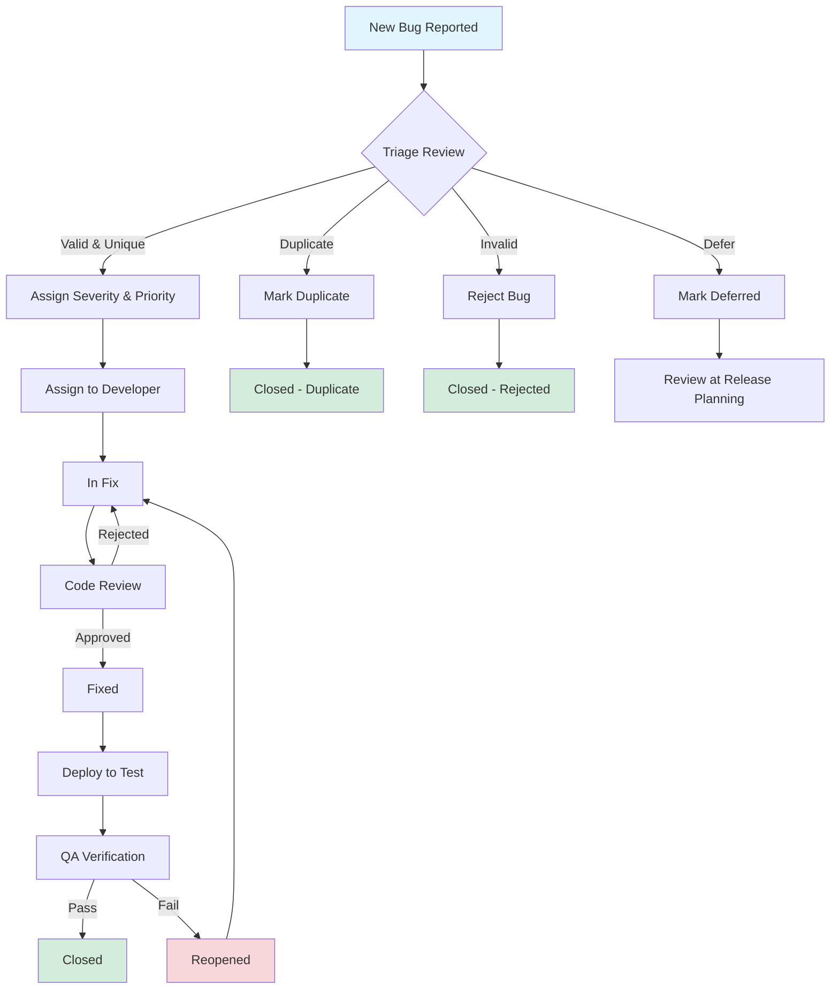

# G-021: Bug Triage & Management Process

---

## Document Control

| Field | Value |
|-------|-------|
| **Document ID** | G-021 |
| **Version** | 1.0 |
| **Date** | January 31, 2026 |
| **Author** | QA Lead |
| **Owner** | QA Lead |
| **Reviewer** | Project Manager |
| **Classification** | Internal |
| **Status** | Approved |

### Revision History

| Version | Date | Author | Changes |
|---------|------|--------|---------|
| 1.0 | 2026-01-31 | QA Lead | Initial release |

---

## Table of Contents

1. [Introduction](#1-introduction)
2. [Bug Lifecycle](#2-bug-lifecycle)
3. [Severity Definitions](#3-severity-definitions)
4. [Priority Definitions](#4-priority-definitions)
5. [Bug Triage Process](#5-bug-triage-process)
6. [Triage Team](#6-triage-team)
7. [Triage Meeting Agenda](#7-triage-meeting-agenda)
8. [Bug Reporting Standards](#8-bug-reporting-standards)
9. [Bug Review & Assignment](#9-bug-review--assignment)
10. [SLA by Severity](#10-sla-by-severity)
11. [Defect Metrics](#11-defect-metrics)
12. [Bug Reopening Process](#12-bug-reopening-process)
13. [Duplicate Management](#13-duplicate-management)
14. [Deferred Bugs](#14-deferred-bugs)
15. [Tool Configuration](#15-tool-configuration)
16. [Communication](#16-communication)
17. [Process Improvement](#17-process-improvement)
18. [Appendices](#18-appendices)

---

## 1. Introduction

### 1.1 Purpose

This document establishes the standardized Bug Triage & Management Process for the Smart Dairy Web Portal System. It defines the methodology for identifying, classifying, prioritizing, and resolving software defects throughout the software development lifecycle (SDLC).

The process ensures that:
- All bugs are systematically evaluated and categorized
- Critical issues receive immediate attention
- Resources are allocated efficiently based on business impact
- Quality standards are maintained throughout the project

### 1.2 Scope

This process applies to:
- **All project phases**: Development, Testing, UAT, and Production
- **All defect types**: Functional, Performance, Security, Usability, and Compatibility issues
- **All team members**: Developers, QA Engineers, Business Analysts, and Project Stakeholders
- **All deliverables**: Web Portal, Mobile Interfaces, APIs, and Backend Systems

### 1.3 Objectives

| Objective | Description |
|-----------|-------------|
| **Consistency** | Ensure uniform bug handling across all teams and phases |
| **Efficiency** | Minimize time-to-resolution through clear prioritization |
| **Quality** | Maintain high standards for bug documentation and resolution |
| **Transparency** | Provide visibility into defect status and trends |
| **Accountability** | Define clear ownership at each stage of the bug lifecycle |
| **Predictability** | Enable accurate forecasting of bug resolution timelines |

### 1.4 Definitions

| Term | Definition |
|------|------------|
| **Bug/Defect** | Any deviation from expected behavior or requirement |
| **Triage** | Process of reviewing, prioritizing, and assigning bugs |
| **Severity** | Impact of the bug on system functionality |
| **Priority** | Urgency of fixing the bug from business perspective |
| **SLA** | Service Level Agreement - agreed response and fix times |
| **Regression** | Reappearance of a previously fixed bug |

---

## 2. Bug Lifecycle

### 2.1 Bug States

```
┌─────────────┐     ┌─────────────┐     ┌─────────────┐     ┌─────────────┐
│    NEW      │────▶│   TRIAGE    │────▶│   ASSIGNED  │────▶│   IN FIX    │
└─────────────┘     └─────────────┘     └─────────────┘     └─────────────┘
                                                                  │
                                                                  ▼
┌─────────────┐     ┌─────────────┐     ┌─────────────┐     ┌─────────────┐
│   CLOSED    │◀────│   VERIFIED  │◀────│    FIXED    │◀────│ CODE REVIEW │
└─────────────┘     └─────────────┘     └─────────────┘     └─────────────┘
       ▲
       │
┌─────────────┐     ┌─────────────┐     ┌─────────────┐
│  REOPENED   │────▶│   REJECTED  │     │   DEFERRED  │
└─────────────┘     └─────────────┘     └─────────────┘
       │
       └──────────────────────────────────────────────────────────────────
```

### 2.2 State Descriptions

| State | Description | Entry Criteria | Exit Criteria |
|-------|-------------|----------------|---------------|
| **New** | Initial state when bug is reported | Bug logged in system | Triage review completed |
| **Triage** | Under evaluation by triage team | New bugs flagged for review | Severity/Priority assigned |
| **Assigned** | Allocated to a developer | Triage completed | Developer accepts assignment |
| **In Fix** | Developer actively working on fix | Assignment accepted | Code fix completed |
| **Code Review** | Fix undergoing peer review | Developer submits fix | Code review approved |
| **Fixed** | Fix deployed to test environment | Code review passed | Build deployed |
| **Verified** | QA validates the fix | Fix available in test env | QA signs off |
| **Closed** | Bug resolution complete | QA verification passed | N/A |
| **Reopened** | Fix failed verification | Verification failed | Re-assigned to developer |
| **Rejected** | Not a valid bug | Triage determines invalid | Reason documented |
| **Deferred** | Fix postponed to future release | Triage decision | Review date set |
| **Duplicate** | Same as existing bug | Match found with existing bug | Linked to original |

### 2.3 State Transitions

| From State | To State | Trigger | Responsible Role |
|------------|----------|---------|------------------|
| New | Triage | Bug automatically flagged | System |
| Triage | Assigned | Valid bug, severity/priority set | QA Lead |
| Triage | Rejected | Not a defect | QA Lead |
| Triage | Duplicate | Matches existing bug | QA Lead |
| Triage | Deferred | Low priority, future release | QA Lead |
| Assigned | In Fix | Developer accepts assignment | Developer |
| In Fix | Code Review | Fix implemented | Developer |
| Code Review | Fixed | Peer review approved | Reviewer |
| Code Review | In Fix | Review failed | Reviewer |
| Fixed | Verified | Deployed to test environment | QA Engineer |
| Verified | Closed | QA verification passed | QA Engineer |
| Verified | Reopened | Verification failed | QA Engineer |
| Reopened | In Fix | Developer re-assigned | QA Lead |

### 2.4 Workflow Diagram (Text)

```
BUG LIFECYCLE WORKFLOW
======================

[Report] 
    │
    ▼
[NEW] ──▶ Logged by Reporter (QA/User/Automated)
    │
    ▼
[TRIAGE] ──▶ Triage Team Review
    │          ├─▶ Valid? ──NO──▶ [REJECTED]
    │          ├─▶ Duplicate? ──YES──▶ [DUPLICATE]
    │          ├─▶ Deferred? ──YES──▶ [DEFERRED]
    │          └─▶ Valid & Unique? ──YES──▶ Assign Severity/Priority
    │
    ▼
[ASSIGNED] ──▶ Allocation to Developer
    │
    ▼
[IN FIX] ──▶ Development Work
    │
    ▼
[CODE REVIEW] ──▶ Peer Review
    │          ├─▶ Failed? ──YES──▶ Return to [IN FIX]
    │          └─▶ Passed? ──YES──▶ Continue
    │
    ▼
[FIXED] ──▶ Build & Deploy to Test
    │
    ▼
[VERIFIED] ──▶ QA Validation
    │          ├─▶ Failed? ──YES──▶ [REOPENED] ──▶ [IN FIX]
    │          └─▶ Passed? ──YES──▶ Continue
    │
    ▼
[CLOSED] ──▶ Resolution Complete
```

---

## 3. Severity Definitions

### 3.1 Severity Levels

| Level | Code | Description | Business Impact |
|-------|------|-------------|-----------------|
| **Critical** | S1 | System crash, data loss, security breach | Complete service disruption |
| **High** | S2 | Major feature broken, workaround difficult | Significant feature impairment |
| **Medium** | S3 | Feature impaired, workaround exists | Partial functionality impact |
| **Low** | S4 | Cosmetic, minor inconvenience | Minimal impact on operations |

### 3.2 Severity Criteria Matrix

| Criteria | Critical (S1) | High (S2) | Medium (S3) | Low (S4) |
|----------|---------------|-----------|-------------|----------|
| **System Availability** | Complete outage | Major degradation | Minor degradation | No impact |
| **Data Integrity** | Data loss/corruption | Data inconsistency | Minor data issues | None |
| **Security** | Breach/exploit possible | Vulnerability exposed | Security concern | None |
| **Workaround** | None available | Difficult/inefficient | Available | N/A |
| **Users Affected** | All users | Many users | Some users | Few users |
| **Business Process** | Critical process blocked | Major process impacted | Minor process affected | N/A |
| **Performance** | System unusable | Severely degraded | Noticeably slow | Negligible |

### 3.3 Severity Decision Tree

```
                    START SEVERITY ASSESSMENT
                             │
            ┌────────────────┴────────────────┐
            │                                 │
    Does it cause data loss?          Does it cause system crash?
            │                                 │
    ┌───────┴───────┐               ┌─────────┴─────────┐
    │               │               │                   │
   YES             NO              YES                 NO
    │               │               │                   │
    ▼               │               ▼                   │
 CRITICAL           │          CRITICAL                 │
   (S1)             │            (S1)                   │
                    │                                   │
    ┌───────────────┴───────────────┐                   │
    │                               │                   │
Is there a security breach?   Is a major feature broken?
    │                               │                   │
┌───┴───┐                   ┌───────┴───────┐           │
│       │                   │               │           │
YES     NO                  YES             NO          │
 │       │                   │               │          │
 ▼       │                   ▼               │          │
CRITICAL │                 HIGH              │          │
  (S1)   │                 (S2)              │          │
         │                                   │          │
         └───────────────┬───────────────────┘          │
                         │                              │
            Is there a workaround?              Is there a workaround?
                         │                              │
             ┌───────────┴───────────┐         ┌───────┴───────┐
             │                       │         │               │
            NO                     YES        YES             NO
             │                       │         │               │
             ▼                       ▼         ▼               ▼
            HIGH                   MEDIUM     MEDIUM          LOW
            (S2)                   (S3)       (S3)           (S4)
```

### 3.4 Severity Examples by Module

#### User Management Module
| Severity | Example |
|----------|---------|
| Critical | Users unable to login; Password reset leads to account lockout for all users |
| High | Admin cannot create new users; Profile update fails for 50%+ users |
| Medium | Email notification delayed; Profile picture upload slow |
| Low | UI alignment issue on user list; Typo in user welcome message |

#### Milk Collection Module
| Severity | Example |
|----------|---------|
| Critical | Collection data lost during sync; Duplicate payments processed |
| High | Cannot record new collection; Farmer lookup fails |
| Medium | Collection history loads slowly; Date picker shows wrong format |
| Low | Collection ID display formatting inconsistent |

#### Payment Processing Module
| Severity | Example |
|----------|---------|
| Critical | Payment double-charging; Financial data corruption |
| High | Payment gateway timeout; Incorrect payment calculations |
| Medium | Payment receipt email missing; Statement format error |
| Low | Payment status color coding wrong |

---

## 4. Priority Definitions

### 4.1 Priority Levels

| Priority | Code | Description | Response Time |
|----------|------|-------------|---------------|
| **P0 - Urgent** | P0 | Production incident, fix immediately | Immediate |
| **P1 - High** | P1 | Fix in current sprint/release | Next build |
| **P2 - Medium** | P2 | Fix in subsequent sprint/release | Following sprint |
| **P3 - Low** | P3 | Fix as time permits, future release | Backlog |

### 4.2 Priority Assignment Criteria

| Factor | P0 (Urgent) | P1 (High) | P2 (Medium) | P3 (Low) |
|--------|-------------|-----------|-------------|----------|
| **Business Impact** | Revenue loss; Legal/compliance risk | Significant business impact | Minor business impact | Minimal impact |
| **Customer Impact** | Customer cannot operate | Major customer inconvenience | Minor inconvenience | Aesthetic issue |
| **Release Timing** | Blocker for release | Required for release | Nice-to-have for release | Future enhancement |
| **Regulatory** | Compliance violation | Compliance concern | Best practice gap | N/A |
| **Workaround** | None exists | Ineffective workaround | Workaround acceptable | N/A |

### 4.3 Severity vs Priority Matrix

| Severity \ Priority | P0 (Urgent) | P1 (High) | P2 (Medium) | P3 (Low) |
|---------------------|-------------|-----------|-------------|----------|
| **S1 (Critical)** | Production incident | Pre-release blocker | Post-release fix | Rare - review |
| **S2 (High)** | Escalated customer issue | Sprint commitment | Next sprint | Deferred |
| **S3 (Medium)** | Rare - business critical | Standard fix | Backlog item | Future release |
| **S4 (Low)** | Never | Cosmetic blocker | Cosmetic fix | Nice-to-have |

### 4.4 Priority Assignment Guidelines

```
PRIORITY ASSIGNMENT DECISION TREE
=================================

Is this a production incident affecting live users?
├── YES → P0 (Urgent)
│
└── NO → Is this blocking a release or major feature?
    ├── YES → P1 (High)
    │
    └── NO → Is there a reasonable workaround?
        ├── NO → P1 (High)
        │
        └── YES → Is the feature frequently used?
            ├── YES → P2 (Medium)
            │
            └── NO → P3 (Low)
```

---

## 5. Bug Triage Process

### 5.1 Triage Process Overview

```
┌─────────────────────────────────────────────────────────────────────────────┐
│                         BUG TRIAGE PROCESS FLOW                              │
├─────────────────────────────────────────────────────────────────────────────┤
│                                                                              │
│  ┌──────────┐    ┌──────────┐    ┌──────────┐    ┌──────────┐              │
│  │ Receive  │───▶│ Validate │───▶│ Classify │───▶│ Prioritize│              │
│  │  Bugs    │    │   Bug    │    │          │    │           │              │
│  └──────────┘    └──────────┘    └──────────┘    └──────────┘              │
│       │               │               │               │                     │
│       ▼               ▼               ▼               ▼                     │
│  Auto-notification  Check if:    Assign:         Assign:                   │
│  Triage Queue      - Duplicate   - Severity      - Priority                │
│                    - Valid       - Category      - Sprint                  │
│                    - Reproducible                               ┌────────┐ │
│                                                                 │ Assign │ │
│                    ┌──────────┐    ┌──────────┐    ┌───────────┤  to    │ │
│                    │ Duplicate│    │ Deferred │    │  Ready    │Dev Team│ │
│                    │ Handling │    │ Decision │    │ for Work  └────┬───┘ │
│                    └──────────┘    └──────────┘    └───────────┘      │    │
│                                                                      │    │
└──────────────────────────────────────────────────────────────────────┼────┘
                                                                       │
                                                                       ▼
                                                              ┌────────────────┐
                                                              │ Update Stake-  │
                                                              │ holders        │
                                                              └────────────────┘
```

### 5.2 Triage Steps

| Step | Activity | Duration | Output |
|------|----------|----------|--------|
| 1. Receive | Bugs enter triage queue automatically | Real-time | Triage list populated |
| 2. Validate | Check reproducibility, duplicates, validity | 5 min/bug | Validation decision |
| 3. Classify | Assign severity and category | 3 min/bug | Severity label |
| 4. Prioritize | Determine priority based on impact | 2 min/bug | Priority assignment |
| 5. Assign | Allocate to developer/team | 2 min/bug | Assignment complete |
| 6. Notify | Stakeholders informed of decisions | 1 min/bug | Notifications sent |

### 5.3 Triage Frequency

| Phase | Triage Frequency | Participants |
|-------|-----------------|--------------|
| Development | Daily (30 min) | QA Lead, Dev Lead, BA |
| Testing | Twice daily | QA Lead, Dev Lead |
| UAT | Daily + On-demand | QA Lead, PM, BA |
| Production | Immediate (P0), Daily (others) | QA Lead, Dev Lead, PM |

### 5.4 Triage Triggers

| Trigger | Action | SLA |
|---------|--------|-----|
| New S1/S2 bug logged | Immediate triage | Within 2 hours |
| New S3/S4 bug logged | Queue for next triage | Within 24 hours |
| Bug reopened | Immediate triage | Within 4 hours |
| Customer escalation | Emergency triage | Within 1 hour |
| Automated alert | Immediate triage | Within 1 hour |

---

## 6. Triage Team

### 6.1 Triage Team Composition

| Role | Responsibility | Attendance |
|------|----------------|------------|
| **QA Lead** | Facilitate, final severity/priority decision | Required |
| **Development Lead** | Technical assessment, effort estimation | Required |
| **Product Owner/BA** | Business impact assessment | Required |
| **Project Manager** | Resource allocation, timeline impact | As needed |
| **Technical Architect** | Complex technical issues | As needed |

### 6.2 RACI Matrix

| Activity | QA Lead | Dev Lead | Product Owner | PM | Developer |
|----------|---------|----------|---------------|-----|-----------|
| **Bug Validation** | A | C | I | I | - |
| **Severity Assignment** | R/A | C | C | I | - |
| **Priority Assignment** | R/A | C | C | I | - |
| **Effort Estimation** | I | R/A | C | C | C |
| **Bug Assignment** | A | R | I | C | I |
| **Fix Implementation** | I | A | I | I | R |
| **Verification** | R/A | C | I | I | C |
| **Communication** | R | C | C | A | I |

**Legend:** R=Responsible, A=Accountable, C=Consulted, I=Informed

### 6.3 Roles and Responsibilities

#### QA Lead (Triage Facilitator)
- Schedule and facilitate triage meetings
- Ensure all bugs are properly documented
- Make final decisions on severity and priority
- Assign bugs to appropriate developers
- Track triage metrics and SLAs
- Escalate issues as needed

#### Development Lead
- Assess technical complexity and effort
- Identify dependencies and risks
- Allocate development resources
- Review and approve technical solutions
- Ensure code review processes are followed

#### Product Owner/Business Analyst
- Assess business impact of bugs
- Prioritize based on business value
- Approve deferral decisions
- Clarify requirements when needed
- Represent customer/stakeholder interests

#### Project Manager
- Monitor project impact of bugs
- Approve resource reallocation
- Communicate timelines to stakeholders
- Manage scope and schedule adjustments
- Track costs associated with bug fixes

---

## 7. Triage Meeting Agenda

### 7.1 Standard Triage Meeting Agenda

**Meeting Details:**
- **Duration:** 30 minutes
- **Frequency:** Daily (Development/Testing phase)
- **Format:** Stand-up / Virtual

### 7.2 Agenda Template

| Time | Item | Owner | Details |
|------|------|-------|---------|
| 0:00-0:05 | Welcome & Context | QA Lead | Review meeting purpose, outstanding items |
| 0:05-0:15 | New Bugs Review | All | Review new bugs since last triage (max 10) |
| 0:15-0:20 | Open Issues | All | Address reopened or blocked bugs |
| 0:20-0:25 | Deferred Review | QA Lead | Review bugs marked for future release |
| 0:25-0:30 | Action Items | QA Lead | Summarize assignments, confirm next meeting |

### 7.3 Bug Review Template (Per Bug)

```
BUG REVIEW TEMPLATE
===================
Bug ID: [BUG-XXX]
Reporter: [Name]
Title: [Brief description]

Discussion Points:
□ Reproducible? (Show evidence/steps)
□ Duplicate of existing bug?
□ Severity assessment:
  - Impact on users?
  - Workaround available?
  - Data/system risk?
□ Priority assessment:
  - Release blocker?
  - Customer impact?
  - Business priority?
□ Effort estimate (Dev Lead):
□ Assignee:
□ Target date:
□ Dependencies:

Decision: [ ] Assign [ ] Reject [ ] Duplicate [ ] Defer
```

### 7.4 Triage Meeting Rules

1. **Time-boxed:** Maximum 5 minutes per bug
2. **Evidence-based:** Decisions require data, not opinions
3. **Documented:** All decisions recorded in bug tracking tool
4. **Action-oriented:** Every bug leaves with an owner and next step
5. **Escalation:** Disputes escalated to PM for resolution

### 7.5 Post-Triage Actions

| Action | Owner | Timeline |
|--------|-------|----------|
| Update bug status and assignments | QA Lead | Within 1 hour |
| Notify assignees | System/QA Lead | Immediate |
| Update project dashboard | Scrum Master | Within 4 hours |
| Communicate high-priority issues | PM | Within 2 hours |

---

## 8. Bug Reporting Standards

### 8.1 Bug Report Template

```markdown
================================================================================
BUG REPORT TEMPLATE
================================================================================

BUG ID:          [Auto-generated: BUG-XXX]
TITLE:           [Clear, concise summary]
STATUS:          New
SEVERITY:        [S1/S2/S3/S4 - To be assigned during triage]
PRIORITY:        [P0/P1/P2/P3 - To be assigned during triage]
ASSIGNED TO:     [To be assigned during triage]

--------------------------------------------------------------------------------
ENVIRONMENT
--------------------------------------------------------------------------------
Application:     Smart Dairy Web Portal
Module:          [User Management / Milk Collection / Payment Processing / etc.]
Version:         [Build/Sprint number]
Environment:     [Dev / Test / UAT / Production]
Browser/OS:      [Chrome 120 / Windows 11 / etc.]
Device:          [Desktop / Mobile / Tablet]

--------------------------------------------------------------------------------
DESCRIPTION
--------------------------------------------------------------------------------
[Detailed description of the defect]

--------------------------------------------------------------------------------
STEPS TO REPRODUCE
--------------------------------------------------------------------------------
1. [Step 1]
2. [Step 2]
3. [Step 3]
4. [Expected Result]
5. [Actual Result]

--------------------------------------------------------------------------------
EXPECTED RESULT
--------------------------------------------------------------------------------
[What should happen]

--------------------------------------------------------------------------------
ACTUAL RESULT
--------------------------------------------------------------------------------
[What actually happens - include error messages]

--------------------------------------------------------------------------------
EVIDENCE
--------------------------------------------------------------------------------
- Screenshot: [Attach image]
- Video: [Attach recording]
- Logs: [Attach relevant log files]
- Network Trace: [Attach HAR file if applicable]

--------------------------------------------------------------------------------
IMPACT
--------------------------------------------------------------------------------
- Users Affected: [Number/Percentage]
- Frequency: [Always / Sometimes / Rare]
- Workaround: [Yes/No - describe if yes]
- Business Impact: [Brief description]

--------------------------------------------------------------------------------
ADDITIONAL INFORMATION
--------------------------------------------------------------------------------
Related Bugs:    [Links to related issues]
Requirements:    [Link to requirement document]
Notes:           [Any additional context]

--------------------------------------------------------------------------------
REPORTER INFORMATION
--------------------------------------------------------------------------------
Reported By:     [Name]
Reported Date:   [YYYY-MM-DD HH:MM]
Contact:         [Email/Slack]
--------------------------------------------------------------------------------
```

### 8.2 Required Fields

| Field | Required | Purpose |
|-------|----------|---------|
| Title | Yes | Quick identification |
| Description | Yes | Understand the issue |
| Steps to Reproduce | Yes | Enable reproduction |
| Expected Result | Yes | Define correct behavior |
| Actual Result | Yes | Document defect |
| Environment | Yes | Context for debugging |
| Severity | Yes (triage) | Impact assessment |
| Priority | Yes (triage) | Fix urgency |
| Screenshots | Strongly recommended | Visual evidence |
| Browser/OS | Yes | Platform identification |
| Module/Feature | Yes | Routing to correct team |

### 8.3 Bug Writing Best Practices

1. **Title:** Clear, specific, and action-oriented
   - ✅ "Payment gateway timeout on checkout for amounts > ₹10,000"
   - ❌ "Payment not working"

2. **Description:** Include context and impact
   - Explain the business impact
   - Note any error messages exactly

3. **Steps to Reproduce:** Numbered, detailed, minimal
   - Include preconditions
   - Be specific (use actual data values)
   - Keep steps minimal (5-7 steps ideal)

4. **Evidence:** Always attach when possible
   - Full-screen screenshots with annotations
   - Screen recordings for complex flows
   - Log files and console errors
   - Network traces for API issues

5. **One Issue Per Bug:** Separate distinct problems

---

## 9. Bug Review & Assignment

### 9.1 Assignment Process

```
┌─────────────────┐     ┌─────────────────┐     ┌─────────────────┐
│  Bug Triage     │────▶│  Skill Match    │────▶│  Capacity Check │
│  Completed      │     │  & Component    │     │  & Availability │
└─────────────────┘     └─────────────────┘     └─────────────────┘
                                                         │
                                                         ▼
┌─────────────────┐     ┌─────────────────┐     ┌─────────────────┐
│  Developer      │◀────│  Assignment     │◀────│  Workload       │
│  Notified       │     │  Decision       │     │  Balancing      │
└─────────────────┘     └─────────────────┘     └─────────────────┘
```

### 9.2 Assignment Criteria

| Criteria | Consideration |
|----------|---------------|
| **Technical Expertise** | Match bug complexity to developer skill |
| **Component Ownership** | Assign to component owner when possible |
| **Current Workload** | Balance across team members |
| **Availability** | Consider vacations, meetings, training |
| **Learning Opportunity** | Use appropriate bugs for skill development |
| **Urgency** | Assign critical bugs to most experienced |

### 9.3 Assignment SLA

| Severity | Assignment SLA | Rationale |
|----------|----------------|-----------|
| S1 (Critical) | Within 2 hours | Immediate attention required |
| S2 (High) | Within 4 hours | Rapid response needed |
| S3 (Medium) | Within 24 hours | Standard queue processing |
| S4 (Low) | Within 48 hours | Backlog management |

### 9.4 Assignment Notification

Notification includes:
- Bug ID and title
- Severity and priority
- Expected resolution date
- Related dependencies
- Link to detailed bug report
- Escalation contact (for S1/S2)

---

## 10. SLA by Severity

### 10.1 Response and Fix SLAs

| Severity | Response Time | Fix Time | Verification Time | Communication |
|----------|---------------|----------|-------------------|---------------|
| **S1 - Critical** | 2 hours | 24 hours | 4 hours | Immediate + hourly updates |
| **S2 - High** | 4 hours | 72 hours | 8 hours | Daily updates |
| **S3 - Medium** | 8 hours | 5 days | 24 hours | Every 2 days |
| **S4 - Low** | 24 hours | 14 days | 48 hours | Weekly summary |

### 10.2 SLA Clock Definition

| Phase | Clock Running | Clock Paused |
|-------|---------------|--------------|
| **Response** | From bug logged | Until acknowledged |
| **Fix** | From assignment | Waiting for: info, dependencies, environment |
| **Verification** | From fix deployed | Waiting for: deployment, environment |

### 10.3 SLA Exclusions

SLA clock is paused for:
- Waiting for stakeholder input or clarification
- Waiting for third-party/vendor resolution
- Environment unavailability (scheduled maintenance)
- Dependencies on other teams
- Force majeure events

### 10.4 SLA Breach Escalation

| SLA Stage | Breach Threshold | Escalation Path |
|-----------|------------------|-----------------|
| Response | 50% of SLA | Notify Dev Lead |
| Response | 100% of SLA | Escalate to PM |
| Response | 150% of SLA | Escalate to Project Director |
| Fix | 50% of SLA | Daily standup highlight |
| Fix | 100% of SLA | PM intervention |
| Fix | 150% of SLA | Executive escalation |

### 10.5 SLA Dashboard Metrics

```
┌─────────────────────────────────────────────────────────────────────────────┐
│                          SLA DASHBOARD                                       │
├─────────────────────────────────────────────────────────────────────────────┤
│                                                                              │
│  RESPONSE TIME SLA                      FIX TIME SLA                        │
│  ┌─────────────────────────────────┐   ┌─────────────────────────────────┐  │
│  │ S1: ████████████░░ 95% Met      │   │ S1: ██████████░░░░░░ 85% Met    │  │
│  │ S2: ██████████████████ 100% Met │   │ S2: ██████████████░░ 92% Met    │  │
│  │ S3: ████████████████░░ 98% Met  │   │ S3: ████████████████ 100% Met   │  │
│  │ S4: ██████████████████ 100% Met │   │ S4: ██████████████████ 100% Met │  │
│  └─────────────────────────────────┘   └─────────────────────────────────┘  │
│                                                                              │
│  BREACH SUMMARY (Current Sprint)                                             │
│  ┌───────────────────────────────────────────────────────────────────────┐  │
│  │ Total Breaches: 3  │  S1: 0  │  S2: 2  │  S3: 1  │  S4: 0             │  │
│  │ Avg Breach Duration: 8 hours                                          │  │
│  └───────────────────────────────────────────────────────────────────────┘  │
│                                                                              │
└─────────────────────────────────────────────────────────────────────────────┘
```

---

## 11. Defect Metrics

### 11.1 Key Performance Indicators (KPIs)

| KPI | Formula | Target | Frequency |
|-----|---------|--------|-----------|
| **Defect Detection Rate** | (Defects Found / Total Defects) × 100 | >95% by UAT | Per phase |
| **Defect Removal Efficiency** | (Defects Fixed / Defects Found) × 100 | >98% | Per sprint |
| **Defect Density** | Defects per 1000 lines of code | <0.5 | Per module |
| **Mean Time to Fix (MTTF)** | Total fix time / Number of fixes | Per severity | Weekly |
| **Mean Time to Verify (MTTV)** | Total verification time / Verifications | <4 hours | Weekly |
| **Reopen Rate** | (Reopened bugs / Total closed) × 100 | <5% | Per sprint |
| **SLA Compliance** | (Bugs within SLA / Total bugs) × 100 | >95% | Weekly |
| **Escaped Defects** | Defects found in production | <2% of total | Per release |

### 11.2 Metrics Dashboard Components

| Component | Purpose | Update Frequency |
|-----------|---------|------------------|
| **Bug Trend Chart** | Track bug inflow/outflow | Daily |
| **Severity Distribution** | Monitor severity balance | Daily |
| **Aging Report** | Identify stale bugs | Daily |
| **Team Velocity** | Track team performance | Sprint |
| **Module Quality** | Identify problematic areas | Sprint |
| **Test Coverage** | Measure coverage effectiveness | Sprint |

### 11.3 Metrics Report Template

```markdown
================================================================================
DEFECT METRICS REPORT - SPRINT [XX]
Period: [Start Date] to [End Date]
Generated: [Date]
================================================================================

EXECUTIVE SUMMARY
--------------------------------------------------------------------------------
Total Bugs Logged:      [XX]
Total Bugs Closed:      [XX]
Net Change:             [+/- XX]
SLA Compliance:         [XX%]
Critical Issues:        [XX]

BUG FLOW
--------------------------------------------------------------------------------
┌──────────┬──────────┬──────────┬──────────┬──────────┐
│  New     │  Triaged │ Assigned │   Fixed  │  Closed  │
├──────────┼──────────┼──────────┼──────────┼──────────┤
│   [XX]   │   [XX]   │   [XX]   │   [XX]   │   [XX]   │
└──────────┴──────────┴──────────┴──────────┴──────────┘

SEVERITY DISTRIBUTION
--------------------------------------------------------------------------------
S1 (Critical): [XX]  ████░░░░░░░░░░░░░░░░ [XX%]
S2 (High):     [XX]  ████████░░░░░░░░░░░░ [XX%]
S3 (Medium):   [XX]  ████████████░░░░░░░░ [XX%]
S4 (Low):      [XX]  ██████░░░░░░░░░░░░░░ [XX%]

PERFORMANCE METRICS
--------------------------------------------------------------------------------
Metric                    Target    Actual    Status
────────────────────────────────────────────────────────
Avg Time to Fix (S1)      24h       [XX]h     [✓/✗]
Avg Time to Fix (S2)      72h       [XX]h     [✓/✗]
Avg Time to Fix (S3)      5 days    [XX]d     [✓/✗]
Reopen Rate               <5%       [XX%]     [✓/✗]
SLA Compliance            >95%      [XX%]     [✓/✗]
Escaped Defects           <2%       [XX%]     [✓/✗]

TOP ISSUES BY MODULE
--------------------------------------------------------------------------------
1. [Module A]: [XX] bugs  ████████████████████
2. [Module B]: [XX] bugs  ███████████████░░░░░
3. [Module C]: [XX] bugs  ██████████░░░░░░░░░░

ACTION ITEMS
--------------------------------------------------------------------------------
1. [Action item 1] - Owner: [Name] - Due: [Date]
2. [Action item 2] - Owner: [Name] - Due: [Date]

================================================================================
```

### 11.4 Defect Trend Analysis

```
BUG BURNDOWN CHART
==================

Bugs
  │
50├────────────────────────────────────
  │                            ╱
40├─────────────────────     ╱
  │                  ╱     ╱
30├──────────      ╱     ╱
  │        ╱     ╱     ╱
20├────  ╱     ╱     ╱
  │   ╱     ╱     ╱
10├ ╱     ╱     ╱
  │╱     ╱     ╱
 0├────┬────┬────┬────┬────┬────┬──▶ Sprint
  W1   W2   W3   W4   W5   W6   W7

── Open Bugs (should trend down)
── Found Bugs (indicates testing activity)
```

---

## 12. Bug Reopening Process

### 12.1 Reopening Criteria

A bug may be reopened when:

| Scenario | Description | Action |
|----------|-------------|--------|
| **Fix Failed** | The reported issue still occurs | Reopen original bug |
| **Partial Fix** | Only part of the issue is resolved | Reopen or create new bug |
| **Regression** | Fix introduced new issue | Create new bug, link to original |
| **Same Root Cause** | Different symptom, same cause | Reopen original bug |
| **Environment Issue** | Fix works in test but not prod | Reopen, investigate environment |

### 12.2 Reopening Process Flow

```
┌─────────────────┐
│  QA Verifies    │
│     Fix         │
└────────┬────────┘
         │
         ▼
┌─────────────────┐
│  Fix Verified?  │
└────────┬────────┘
         │
    ┌────┴────┐
   YES       NO
    │         │
    ▼         ▼
┌────────┐  ┌─────────────────┐
│ Close  │  │ Document Failed │
│  Bug   │  │  Verification   │
└────────┘  └────────┬────────┘
                     │
                     ▼
            ┌─────────────────┐
            │  Reopen Bug     │
            │  - Add comment  │
            │  - Attach new   │
            │    evidence     │
            └────────┬────────┘
                     │
                     ▼
            ┌─────────────────┐
            │  Assign to      │
            │  Developer      │
            └────────┬────────┘
                     │
                     ▼
            ┌─────────────────┐
            │  Update Metrics │
            │  (Reopen count) │
            └─────────────────┘
```

### 12.3 Reopening Documentation Requirements

When reopening a bug, the QA engineer must provide:

| Required Information | Purpose |
|---------------------|---------|
| Reason for reopening | Explain why fix failed |
| Steps to reproduce (revalidated) | Confirm issue still exists |
| Environment details | Document where fix failed |
| Evidence (screenshots/logs) | Prove issue persists |
| Expected vs actual behavior | Clarify gap |
| Related build/version | Identify where fix was tested |

### 12.4 Reopen Rate Tracking

| Metric | Calculation | Target |
|--------|-------------|--------|
| Reopen Rate | (Reopened bugs / Total closed bugs) × 100 | <5% |
| Reopen by Developer | Reopens per developer | Track for coaching |
| Reopen by Severity | Reopen rate per severity | Identify patterns |
| Reopen Reason Analysis | Categorize reopen reasons | Drive improvement |

---

## 13. Duplicate Management

### 13.1 Duplicate Detection Process

```
┌─────────────────────────────────────────────────────────────────────────────┐
│                        DUPLICATE DETECTION FLOW                              │
├─────────────────────────────────────────────────────────────────────────────┤
│                                                                              │
│  New Bug Logged                                                              │
│       │                                                                      │
│       ▼                                                                      │
│  ┌───────────────────────────────────────┐                                   │
│  │  Automated Duplicate Detection        │                                   │
│  │  - Title matching                     │                                   │
│  │  - Description similarity             │                                   │
│  │  - Component/Error code matching      │                                   │
│  └───────────────┬───────────────────────┘                                   │
│                  │                                                           │
│         ┌────────┴────────┐                                                  │
│         │                 │                                                  │
│    Potential           No match                                              │
│    matches found                                                         │
│         │                 │                                                  │
│         ▼                 ▼                                                  │
│  ┌────────────────┐  ┌────────────────┐                                     │
│  │ Manual Review  │  │ Continue with  │                                     │
│  │ by QA Lead     │  │ New Bug Triage │                                     │
│  └────────┬───────┘  └────────────────┘                                     │
│           │                                                                  │
│    ┌──────┴──────┐                                                          │
│    │             │                                                          │
│ Duplicate     Not duplicate                                                  │
│    │             │                                                          │
│    ▼             │                                                          │
│ ┌─────────────┐  │                                                          │
│ │ Mark as     │  │                                                          │
│ │ Duplicate   │  │                                                          │
│ │ Link to     │  │                                                          │
│ │ Original    │  │                                                          │
│ └─────────────┘  │                                                          │
│                                                                              │
└─────────────────────────────────────────────────────────────────────────────┘
```

### 13.2 Duplicate Identification Criteria

| Criterion | Weight | Detection Method |
|-----------|--------|------------------|
| **Title similarity** | High | Keyword matching (80%+ match) |
| **Description similarity** | High | Text analysis, NLP |
| **Error message** | Very High | Exact match on error codes |
| **Component/Module** | Medium | Same functional area |
| **Steps to reproduce** | High | Pattern matching |
| **Reporter** | Low | Same user (may indicate retry) |
| **Time proximity** | Medium | Logged within same timeframe |

### 13.3 Duplicate Handling Procedures

When a duplicate is identified:

1. **Mark the new bug as DUPLICATE**
2. **Link to original bug** (Parent/Child relationship)
3. **Copy relevant information** to original bug if new details provided
4. **Notify reporter** that issue is already tracked
5. **Close duplicate** with reference to original
6. **Update original bug** if new reproduction steps or context provided

### 13.4 Duplicate Prevention

| Strategy | Implementation |
|----------|----------------|
| **Search before logging** | Mandatory search field in bug form |
| **Suggested matches** | Auto-suggest similar bugs during creation |
| **Knowledge base** | Common issues documented for reference |
| **Training** | Educate testers on effective searching |
| **Bug template** | Structured data improves searchability |

### 13.5 Duplicate Metrics

| Metric | Target | Purpose |
|--------|--------|---------|
| Duplicate Rate | <10% | Measure logging efficiency |
| Time to Identify Duplicate | <5 min | Triage efficiency |
| Duplicate by Reporter | Track per reporter | Training needs |

---

## 14. Deferred Bugs

### 14.1 Deferral Criteria

A bug may be deferred when:

| Scenario | Justification |
|----------|---------------|
| **Low Business Impact** | S3/S4 bugs with acceptable workarounds |
| **Resource Constraints** | Critical path items take precedence |
| **Technical Dependencies** | Blocked by external factors |
| **Planned Redesign** | Area scheduled for rework |
| **Risk Assessment** | Fix risk outweighs benefit |
| **Release Timeline** | Cannot be fixed in current release |

### 14.2 Deferral Approval Process

```
┌─────────────────┐
│ Triage Team     │
│ Identifies      │
│ Candidate for   │
│ Deferral        │
└────────┬────────┘
         │
         ▼
┌─────────────────┐
│ Document        │
│ Rationale:      │
│ - Business      │
│   impact        │
│ - Workaround    │
│ - Risk          │
│ - Proposed      │
│   timeline      │
└────────┬────────┘
         │
         ▼
┌─────────────────┐
│ Product Owner   │
│ Approval        │
└────────┬────────┘
         │
    ┌────┴────┐
 Approved  Rejected
    │         │
    ▼         ▼
┌────────┐  ┌────────────────┐
│ Mark   │  │ Continue with  │
│ as     │  │ Normal Fix     │
│Deferred│  │ Process        │
└───┬────┘  └────────────────┘
    │
    ▼
┌─────────────────┐
│ Set Review Date │
│ (Release/Sprint)│
└────────┬────────┘
         │
         ▼
┌─────────────────┐
│ Add to          │
│ Deferred Log    │
└─────────────────┘
```

### 14.3 Deferred Bug Tracking

| Tracking Element | Description |
|------------------|-------------|
| **Deferral Date** | When decision was made |
| **Review Date** | When to reconsider (next release/sprint) |
| **Deferral Rationale** | Documented justification |
| **Business Impact** | Impact of not fixing |
| **Workaround Details** | How users can work around |
| **Proposed Release** | Target release for fix |
| **Approver** | Who approved deferral |

### 14.4 Deferred Bug Review

| Review Trigger | Action |
|----------------|--------|
| **Release Planning** | Review all deferred bugs for inclusion |
| **Sprint Planning** | Consider high-priority deferred items |
| **Quarterly Review** | Comprehensive review of deferred backlog |
| **Customer Escalation** | Re-evaluate if customers report impact |
| **Technical Change** | Reassess if architecture changes |

### 14.5 Deferred Bug Report

```
DEFERRED BUGS SUMMARY - Release [X.X]
================================================================================

Total Deferred: [XX] bugs

Breakdown by Severity:
- S1: [XX] (Emergency only - requires executive approval)
- S2: [XX] (High priority for next release)
- S3: [XX] (Standard backlog)
- S4: [XX] (Future consideration)

Breakdown by Module:
[Module A]: [XX] bugs
[Module B]: [XX] bugs
...

Risk Assessment:
High Risk: [XX] bugs - May impact release acceptance
Medium Risk: [XX] bugs - Monitor during UAT
Low Risk: [XX] bugs - Cosmetic/minor

Recommended for Next Release:
1. [BUG-XXX] - [Brief description]
2. [BUG-XXX] - [Brief description]
...

================================================================================
```

---

## 15. Tool Configuration

### 15.1 JIRA Configuration

#### Project Setup
```yaml
Project Name: Smart Dairy Web Portal
Project Key: SDWP
Issue Types:
  - Bug
  - Task
  - Story
  - Epic

Workflow Scheme: Bug Workflow v1.0
Screen Scheme: Bug Screen Scheme
Field Configuration: Bug Field Config
Notification Scheme: Bug Notification Scheme
Permission Scheme: Project Permissions
```

#### Bug Issue Type Configuration

| Field | Type | Required | Values |
|-------|------|----------|--------|
| Summary | Text | Yes | Free text |
| Description | Text Area | Yes | Free text |
| Severity | Select | Yes | Critical, High, Medium, Low |
| Priority | Select | Yes | P0, P1, P2, P3 |
| Component | Select | Yes | User Management, Milk Collection, etc. |
| Affects Version | Version | Yes | Release versions |
| Fix Version | Version | No | Target release |
| Assignee | User | Yes | Developer |
| Reporter | User | Auto | Logged by |
| Environment | Text | Yes | Browser, OS, etc. |
| Steps to Reproduce | Text Area | Yes | Numbered steps |
| Actual Result | Text Area | Yes | Observed behavior |
| Expected Result | Text Area | Yes | Expected behavior |
| Attachments | Attachment | No | Files, screenshots |
| Labels | Labels | No | categorization |
| Linked Issues | Issue Link | No | Related bugs |

#### JIRA Workflow Configuration

```
WORKFLOW: Bug Workflow
======================

Statuses:
1. New (gray)
2. Triage (blue)
3. Assigned (blue)
4. In Progress (yellow)
5. In Review (yellow)
6. Fixed (yellow)
7. Ready for Test (green)
8. Verified (green)
9. Closed (green)
10. Reopened (red)
11. Rejected (gray)
12. Deferred (gray)

Transitions:
- New → Triage: Auto-transition
- Triage → Assigned: Assign Issue
- Triage → Rejected: Reject Bug
- Triage → Duplicate: Mark Duplicate
- Triage → Deferred: Defer Bug
- Assigned → In Progress: Start Progress
- In Progress → In Review: Submit for Review
- In Review → In Progress: Reject Fix
- In Review → Fixed: Approve Fix
- Fixed → Ready for Test: Deploy to Test
- Ready for Test → Verified: Verify Fix
- Ready for Test → Reopened: Fail Verification
- Verified → Closed: Close Issue
- Reopened → In Progress: Restart Work

Conditions:
- Triage → Assigned: QA Lead permission
- In Review → Fixed: Code review approval
- Ready for Test → Verified: QA permission

Validators:
- Submit for Review: Fix description required
- Verify Fix: Test evidence required

Post Functions:
- Assign Issue: Set assignee, notify user
- Close Issue: Set resolution, update fix version
```

### 15.2 Azure DevOps Configuration (Alternative)

#### Work Item Template
```xml
<Bug>
  <Field refname="System.Title" />
  <Field refname="System.Description" />
  <Field refname="Microsoft.VSTS.Common.Severity">
    <ALLOWEDVALUES>
      <LISTITEM value="1 - Critical" />
      <LISTITEM value="2 - High" />
      <LISTITEM value="3 - Medium" />
      <LISTITEM value="4 - Low" />
    </ALLOWEDVALUES>
  </Field>
  <Field refname="Microsoft.VSTS.Common.Priority">
    <ALLOWEDVALUES>
      <LISTITEM value="0" />
      <LISTITEM value="1" />
      <LISTITEM value="2" />
      <LISTITEM value="3" />
    </ALLOWEDVALUES>
  </Field>
  <Field refname="Microsoft.VSTS.TCM.ReproSteps" />
  <Field refname="Microsoft.VSTS.TCM.SystemInfo" />
  <Field refname="Microsoft.VSTS.Common.AcceptanceCriteria" />
</Bug>
```

### 15.3 Automation Rules

| Trigger | Action | Tool |
|---------|--------|------|
| S1 bug created | Alert QA Lead + Dev Lead | JIRA Automation |
| Bug reopened | Alert original assignee + QA Lead | JIRA Automation |
| SLA approaching | Email warning to assignee | JIRA SLA |
| SLA breached | Escalate to manager | JIRA SLA |
| Bug closed | Notify reporter | JIRA Notification |
| Deferred bug | Schedule review reminder | JIRA Automation |

### 15.4 Dashboard Configuration

```
JIRA DASHBOARD: QA Bug Dashboard
================================

Gadgets:
1. Filter Results: Open Critical/High Bugs
2. Pie Chart: Bugs by Severity
3. Created vs Resolved: Sprint trend
4. Filter Results: SLA Breaches
5. Two Dimensional: Component vs Severity
6. Average Age: By priority
7. Resolution Time: Trend chart
8. Agile Sprint Health

Filters:
- My Open Bugs: assignee = currentUser()
- Unassigned S1/S2: severity in (Critical, High) AND assignee is EMPTY
- Ready for Test: status = "Ready for Test"
- Deferred: status = Deferred
- SLA Breach: sla_breached = true
```

---

## 16. Communication

### 16.1 Communication Matrix

| Event | Stakeholders | Channel | Timing |
|-------|--------------|---------|--------|
| **New S1 Bug** | QA Lead, Dev Lead, PM, Tech Lead | Email + Slack + Call | Immediate |
| **New S2 Bug** | QA Lead, Dev Lead, PM | Slack + Email | Within 1 hour |
| **New S3/S4 Bug** | Assignee, QA Lead | JIRA notification | Daily digest |
| **SLA Breach** | Dev Lead, PM, QA Lead | Slack + Email | When breached |
| **Bug Reopened** | Original assignee, QA Lead | Slack + JIRA | Immediate |
| **Deferred Decision** | Reporter, PM, Product Owner | JIRA comment | At deferral |
| **Daily Summary** | All team members | Email | End of day |
| **Weekly Metrics** | Management, Leads | Email + Dashboard | Weekly |

### 16.2 Escalation Path

```
LEVEL 1 (0-2 hours)
├── Issue: New S1 bug, Production incident
├── Actions: Immediate notification, team mobilization
└── Contacts: QA Lead, Dev Lead
         │
         ▼ (If unresolved after 2 hours)
LEVEL 2 (2-4 hours)
├── Issue: S1 not acknowledged, SLA breach
├── Actions: Resource reallocation, priority shift
└── Contacts: Project Manager, Tech Lead
         │
         ▼ (If unresolved after 4 hours)
LEVEL 3 (4-8 hours)
├── Issue: Critical issue unresolved, business impact
├── Actions: Executive notification, external support
└── Contacts: Project Director, Delivery Head
         │
         ▼ (If unresolved after 8 hours)
LEVEL 4 (8+ hours)
├── Issue: System outage, major business impact
├── Actions: Crisis management, customer communication
└── Contacts: CTO, CEO, Customer Success
```

### 16.3 Communication Templates

#### S1 Critical Bug Notification
```
Subject: [URGENT] S1 Critical Bug - [BUG-ID] - [Brief Description]

Priority: CRITICAL
Bug ID: [BUG-ID]
Severity: S1 - Critical
Reported: [Time]
Reporter: [Name]

ISSUE SUMMARY:
[One-line description of the issue]

BUSINESS IMPACT:
[Description of user/business impact]

IMMEDIATE ACTIONS REQUIRED:
1. [Action 1]
2. [Action 2]

CURRENT STATUS:
[Current state of investigation/fix]

NEXT UPDATE:
[When next communication will be sent]

View Bug: [JIRA Link]
```

#### Daily Bug Summary
```
Subject: Daily Bug Summary - [Date]

NEW BUGS (Last 24 hours)
========================
S1: [X]  S2: [X]  S3: [X]  S4: [X]
Total: [XX]

OPEN BUGS BY SEVERITY
=====================
S1: [X]  S2: [X]  S3: [X]  S4: [X]

CLOSED YESTERDAY
================
Total: [XX]

SLA ALERTS
==========
Approaching SLA: [XX] bugs
Breached SLA: [XX] bugs

ACTION ITEMS
============
[ ] [Action 1]
[ ] [Action 2]

Dashboard: [Link]
```

### 16.4 Stakeholder Updates

| Stakeholder | Information Needs | Frequency | Format |
|-------------|-------------------|-----------|--------|
| **Development Team** | Assignments, blockers | Daily | Standup + Dashboard |
| **QA Team** | Verification queue, new bugs | Daily | Dashboard + Slack |
| **Project Manager** | SLA status, trends | Daily | Email + Meeting |
| **Product Owner** | Business impact bugs | As needed | Meeting |
| **Management** | Metrics, risks | Weekly | Report + Meeting |
| **Customers** | Production issues | As needed | Formal communication |

---

## 17. Process Improvement

### 17.1 Continuous Improvement Cycle

```
        ┌─────────────┐
        │    PLAN     │
        │  Set goals  │
        └──────┬──────┘
               │
    ┌──────────┼──────────┐
    │          │          │
    ▼          │          ▼
┌────────┐     │     ┌────────┐
│  DO    │     │     │  ACT   │
│Execute │     │     │Implement│
│Process │     │     │Changes │
└───┬────┘     │     └───┬────┘
    │          │         │
    │          │         │
    ▼          │         ▼
┌─────────────────────────┐
│        CHECK            │
│  Review metrics,        │
│  gather feedback        │
└─────────────────────────┘
```

### 17.2 Retrospective Process

| Frequency | Focus | Participants |
|-----------|-------|--------------|
| **Sprint** | Process issues, team feedback | Scrum team |
| **Monthly** | Trend analysis, metric review | QA, Dev Leads |
| **Quarterly** | Strategic improvements, tool evaluation | Extended team |
| **Release** | Lessons learned, process changes | Project team |

### 17.3 Feedback Collection

| Method | Purpose | Frequency |
|--------|---------|-----------|
| **Bug Triage Feedback** | Process efficiency | Per triage |
| **Developer Survey** | Assignment quality | Monthly |
| **Reporter Survey** | Bug quality, documentation | Quarterly |
| **Metric Analysis** | Trend identification | Sprint/Monthly |

### 17.4 Process Improvement Metrics

| Improvement Area | Metric | Target |
|------------------|--------|--------|
| **Triage Efficiency** | Avg time per bug | <5 minutes |
| **Bug Quality** | Reopen rate | <5% |
| **Documentation** | Bug completeness score | >90% |
| **Response Time** | SLA compliance | >95% |
| **Communication** | Stakeholder satisfaction | >4/5 |
| **Tool Efficiency** | Time in tool vs working | Minimize |

### 17.5 Change Management

| Change Type | Approval | Documentation | Communication |
|-------------|----------|---------------|---------------|
| **Workflow change** | QA Lead + Dev Lead | Update this document | Team meeting + Email |
| **Severity/Priority criteria** | Project Manager | Update section 3-4 | Team meeting |
| **SLA change** | Project Director | Update section 10 | Formal notification |
| **Tool change** | Tech Lead + QA Lead | Configuration guide | Training session |

---

## 18. Appendices

### Appendix A: Bug Report Template (Printable)

```
┌─────────────────────────────────────────────────────────────────────────────┐
│                         BUG REPORT FORM                                      │
├─────────────────────────────────────────────────────────────────────────────┤
│ Bug ID: _________________  Date: _________________                          │
│ Reporter: _______________  Module: _______________                          │
├─────────────────────────────────────────────────────────────────────────────┤
│ TITLE:                                                                       │
│ _________________________________________________________________________   │
├─────────────────────────────────────────────────────────────────────────────┤
│ DESCRIPTION:                                                                 │
│ _________________________________________________________________________   │
│ _________________________________________________________________________   │
├─────────────────────────────────────────────────────────────────────────────┤
│ ENVIRONMENT:                                                                 │
│ Browser/OS: ______________________ Version: _____________________________   │
│ Environment: [ ] Dev [ ] Test [ ] UAT [ ] Prod                              │
├─────────────────────────────────────────────────────────────────────────────┤
│ STEPS TO REPRODUCE:                                                          │
│ 1. _____________________________________________________________________    │
│ 2. _____________________________________________________________________    │
│ 3. _____________________________________________________________________    │
│ 4. _____________________________________________________________________    │
│ 5. _____________________________________________________________________    │
├─────────────────────────────────────────────────────────────────────────────┤
│ EXPECTED RESULT:                                                             │
│ _________________________________________________________________________   │
├─────────────────────────────────────────────────────────────────────────────┤
│ ACTUAL RESULT:                                                               │
│ _________________________________________________________________________   │
│ _________________________________________________________________________   │
│ Error Message: ___________________________________________________________  │
├─────────────────────────────────────────────────────────────────────────────┤
│ EVIDENCE: [ ] Screenshot [ ] Video [ ] Logs [ ] Other: ________________     │
├─────────────────────────────────────────────────────────────────────────────┤
│ SEVERITY: [ ] S1-Critical [ ] S2-High [ ] S3-Medium [ ] S4-Low              │
│ PRIORITY: [ ] P0-Urgent [ ] P1-High [ ] P2-Medium [ ] P3-Low                │
├─────────────────────────────────────────────────────────────────────────────┤
│ IMPACT:                                                                      │
│ Users Affected: [ ] All [ ] Many [ ] Some [ ] Few                           │
│ Workaround: [ ] None [ ] Difficult [ ] Available [ ] N/A                    │
│ Frequency: [ ] Always [ ] Often [ ] Sometimes [ ] Rare                      │
├─────────────────────────────────────────────────────────────────────────────┤
│ TRIAGE DECISION:                                                             │
│ [ ] Assign To: ______________ Target: ______________                        │
│ [ ] Duplicate of: ______________________________________________________    │
│ [ ] Reject - Reason: ___________________________________________________    │
│ [ ] Defer - Review Date: _______________________________________________    │
├─────────────────────────────────────────────────────────────────────────────┤
│ Notes: __________________________________________________________________   │
│ __________________________________________________________________________  │
└─────────────────────────────────────────────────────────────────────────────┘
```

### Appendix B: Triage Checklist

```
TRIAGE CHECKLIST
================

PRE-TRIAGE
----------
□ Review new bugs since last triage
□ Check for any escalations
□ Prepare screen for review
□ Ensure all required participants present

PER BUG (Repeat for each bug)
-----------------------------
□ Bug ID and title reviewed
□ Description is clear and complete
□ Steps to reproduce are understandable
□ Evidence (screenshots/logs) attached
□ Environment information complete
□ Severity assessment:
   □ Impact on users determined
   □ Workaround identified
   □ Data/system risk evaluated
   □ Severity assigned (S1/S2/S3/S4)
□ Priority assessment:
   □ Release blocker status confirmed
   □ Business impact evaluated
   □ Priority assigned (P0/P1/P2/P3)
□ Duplicate check completed
□ Effort estimate provided (Dev Lead)
□ Assignee identified
□ Target date agreed
□ Dependencies noted

DECISION DOCUMENTATION
----------------------
□ Decision recorded in bug tracker
□ Status updated appropriately
□ Assignee updated
□ Comments added for any special notes
□ Notifications sent

POST-TRIAGE
-----------
□ Action items summarized
□ Owners confirmed
□ Next meeting scheduled
□ Metrics updated
```

### Appendix C: Workflow Diagram (Mermaid Format)



### Appendix D: Metrics Report Template (Excel Format)

```
Sheet 1: Summary
┌──────────────────┬────────┬────────┬────────┬────────┐
│ Metric           │ Target │ Week 1 │ Week 2 │ Week 3 │
├──────────────────┼────────┼────────┼────────┼────────┤
│ New Bugs         │   -    │   45   │   38   │   42   │
│ Closed Bugs      │   -    │   40   │   42   │   45   │
│ S1 Bugs          │   0    │   2    │   1    │   0    │
│ SLA Compliance   │  >95%  │  94%   │  96%   │  98%   │
│ Reopen Rate      │  <5%   │  4.2%  │  3.8%  │  3.5%  │
│ Avg Time to Fix  │   -    │  2.3d  │  2.1d  │  1.9d  │
└──────────────────┴────────┴────────┴────────┴────────┘

Sheet 2: By Module
┌──────────────────┬────────┬────────┬────────┬────────┐
│ Module           │ S1     │ S2     │ S3     │ S4     │
├──────────────────┼────────┼────────┼────────┼────────┤
│ User Mgmt        │   0    │   3    │   8    │   5    │
│ Milk Collection  │   1    │   5    │  12    │   8    │
│ Payment          │   0    │   2    │   6    │   4    │
│ Reporting        │   0    │   1    │   4    │   3    │
└──────────────────┴────────┴────────┴────────┴────────┘

Sheet 3: Aging
┌──────────────────┬────────┬────────┬────────┬────────┐
│ Age Range        │ S1     │ S2     │ S3     │ S4     │
├──────────────────┼────────┼────────┼────────┼────────┤
│ 0-1 days         │   0    │   2    │   5    │   8    │
│ 2-3 days         │   0    │   3    │   7    │   6    │
│ 4-7 days         │   0    │   1    │   4    │   3    │
│ 8-14 days        │   0    │   0    │   2    │   2    │
│ >14 days         │   0    │   0    │   1    │   1    │
└──────────────────┴────────┴────────┴────────┴────────┘
```

### Appendix E: JIRA Quick Reference

| Action | Navigation | Shortcut |
|--------|------------|----------|
| Create Bug | Top menu → Create | c |
| Quick Search | Header bar | / |
| View Dashboard | Dashboards → My Dashboards | g + d |
| View Board | Boards → Select Board | g + a |
| Edit Issue | Issue page → Edit | e |
| Assign Issue | Issue page → Assign | a |
| Add Comment | Issue page → Comment | m |
| Transition | Issue page → Workflow | . |
| Filter Issues | Issues → Search | / |

### Appendix F: Severity/Priority Quick Reference Card

```
╔═══════════════════════════════════════════════════════════════════════════════╗
║                    SEVERITY & PRIORITY QUICK REFERENCE                        ║
╠═══════════════════════════════════════════════════════════════════════════════╣
║                                                                               ║
║  SEVERITY (Impact on System)                                                  ║
║  ══════════════════════════════════════════════════════════════════════════   ║
║  S1 - CRITICAL  ■■■■■  System crash, data loss, security breach               ║
║  S2 - HIGH      ■■■□□  Major feature broken, workaround difficult             ║
║  S3 - MEDIUM    ■■□□□  Feature impaired, workaround exists                    ║
║  S4 - LOW       ■□□□□  Cosmetic, minor inconvenience                          ║
║                                                                               ║
║  PRIORITY (Business Urgency)                                                  ║
║  ══════════════════════════════════════════════════════════════════════════   ║
║  P0 - URGENT    ■■■■■  Production incident, fix immediately                   ║
║  P1 - HIGH      ■■■□□  Fix in current sprint/release                          ║
║  P2 - MEDIUM    ■■□□□  Fix in subsequent sprint/release                       ║
║  P3 - LOW       ■□□□□  Fix as time permits, future release                    ║
║                                                                               ║
║  SLA REFERENCE                                                                ║
║  ══════════════════════════════════════════════════════════════════════════   ║
║  ┌─────────┬──────────┬──────────┬─────────────┐                              ║
║  │ Severity│ Response │   Fix    │ Verification│                              ║
║  ├─────────┼──────────┼──────────┼─────────────┤                              ║
║  │   S1    │   2 hrs  │  24 hrs  │    4 hrs    │                              ║
║  │   S2    │   4 hrs  │  72 hrs  │    8 hrs    │                              ║
║  │   S3    │   8 hrs  │  5 days  │   24 hrs    │                              ║
║  │   S4    │  24 hrs  │ 14 days  │   48 hrs    │                              ║
║  └─────────┴──────────┴──────────┴─────────────┘                              ║
║                                                                               ║
╚═══════════════════════════════════════════════════════════════════════════════╝
```

### Appendix G: Escalation Contact List

| Level | Role | Primary Contact | Backup Contact | Escalation Trigger |
|-------|------|-----------------|----------------|-------------------|
| L1 | QA Lead | [Name/Email] | [Name/Email] | S1 bug reported |
| L1 | Dev Lead | [Name/Email] | [Name/Email] | Fix not started in SLA |
| L2 | Project Manager | [Name/Email] | [Name/Email] | S1 not resolved in 4h |
| L2 | Tech Lead | [Name/Email] | [Name/Email] | Technical blocker |
| L3 | Project Director | [Name/Email] | [Name/Email] | Business impact |
| L3 | Delivery Head | [Name/Email] | [Name/Email] | Multiple SLA breaches |
| L4 | CTO | [Name/Email] | [Name/Email] | System outage |

---

## Document Approval

| Role | Name | Signature | Date |
|------|------|-----------|------|
| **Author** | QA Lead | _________________ | _________________ |
| **Reviewer** | Project Manager | _________________ | _________________ |
| **Approver** | Project Director | _________________ | _________________ |

---

*End of Document G-021: Bug Triage & Management Process*

*Version 1.0 - January 31, 2026*
