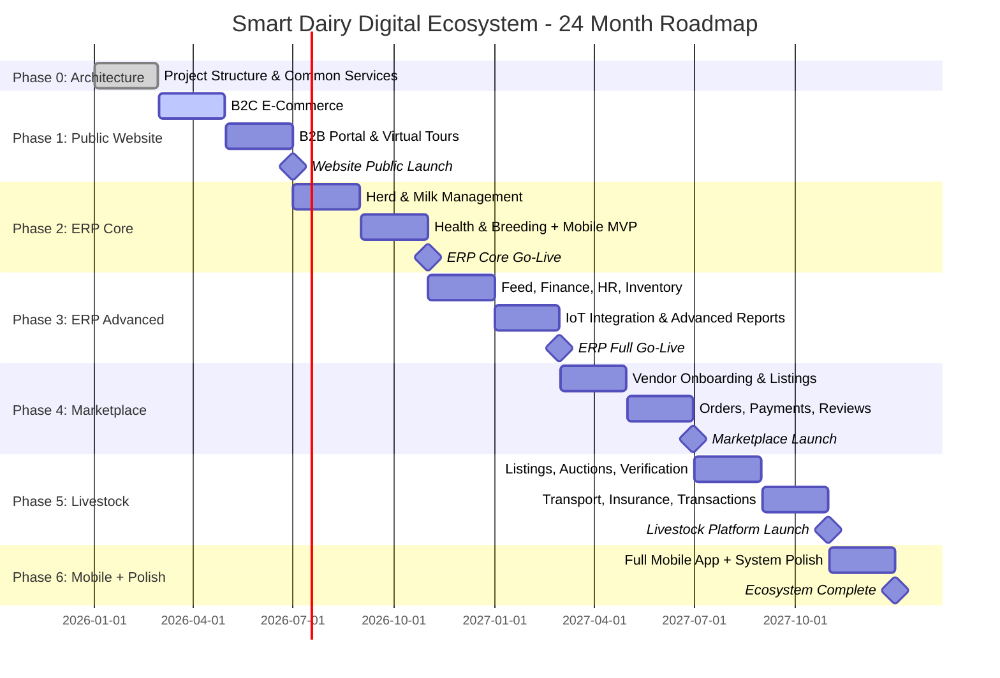

# Smart Dairy Limited - Project Overview and Guiding Principles
## Digital Ecosystem Implementation Roadmap Foundation Document

**Document Version:** 2.0
**Date:** January 31, 2026
**Project:** Smart Dairy Digital Ecosystem - Full Platform Development
**Scope:** Public Website + Agro Marketplace + Livestock Trading + Dairy ERP + Mobile App

---

## Executive Summary

Smart Dairy Limited is building Bangladesh's first fully integrated agricultural digital ecosystem, encompassing five interconnected platforms: a consumer-facing e-commerce website, a multi-vendor agro marketplace, a livestock trading platform, a comprehensive dairy farm management ERP, and a cross-platform mobile application. This represents a strategic expansion from the original website-only scope to a complete digital infrastructure serving the entire agricultural value chain.

### Strategic Context

Bangladesh's dairy market, valued at over $5 billion annually, remains dominated by traditional players with limited digital presence. The agricultural sector broadly lacks digital infrastructure for marketplace commerce, livestock transactions, and farm management. Smart Dairy's ecosystem addresses these gaps simultaneously, creating network effects where each platform strengthens the others.

### Expansion Rationale

The original 12-month website plan addressed only the consumer-facing layer. Analysis reveals that true competitive advantage requires:

1. **Operational digitization (ERP)** to generate the real-time farm data that powers the technology showcase
2. **Marketplace infrastructure** to build an agricultural commerce ecosystem around the Smart Dairy brand
3. **Livestock platform** to address the $2B+ cattle trading market with zero digital incumbents
4. **Mobile application** to serve farm workers in the field and marketplace/livestock users on-the-go

### System Scale

| Metric | Current | Target (24 months) |
|--------|---------|-------------------|
| Cattle herd | 260 | 1,200 |
| Daily milk production | 900 liters | 4,000+ liters |
| Farm workers | 20-30 | 50+ |
| Database tables | 0 (no system) | 105 across 5 schemas |
| API endpoints | 0 | 180 REST + 4 WebSocket namespaces |
| Monthly web visitors | 0 | 50,000+ |
| Marketplace vendors | 0 | 200+ |
| Mobile app users | 0 | 5,000+ |

### Financial Impact

The expanded digital ecosystem enables multiple revenue streams:
- Direct-to-consumer dairy sales (15-25% margin improvement over distributors)
- Marketplace commission revenue (3-12% per transaction)
- Livestock trading platform fees (2-5% per transaction)
- B2B platform creating high-value commercial relationships
- Operational cost reduction through ERP-driven efficiency (15-20%)
- Premium pricing justified through radical transparency

---

## Project Mission Statement

### Primary Mission

*To build Bangladesh's most comprehensive agricultural digital ecosystem, integrating Smart Dairy's farm operations, consumer commerce, agro marketplace, and livestock trading into a unified platform that serves farmers, consumers, businesses, and the broader agricultural community.*

### Core Mission Components

1. **Technology Leadership:** Demonstrate AI-powered dairy management at scale through a fully digitized farm operation (ERP), providing real data for the public technology showcase.

2. **Direct Market Access:** Create seamless digital channels connecting farm production directly with consumers (B2C) and businesses (B2B), eliminating traditional distribution inefficiencies.

3. **Radical Transparency:** Implement unprecedented farm-to-table visibility through IoT sensors, real-time dashboards, virtual tours, and batch-level traceability -- powered by actual ERP production data.

4. **Ecosystem Development:** Establish a multi-platform digital ecosystem that creates network effects: the marketplace attracts vendors who attract buyers; the livestock platform uses ERP health data to build trust; the ERP optimizes operations that power the website's technology showcase.

5. **Agricultural Sector Digitization:** Address the broader gap in Bangladesh's agricultural digital infrastructure through marketplace and livestock trading platforms that serve the entire farming community.

### Vision Statement

*By 2028, Smart Dairy will operate Bangladesh's premier agricultural digital ecosystem -- a fully integrated platform processing 50,000+ monthly e-commerce orders, hosting 200+ marketplace vendors, facilitating livestock trade across all 64 districts, and managing 1,200+ cattle through AI-powered farm operations, while serving as a technology showcase for South Asian agriculture.*

---

## Architecture: Modular Monolith

### Design Decision

The system uses a **Modular Monolith** architecture -- a single deployable application with strict internal domain boundaries organized as five modules:

| Module | Schema | Tables | Description |
|--------|--------|--------|-------------|
| Module A: Public Website | `web` | ~25 | B2C e-commerce, B2B portal, virtual tours, blog |
| Module B: Agro Marketplace | `mkt` | ~18 | Multi-vendor marketplace for agro products and equipment |
| Module C: Livestock Trading | `lvs` | ~15 | Animal listings, auctions, transport, verification |
| Module D: Dairy ERP | `erp` | ~35 | Herd, milk, health, breeding, feed, finance, HR |
| Common Services | `common` | ~12 | Auth, payments, files, notifications, search |

### Why Modular Monolith (Not Microservices)

| Factor | Microservices | Modular Monolith (Chosen) |
|--------|--------------|---------------------------|
| Solo developer feasibility | Very poor | Excellent |
| Operational complexity | High | Low (single deployment) |
| Data consistency | Saga patterns required | Simple transactions |
| Development speed | Slow | Fast (shared TypeScript types) |
| Debugging | Distributed tracing | Standard debugger |
| Future extraction | Already separated | Clean interfaces, extract later |

### Technology Stack

```
FRONTEND:  Next.js 15 + React 18 + TypeScript + Tailwind CSS + shadcn/ui
           Zustand + React Hook Form + Zod + Recharts + Socket.IO Client + next-intl

BACKEND:   Node.js 22 LTS + Express.js + TypeScript + Prisma ORM
           BullMQ + Socket.IO + Passport.js/JWT + Multer + Sharp
           node-cron + Puppeteer/PDFKit

DATA:      PostgreSQL 16 + Redis 7+ + Meilisearch (Phase 4+) + Mosquitto MQTT

MOBILE:    React Native (Expo SDK 51+) + expo-sqlite (offline)
           Expo Camera, Location, Notifications APIs

INFRA:     Docker + docker-compose + Nginx + DigitalOcean (4vCPU/8GB)
           DigitalOcean Spaces (S3) + Cloudflare CDN/WAF + GitHub Actions CI/CD
```

---

## Core Development Principles

### 1. Technology-First Approach

**Principle:** Every feature must demonstrate technological advancement or enable technology showcase.

**Implementation:**
- Public-facing dashboards displaying real-time farm metrics from ERP IoT sensors
- Virtual farm experiences leveraging 360-degree photography and live sensor data
- Livestock listings enriched with ERP-sourced health and production records
- Marketplace powered by intelligent search (Meilisearch) and recommendation

**Business Rationale:** Technology differentiation creates defensible market position across all five platforms.

### 2. Multi-Platform Ecosystem

**Principle:** Build interconnected platforms where each strengthens the others through shared data and user base.

**Implementation:**
- Unified authentication across all modules (single sign-on with role-based access)
- Cross-module search (one search bar finds products, marketplace items, and livestock)
- ERP animal records flow to livestock listings with verified health data
- ERP milk production data feeds website's live technology dashboard
- Shared payment infrastructure across website, marketplace, and livestock

**Business Rationale:** Network effects create compounding value -- each new platform user benefits all platforms.

### 3. Radical Transparency

**Principle:** Make farm operations, quality metrics, and production processes completely visible to customers -- powered by real ERP data, not simulated numbers.

**Implementation:**
- IoT sensors (MQTT) feed real-time milk production, temperature, and tank levels to public dashboard
- Batch-level traceability from ERP milk records to product pages
- Virtual tours showing actual farm areas with live camera feeds
- Livestock "SD Verified" badge backed by actual veterinary health records from ERP

**Business Rationale:** Transparency built on real operational data is impossible to fake and hard for competitors to replicate.

### 4. Solo Developer Optimization

**Principle:** Design all systems for efficient solo development while maintaining professional quality and future team scalability.

**Implementation:**
- Modular monolith avoids microservices operational overhead
- Schema-per-module database isolation reduces cognitive load
- TypeScript end-to-end (frontend, backend, mobile) for single-language mastery
- Comprehensive automation: CI/CD, testing, deployment, monitoring
- Extensive documentation to reduce context-switching cost

**Hiring Recommendation:** After Phase 1 (month 6), consider hiring a junior developer for routine tasks (bug fixes, vendor support, content updates), freeing the lead developer for ERP and platform architecture.

### 5. Bangladesh Market Localization

**Principle:** Optimize all platforms for Bangladesh market specifics.

**Implementation:**
- Bilingual interface (English/Bengali) via next-intl across all platforms
- Local payment integration: bKash, Nagad, Rocket, SSL Commerz, COD
- Mobile-first design (80%+ of Bangladesh internet access is mobile)
- Bangladesh-specific: DLS livestock regulations, local feed types (Napier grass, rice straw), vaccination protocols (FMD, Anthrax, BQ, HS)
- SMS notifications via local providers (BulkSMSBD ~0.25 BDT/SMS)

### 6. Incremental Delivery with MVP Focus

**Principle:** Each phase delivers a standalone MVP that generates value before the next phase begins.

**Implementation:**
- Phase 0: Architecture foundation and common services
- Phase 1: Functional e-commerce website (generates revenue)
- Phase 2: ERP core (digitizes daily farm operations)
- Phase 3: ERP advanced (financial tracking, IoT integration)
- Phase 4: Agro marketplace (commission revenue)
- Phase 5: Livestock trading (platform fees)
- Phase 6: Mobile complete + system polish

**Business Rationale:** Each phase is independently valuable. If development stops at any phase, the completed modules continue operating.

### 7. Security and Privacy First

**Principle:** Build security into every layer across all five platforms.

**Implementation:**
- TLS 1.3 for all data in transit
- Encryption at rest for financial and personal data
- Row-level security for multi-tenant marketplace
- PCI DSS compliance through tokenized payments (gateway-handled)
- RBAC with 10 roles and granular module:resource:action permissions
- Audit logging for all data modifications
- Automated security scans in CI/CD (npm audit, OWASP ZAP)

### 8. Offline-First for Farm Operations

**Principle:** Farm workers must be able to record data regardless of internet connectivity.

**Implementation:**
- React Native mobile app with expo-sqlite local database
- Offline recording: milk production, health events, attendance, photos
- Sync queue: uploads when connectivity returns via BullMQ
- Conflict resolution: server wins for master data, mobile wins for new records (append-only)
- SMS fallback for critical alerts (vaccination due, calving expected, health emergency)

**Business Rationale:** Bangladesh's rural internet is unreliable. Farm operations happen regardless of connectivity -- the software must too.

---

## 24-Month Implementation Roadmap

### Timeline Overview



### Phase Summary

| Phase | Months | Focus | Key Deliverable | Revenue Impact |
|-------|--------|-------|----------------|----------------|
| 0 | 1-2 | Architecture Foundation | Running dev environment, auth, empty module shells | None (infrastructure) |
| 1 | 3-6 | Public Website + E-commerce | Functional B2C/B2B website with payments | Direct dairy sales |
| 2 | 7-10 | ERP Core | Herd, milk, health, breeding + mobile app MVP | Operational efficiency |
| 3 | 11-14 | ERP Advanced | Feed, finance, HR, IoT, reports | Cost reduction 15-20% |
| 4 | 15-18 | Agro Marketplace | Multi-vendor platform with payments/payouts | Commission revenue |
| 5 | 19-22 | Livestock Trading | Animal listings, auctions, transport | Platform fees |
| 6 | 23-24 | Mobile + Polish | Full mobile app, optimization, security audit | User retention |

### Phase Dependencies

```
Phase 0 (Foundation) --> ALL subsequent phases
Phase 1 (Website)    --> Phase 4 (Marketplace extends e-commerce infra)
Phase 2 (ERP Core)   --> Phase 3 (ERP Advanced builds on core)
Phase 2 (ERP Core)   --> Phase 5 (Livestock uses ERP animal records)
Phase 4 (Marketplace) --> Phase 5 (Livestock reuses listing/payment/review patterns)
```

**Why ERP before Marketplace:** Farm operational efficiency is the foundation. The ERP generates the real data that powers the website's technology showcase. Marketplace and livestock trading use ERP animal data for "SD Verified" badges and health certificates.

### Success Milestones

**Technical Milestones:**
- Month 2: Modular monolith running with auth + empty module shells
- Month 6: Website public launch with e-commerce and B2B
- Month 10: Farm staff recording daily operations via mobile app
- Month 14: Complete farm management with financial tracking and IoT
- Month 18: Marketplace with vendors listing and selling products
- Month 22: Livestock platform with auctions and transport
- Month 24: Full ecosystem with mobile app and performance optimization

**Business Milestones:**
- Month 6: First online dairy orders processed
- Month 10: 100% of farm operations digitized (milking, health, breeding)
- Month 14: Cost per liter tracked automatically; 15-20% efficiency gain
- Month 18: 50+ marketplace vendors, commission revenue flowing
- Month 22: First livestock auction completed digitally
- Month 24: 50,000+ monthly visitors, 200+ vendors, 5,000+ mobile users

---

## Strategic Context: Bangladesh Market

### Digital Economy Landscape

Bangladesh's digital transformation creates unprecedented opportunities:
- **Internet Penetration:** 65%+ of urban population, growing 15% annually
- **Mobile Payments:** bKash, Nagad, and Rocket process $10B+ monthly transactions
- **E-commerce Growth:** 30%+ annual growth in online grocery and food delivery
- **Agricultural Technology:** Government initiatives promoting digital agriculture adoption
- **Livestock Market:** $2B+ cattle trading market with zero digital platforms

### Competitive Positioning (Expanded)

| Capability | Smart Dairy | Milk Vita | Aarong | PRAN | Any Competitor |
|-----------|-------------|-----------|--------|------|----------------|
| E-Commerce Platform | Full | None | None | Basic | Rare |
| B2B Digital Portal | Full | None | None | None | None |
| Virtual Farm Tour | Full | None | None | None | None |
| AI/IoT Technology Showcase | Full | None | None | None | None |
| Multi-Vendor Marketplace | Full | None | None | None | None in agro |
| Livestock Trading Platform | Full | None | None | None | None in BD |
| Farm Management ERP | Full | Unknown | Unknown | Unknown | None public |
| Mobile App (Farm + Consumer) | Full | None | None | None | None |
| Real-time IoT Dashboard | Full | None | None | None | None |

**Key Insight:** No competitor in Bangladesh -- or South Asia -- offers an integrated ecosystem combining farm ERP, consumer commerce, agro marketplace, and livestock trading. This represents significant first-mover advantage.

### Success Factors

Critical success factors for Bangladesh market:
1. **Mobile Optimization:** 80%+ of internet access via mobile devices
2. **Offline Capability:** Rural internet unreliable; farm app must work offline
3. **Local Payment Integration:** 70%+ of digital payments via bKash/Nagad
4. **Bengali Language Support:** Essential for mass market and farm worker adoption
5. **Trust Building:** "SD Verified" livestock badges and ERP-backed product traceability
6. **Regulatory Readiness:** DLS livestock regulations, cattle movement permits

---

## Implementation Philosophy

### Agile Solo Development Approach

The implementation embraces agile methodologies adapted for solo development:

**Sprint Structure:**
- 2-week sprints with focused feature delivery
- Sprint goals aligned to phase milestones
- Retrospectives for continuous process improvement
- Stakeholder demos at end of each phase

**Quality Assurance:**
- Test-driven development for critical business logic (payments, breeding calculations, auction bidding)
- Automated testing pipeline with 70%+ coverage target
- E2E testing for critical user flows (checkout, milk recording, auction bidding)
- Performance and security audits before each phase launch

**Risk Management:**
- Phase-independent MVPs: each phase works standalone if development pauses
- Weekly risk assessment and mitigation
- Feature prioritization based on business impact and technical risk
- Clear rollback procedures for all deployments
- Database migration strategy with Prisma

### Technology Decision Framework

All technology choices evaluated against:

1. **Solo Developer Viability:** Can one person implement and maintain this across 5 modules?
2. **Bangladesh Compatibility:** Works with local infrastructure, payments, and SMS providers?
3. **Business Value:** Direct contribution to revenue, cost reduction, or operational efficiency?
4. **Scalability Path:** Handles growth from 260 to 1,200 cattle, 100 to 500 concurrent users?
5. **Code Reuse:** Can patterns from one module (e.g., marketplace orders) be reused in another (e.g., livestock transactions)?

---

## Risk Management

### Critical Risks

| Risk | Probability | Impact | Mitigation |
|------|-------------|--------|------------|
| Solo developer burnout (24 months) | High | Critical | Each phase ships independently; take breaks between phases |
| DB schema complexity (105 tables) | Medium | High | Schema-per-module isolation, Prisma migrations, design upfront |
| Low marketplace vendor adoption | Medium | High | Start with Smart Dairy own products; zero commission first 3 months |
| Livestock platform trust | Medium | High | Launch with SD Verified animals from own herd first |
| IoT sensor reliability (humid farm) | High | Medium | Manual entry fallback always available; sensors supplementary |
| Bangladesh internet reliability | High | Medium | Offline-first mobile for ERP; SMS fallback for alerts |
| Payment gateway integration quirks | Medium | Medium | bKash/Nagad APIs need extra testing; always offer COD |
| Scope creep | High | High | This document IS the scope. Changes require formal evaluation |

### Bus Factor Mitigation

With bus factor = 1 (solo developer), mitigation includes:
- Comprehensive TypeScript throughout (self-documenting)
- 70%+ automated test coverage
- Detailed documentation for every module
- Clean modular architecture (new developer can understand one module at a time)
- GitHub-hosted with CI/CD (no tribal knowledge required to deploy)

---

## Budget Overview

### Infrastructure (Monthly)

| Item | Cost/Month |
|------|-----------|
| DigitalOcean Droplet (4vCPU/8GB) | $48 |
| DigitalOcean Spaces (250GB S3) | $5 |
| Cloudflare Pro (CDN + WAF) | $20 |
| SendGrid (40K emails) | $15 |
| SMS (BulkSMSBD ~5,000/mo) | ~$15 |
| Apple Developer Account | $8.25 |
| Google Play Developer | $2.08 |
| Domain renewal | ~$2 |
| **Total Infrastructure** | **~$115/month** |

### Development Cost Estimate

| Scope | Timeline | Estimated Cost |
|-------|----------|---------------|
| Original (website only) | 12 months | $97K-$202K |
| Expanded (full ecosystem) | 24 months | $250K-$400K |

The ERP module alone represents ~40% of total new development effort. The expanded scope is 5-7x more complex than the original website plan but reuses Phase 1 infrastructure heavily.

---

## Conclusion

This expanded Project Overview establishes the strategic foundation for Smart Dairy's transformation from a website project into a comprehensive agricultural digital ecosystem. The 24-month, 6-phase roadmap balances ambitious scope with practical solo developer constraints by:

1. **Delivering value incrementally** -- each phase ships an independently useful product
2. **Building on shared infrastructure** -- common auth, payments, files, and notifications serve all modules
3. **Creating network effects** -- ERP data powers website transparency; marketplace attracts users to livestock platform
4. **Maintaining technical discipline** -- modular monolith, schema isolation, TypeScript end-to-end, automated testing

The ecosystem approach positions Smart Dairy not just as a dairy company with a website, but as an agricultural technology platform serving the entire farming value chain in Bangladesh.

---

**Document Status:** Final
**Next Review:** After Phase 1 Completion (Month 6)
**Maintained By:** Project Lead & Development Team
**Approval Required:** Smart Dairy Executive Team

---

*This document serves as the foundation for all subsequent implementation planning. The companion phase roadmap files (Phase_01 through Phase_06) provide detailed sprint-level breakdowns for each phase.*
